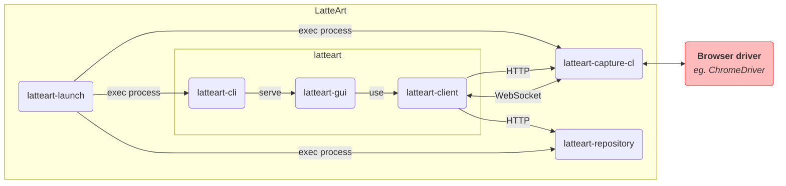

# Contributing to LatteArt

[日本語版はこちら](contributing_ja.md)を参照して下さい。

## Issues

Use [Issues](https://github.com/latteart-org/latteart/issues) on GitHub.

### Bug report

- Use the template `Bug report`.
- Apply the label `bug` to the issue.

### Feature requests

- Use the template `Feature request`.
- Apply the label `enhancement` to the issue.

## Questions

Use [discussions](https://github.com/latteart-org/latteart/discussions) feature of GitHub.

## Development

LatteArt consists of the following packages:

| Package             | Description                               |
| ------------------- | ----------------------------------------- |
| latteart-launch     | Command for launching                     |
| latteart-cli        | Web server for providing GUI              |
| latteart-gui        | GUI (web application)                     |
| latteart-client     | Common front-end module                   |
| latteart-capture-cl | Server for capturing browser interactions |
| latteart-repository | Server for storing data                   |

Each package of LatteArt works in cooperation as follows.



### Web API

Please refer to the following Web API when communicating with `latteart-capture-cl` and `latteart-repository`:

- `latteart-capture-cl`
  - [REST API Reference](https://latteart-org.github.io/latteart/docs/api/latteart-capture-cl/rest/)
  - [WebSocket API Reference](../packages/latteart-capture-cl/docs/api/websocket.md)
- `latteart-repository`
  - [REST API Reference](https://latteart-org.github.io/latteart/docs/api/latteart-repository/rest/)

### Development Environment Setup

Install the following software needed for development in your development environment:

- Git
- Node.js v18.15.0

Once you have installed everything, clone the `latteart` repository and run the following command:

```bash
$ cd latteart
$ npm install
```

### Editor Setup

Install Visual Studio Code in your development environment.

After installation, double-click on `latteart.code-workspace` to open the workspace.

:bulb: If a popup appears recommending extensions, please install them as appropriate.

### Commands to develop each package

See the respective `package.json` for the commands used to develop each package.

### Build

To build the installation materials, run the following command to build all packages:

```bash
# for Windows
$ npm run package:win

# for Mac
$ npm run package:mac
```

This will create directories with the following structure under the `dist` directory:

```bash
# for Windows
dist/
  └─ package/
      └─ win/
          └─ latteart/
              ├─ capture.bat
              ├─ manage.bat
              ├─ launch.config.json
              ├─ launch.exe
              ├─ latteart/
              │   ├─ public/
              │   └─ latteart.exe
              ├─ latteart-capture-cl/
              │   └─ latteart-capture-cl.exe
              └─ latteart-repository/
                  ├─ history-viewer/
                  ├─ snapshot-viewer/
                  ├─ latteart-repository.exe
                  └─ latteart.config.json

# for Mac
dist/
  └─ package/
      └─ mac/
          └─ latteart/
              ├─ capture.command
              ├─ manage.command
              ├─ launch.config.json
              ├─ launch
              ├─ latteart/
              │   ├─ public/
              │   └─ latteart
              ├─ latteart-capture-cl/
              │   └─ latteart-capture-cl
              └─ latteart-repository/
                  ├─ history-viewer/
                  ├─ snapshot-viewer/
                  ├─ latteart-repository
                  └─ latteart.config.json
```

## Pull Requests

- Create a pull request to merge code from your feature branch to the develop branch.
  - In principle, branch names should be `feature/#[issue number]_[summary]`.
- You must agree to [DCO](https://developercertificate.org/) to contribute to LatteArt.
  - Add the following signature to the commit message to indicate that you agree with the DCO.
    - `Signed-off-by: Random J Developer <random@developer.example.org>`
      - Use your real name in the signature.
      - You need to set the same name in GitHub Profile.
      - `git commit -s` can add the signature.
- Associate a pull request with the corresponding Issue.
  - If there is no corresponding issue, create a new one before creating a pull request.
- Use the templates when creating a pull request.
- The title of a pull request should include "fix" followed by the issue number and a summary of the pull request.
  - `fix #[issue number] [summary]`

## Coding Style

- Your code must pass the check by `eslint`.
