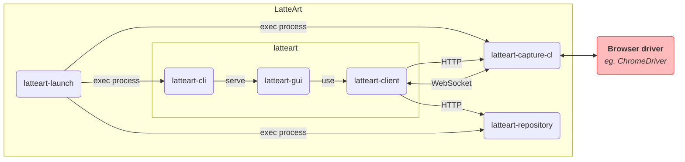

# LatteArt へのコントリビューション

## バグの報告・機能追加要望

GitHub の [Issues](https://github.com/latteart-org/latteart/issues) を使用してください。

### バグ

- バグを報告する際は、`Bug report` テンプレートを使用してください。
- Labels には `bug` を付与してください。

### 機能追加

- 新たな機能追加を要求する際は、`Feature request` テンプレートを使用してください。
- Labels には `enhancement` を付与してください。

## 質問

GitHub の [Discussions](https://github.com/latteart-org/latteart/discussions) 機能をご利用ください。

## 開発

LatteArt は以下のパッケージから構成されています。

| パッケージ          | 説明                         |
| ------------------- | ---------------------------- |
| latteart-launch     | 起動用コマンド               |
| latteart-cli        | GUI 提供用 Web サーバ        |
| latteart-gui        | GUI (Web アプリケーション)   |
| latteart-client     | フロントエンド共通モジュール |
| latteart-capture-cl | ブラウザ操作情報取得用サーバ |
| latteart-repository | データ保存用サーバ           |

LatteArt の各パッケージは以下のように連携して動作します。



### Web API

`latteart-capture-cl`、`latteart-repository`との通信で使用する Web API は以下を参照してください。

- latteart-capture-cl
  - [REST API リファレンス](https://latteart-org.github.io/latteart/docs/api/latteart-capture-cl/rest/)
  - [WebSocket API リファレンス](../packages/latteart-capture-cl/docs/api/websocket.md)
- latteart-repository
  - [REST API リファレンス](https://latteart-org.github.io/latteart/docs/api/latteart-repository/rest/)

### 開発環境のセットアップ

開発に必要な以下ソフトウェアを開発環境にインストールします。

- Git
- Node.js v18.15.0

全てのインストールが完了したら、`latteart`リポジトリを clone し、以下を実行します。

```bash
$ cd latteart
$ npm install
```

### エディタのセットアップ(VSCode)

Visual Studio Code を開発環境にインストールします。

インストールが完了したら、`latteart.code-workspace`をダブルクリックし、ワークスペースを開きます。

:bulb: 推奨拡張機能のポップアップが表示された場合は、適宜インストールしてください。

### 開発用コマンド

各パッケージの開発用コマンドは以下の README を参照してください。

- [latteart-launch](../packages/latteart-launch/README_ja.md)
- [latteart-cli](../packages/latteart-cli/README_ja.md)
- [latteart-gui](../packages/latteart-gui/README_ja.md)
- [latteart-client](../packages/latteart-client/README_ja.md)
- [latteart-capture-cl](../packages/latteart-capture-cl/README_ja.md)
- [latteart-repository](../packages/latteart-repository/README_ja.md)

### インストール資材のビルド

以下コマンドを実行すると、全てのパッケージのビルドを実行し、インストール資材を作成します。

```bash
# Windows版LatteArt
$ npm run package:win

# Mac版LatteArt
$ npm run package:mac
```

`dist`ディレクトリ配下に以下構成のディレクトリが作成されます。

```bash
# Windows版LatteArt
dist/
  └─ package/
      └─ win/
          └─ latteart/
              ├─ latteart.bat
              ├─ launch.config.json
              ├─ launch.exe
              ├─ latteart/
              │   ├─ public/
              │   └─ latteart.exe
              ├─ latteart-capture-cl/
              │   └─ latteart-capture-cl.exe
              └─ latteart-repository/
                  ├─ history-viewer/
                  ├─ snapshot-viewer/
                  ├─ latteart-repository.exe
                  └─ latteart.config.json

# Mac版LatteArt
dist/
  └─ package/
      └─ mac/
          └─ latteart/
              ├─ latteart.command
              ├─ launch.config.json
              ├─ launch
              ├─ latteart/
              │   ├─ public/
              │   └─ latteart
              ├─ latteart-capture-cl/
              │   └─ latteart-capture-cl
              └─ latteart-repository/
                  ├─ history-viewer/
                  ├─ snapshot-viewer/
                  ├─ latteart-repository
                  └─ latteart.config.json
```

## プルリクエスト

- コントリビュータは、最初に LatteArt のリポジトリを fork してください。
- コントリビュータは、fork したリポジトリ上で topic branch を作成し、latteart-org 配下のリポジトリの develop branch に対して Pull Request を行ってください。
  - topic branch のブランチ名は任意です。
- コントリビュータは、[DCO](https://developercertificate.org/)に同意する必要があります。
  - DCO に同意していることを示すため、全てのコミットに対して、コミットメッセージに以下を記入してください。
    - `Signed-off-by: Random J Developer <random@developer.example.org>`
      - 氏名の部分は、本名を使用してください。
      - GitHub の Profile の Name にも同じ名前を設定する必要があります。
      - `git commit -s` でコミットに署名を追加できます。
- Pull Request を発行する際は、対応する Issue に紐づけてください。
  - 対応する Issue がない場合は Pull Request の発行前に作成してください。
- Pull Request のタイトルには、"fix"に続いて対処した issue 番号および修正の概要を記入してください。
  - `fix #[issue番号] [修正の概要]`
- Pull Request の本文は、テンプレートを使用してください。

## コーディングスタイル

- 静的解析によるチェックを通るようにコーディングしてください。

## 拡張機能の開発

拡張機能を作成することで、独自の機能を追加することができます。

- [LatteArt チュートリアル（Extension開発）](./tutorial/extension/tutorial-extension.md) : LatteArt の拡張機能開発の実践
