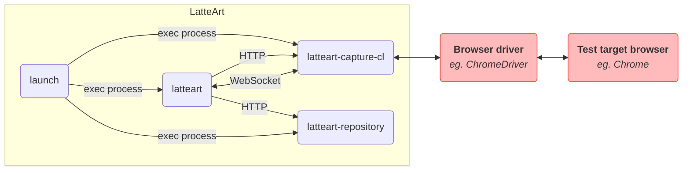

# LatteArt へのコントリビューション

## バグの報告・機能追加要望

GitHub の [Issues](https://github.com/latteart-org/latteart/issues) を使用してください。

### バグ

- バグを報告する際は、`Bug report` テンプレートを使用してください。
- Labels には `bug` を付与してください。

### 機能追加

- 新たな機能追加を要求する際は、`Feature request` テンプレートを使用してください。
- Labels には `enhancement` を付与してください。

## 質問

GitHub の [Discussions](https://github.com/latteart-org/latteart/discussions) 機能をご利用ください。

## 開発

### リポジトリ構成

LatteArt は以下のパッケージから構成され、複数の GitHub リポジトリで管理されています。

| GitHub リポジトリ   | パッケージ          | 説明                         |
| ------------------- | ------------------- | ---------------------------- |
| latteart            | launch              | 各サーバ起動用コマンド       |
|                     | latteart            | GUI サーバ                   |
| latteart-capture-cl | latteart-capture-cl | ブラウザ操作情報取得用サーバ |
| latteart-repository | latteart-repository | データ保存用サーバ           |

:warning: Issues は全て`latteart`リポジトリ配下で管理しているため注意してください。

各パッケージは以下のように連携して動作します。



### 環境のセットアップ

開発に必要な以下ソフトウェアを開発環境にインストールします。

- Git
- Node.js v14.15.3
- Yarn

全てのインストールが完了したら、`latteart`、`latteart-capture-cl`、`latteart-repository`のリポジトリを全て clone し、各ディレクトリで以下を実行します。

```bash
$ yarn install
```

### 開発用コマンド

#### latteart

```bash
# 静的解析
$ yarn lint

# テストの実行
$ yarn test:unit

# フロントエンド側ソースコードの変更検知、再ビルド、フロントエンド開発用サーバ起動
$ yarn serve

# バックエンド側ソースコードの変更検知、再ビルド
$ yarn watch:server

# ビルド済サーバの起動
$ yarn start:server
```

#### latteart-capture-cl

```bash
# 静的解析、自動修正
$ yarn fix

# テストの実行
$ yarn test

# ソースコードの変更検知、再ビルド
$ yarn watch

# ビルド済サーバの起動
$ node dist/index.js
```

#### latteart-repository

```bash
# 静的解析、自動修正
$ yarn fix

# テストの実行
$ yarn test

# ソースコードの変更検知、再ビルド
$ yarn watch

# ビルド済サーバの起動
$ node dist/index.js
```

### パッケージのビルド

#### latteart

`latteart`ディレクトリで以下を実行します。

```bash
$ yarn package
```

`dist/latteart`に以下構成のディレクトリが作成されます。

```bash
dist/latteart/
    ├─ capture.bat # バッチファイル
    ├─ manage.bat  # バッチファイル
    ├─ launch.config.json # バッチ実行設定ファイル
    ├─ launch.exe # Windows用実行ファイル
    ├─ latteart/
    │        ├─ public/ # index.htmlとfavicon
    │        └─ latteart.exe # Windows用実行ファイル
    └─ latteart-repository/
            ├─ history-viewer/ # スナップショットビューア(レビュー画面)
            └─ snapshot-viewer/ # スナップショットビューア
```

#### latteart-capture-cl

`latteart-capture-cl`ディレクトリで以下を実行します。

```bash
$ yarn package
```

`dist/latteart-capture-cl`に以下構成のディレクトリが作成されます。

```bash
dist/latteart-capture-cl/
    ├─ node_modules/ # 外部ライブラリ群
    ├─ latteart-capture-cl.exe # Windows用実行ファイル
    └─ latteart-capture-cl # Mac用実行ファイル
```

#### latteart-repository

`latteart-repository`ディレクトリで以下を実行します。

```bash
$ yarn typescript-json-validator src/lib/settings/Settings.ts
$ yarn typescript-json-validator src/lib/settings/DeviceSettings.ts
$ yarn package
```

`dist/latteart-repository`に以下構成のディレクトリが作成されます。

```bash
dist/latteart-repository/
    ├─ node_modules/ # 外部ライブラリ群
    ├─ public/ # リソース格納用ディレクトリ
    ├─ latteart-repository.exe # Windows用実行ファイル
    ├─ latteart-repository # Mac用実行ファイル
    ├─ latteart.config.json # 設定ファイル
    ├─ latteart.device.config.json # デバイス設定ファイル
    └─ ormconfig.json # DB設定ファイル
```

### インストール資材の作成

パッケージのビルドで作成された`latteart`、`latteart-capture-cl`、`latteart-repository`ディレクトリを統合します。

`latteart`ディレクトリ配下に以下の構成で`latteart-capture-cl`、`latteart-repository`を配置します。

```bash
latteart/
    ├─ capture.bat
    ├─ manage.bat
    ├─ launch.config.json
    ├─ launch.exe
    ├─ latteart/
    ├─ latteart-capture-cl/ # 追加
    └─ latteart-repository/ # マージ
```

## プルリクエスト

- コントリビュータは、最初に LatteArt の各リポジトリを fork してください。
- コントリビュータは、fork したリポジトリ上で topic branch を作成し、latteart-org 配下のリポジトリの develop branch に対して Pull Request を行ってください。
  - topic branch のブランチ名は任意です。
- コントリビュータは、[DCO](https://developercertificate.org/)に同意する必要があります。
  - DCO に同意していることを示すため、全てのコミットに対して、コミットメッセージに以下を記入してください。
    - `Signed-off-by: Random J Developer <random@developer.example.org>`
      - 氏名の部分は、本名を使用してください。
      - GitHub の Profile の Name にも同じ名前を設定する必要があります。
      - `git commit -s` でコミットに署名を追加できます。
- Pull Request を発行する際は、対応する Issue に紐づけてください。
  - 対応する Issue がない場合は Pull Request の発行前に作成してください。
- Pull Request のタイトルには、"fix"に続いて対処した issue 番号および修正の概要を記入してください。
  - `latteart`リポジトリでの修正は、`fix #[issue番号] [修正の概要]`
  - `latteart-capture-cl`、`latteart-repository`での修正は、`fix latteart-org/latteart#[issue番号] [修正の概要]`
- Pull Request の本文は、テンプレートを使用してください。

## コーディングスタイル

- 静的解析によるチェックを通るようにコーディングしてください。
