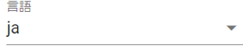
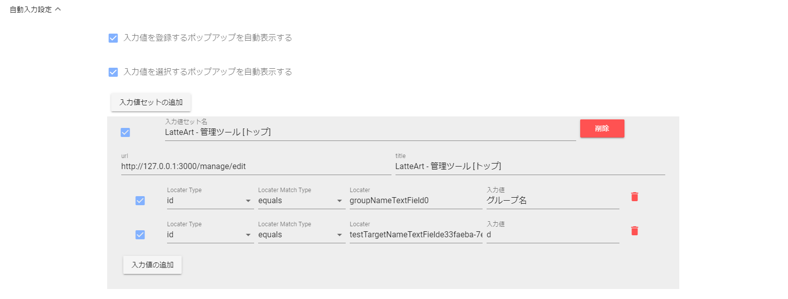
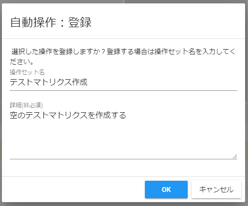
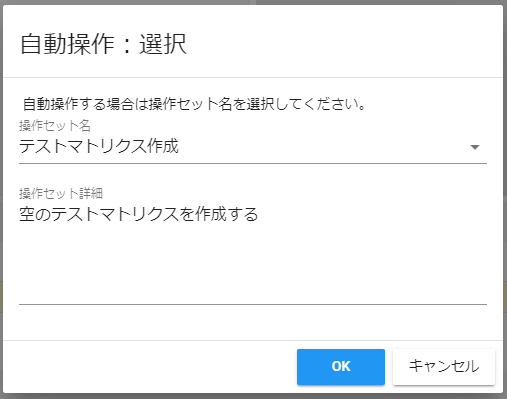
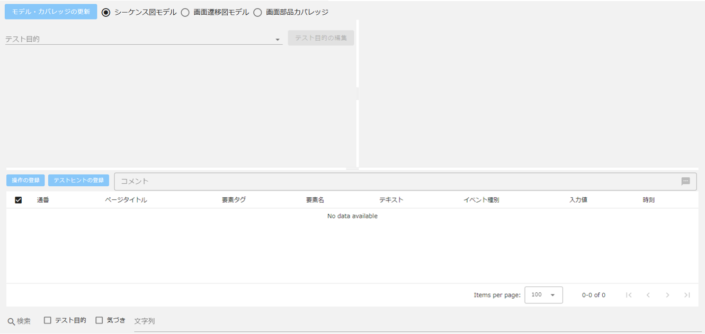
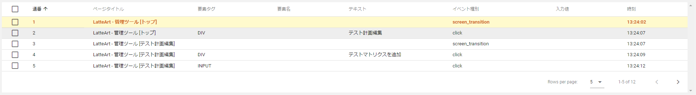
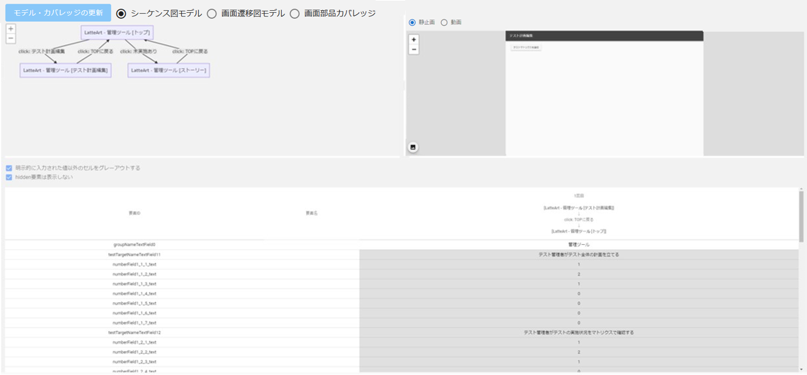
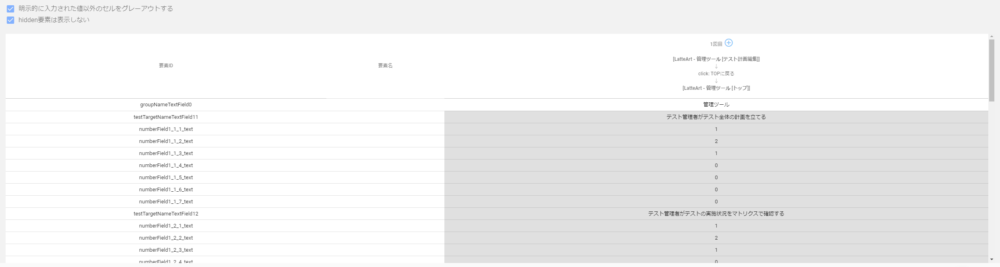

# 記録ツール 操作説明書

記録ツールはテスト対象サイト上で行われたユーザー操作を記録するツールです。
本ツールは以下の画面から構成されます。

- [ヘッダー](#ヘッダー)
  - [URL 入力欄](#url-入力欄)
  - [テスト結果名入力欄](#テスト結果名入力欄)
  - [テスト開始/終了ボタン](#テスト開始終了ボタン)
  - [操作記録の一時停止/再開ボタン](#操作記録の一時停止再開ボタン)
  - [履歴リセットボタン](#履歴リセットボタン)
  - [過去のテスト結果の読み込みボタン](#過去のテスト結果の読み込みボタン)
  - [メニューボタン](#メニューボタン)
    - [テスト結果のインポート](#テスト結果のインポート)
    - [テスト結果のエクスポート](#テスト結果のエクスポート)
    - [設定のインポート](#設定のインポート)
    - [設定のエクスポート](#設定のエクスポート)
    - [テストスクリプト生成](#テストスクリプト生成)
    - [テスト結果のリプレイ/リプレイの中止](#テスト結果のリプレイ・中止)
    - [スクリーンショット出力](#スクリーンショット出力)
    - [テスト結果の削除](#テスト結果の削除)
  - [言語](#言語)
  - [リポジトリ URL](#リポジトリ-url-入力欄)
  - [接続ボタン](#接続ボタン)
- [フッター](#フッター)
  - [ブラウザバック・フォワードボタン](#ブラウザバックフォワードボタン)
  - [タブ・ウィンドウ切り替えボタン](#タブウィンドウ切り替えボタン)
  - [自動操作ボタン](#自動操作ボタン)
  - [自動入力ボタン](#自動入力ボタン)
  - [メモボタン](#メモボタン)
  - [画面切り替えボタン](#画面切り替えボタン)
  - [経過時間](#経過時間)
- [設定画面](#設定画面)
  - [テスト対象設定](#テスト対象設定)
  - [デバイスの詳細設定](#デバイスの詳細設定)
  - [画像圧縮設定](#画像圧縮設定)
  - [画面要素カバレッジの設定](#画面要素カバレッジの設定)
  - [画面遷移の定義](#画面遷移の定義)
  - [自動入力設定](#自動入力設定)
  - [自動操作設定](#自動操作設定)
- [履歴画面](#履歴画面)
  - [スクリーンショット出力ボタン](#スクリーンショット出力ボタン)
  - [モデル・カバレッジ更新ボタン](#モデル・カバレッジ更新ボタン)
  - [シーケンス図モデル](#シーケンス図モデル)
  - [画面遷移図モデル](#画面遷移図モデル)
  - [画面要素カバレッジ](#画面要素カバレッジ)

# ヘッダー


テストの開始や終了、過去のテスト結果の読み込み、記録した操作のリプレイなどを行うことができます。

## URL 入力欄


テスト対象サイトの URL を入力する欄です。

## テスト結果名入力欄


テスト結果の名称を入力する欄です。
任意の名称を付与することができ、未記入の場合は自動的に付与されます。

## テスト開始/終了ボタン


「URL 入力欄」に有効な URL を入力すると活性化され、押下すると以下のダイアログからテスト目的を使用してテストをするか、その場合最初のテスト目的はどうするかといった設定を入力することができます。

:bulb: アドホックテスト等、特にテスト目的を決めずにテストを進めたい場合はチェックボックスを OFF にして始めることもできます。

:bulb: リモート接続中の場合は、テスト終了時にテスト結果をリモート接続先にアップロードすることができます。


ダイアログの「OK」ボタンを押下するとブラウザが立ち上がり、「URL 入力欄」で入力された URL のページを表示し、記録が開始されます。

:bulb: 操作内容は`latteart-repository/`配下の`latteart.sqlite`に保存されます。  
:bulb: バージョン 1.7.5 以前の LatteArt の場合は`latteart-repository/public/test-results/`配下のディレクトリに保存されます。

:warning: LatteArt での記録中に画面遷移等で新しいページを開く際、ページが読み込まれる前に操作をすると LatteArt が正しく記録できない場合があります。完全にページがロードされてから操作するようにしてください。

記録開始後に再度押下するとブラウザが閉じ、記録が終了されます。

## 操作記録の一時停止/再開ボタン


テスト中に押下すると、LatteArt での操作記録を一時停止します。
記録の停止中は、テスト対象サイト上でクリックやテキスト入力等の入力操作を行っても LatteArt に記録されません。
停止中に再度押下すると、停止状態が解除され、以降の操作は通常通り LatteArt に記録されるようになります。

:bulb: テスト対象サイトによっては、LatteArt での記録中に画面要素を操作しても正しく動作しない場合がございます（クリックが反応しない等）。その場合は回避策として本機能をご利用ください。

:warning: テスト中に記録の一時停止を行った操作履歴は、「テスト結果のリプレイ」機能や「テストスクリプト生成」機能で利用した際に、正しく動作しない場合があります。

## 履歴リセットボタン


押下すると記録されているテスト履歴をクリアします。テストを最初から行いたい場合等に使用してください。

:bulb: 過去のテスト結果は保存されているため、誤ってリセットしてしまった場合は、「過去のテスト結果の読み込みボタン」により復元できます。

## 過去のテスト結果の読み込みボタン


押下すると保存されているテスト結果名の一覧が表示され、選択したテスト結果を読み込むことができます。  
読み込んだテスト結果は再度「テスト開始ボタン」を押下することで、セッションの続きからテストを行うことができます。

## メニューボタン


押下すると以下の機能一覧を表示します。

- テスト結果のインポート
- テスト結果のエクスポート
- 設定のインポート
- 設定のエクスポート
- テストスクリプト生成
- テスト結果のリプレイ
- スクリーンショット出力
- テスト結果の削除

### テスト結果のインポート

メニューボタンの一覧から押下するとインポートダイアログが表示され、選択したテスト結果をインポートすることができます。  
インポートしたテスト結果は「過去のテスト結果の読み込みボタン」からテスト結果を選択することで読み込むことができます。  
インポートファイル(zip)内の構成は以下の通り

- test_result_YYYYDDMM_HHmmss.zip

```
  - スクリーンショット
  - テスト結果情報(log.json)
```

:bulb: zip ファイル名はエクスポート時は上記のように出力されるがファイル名の指定は自由となります。  
:bulb: バージョン 1.7.5 以前の LatteArt のデータをインポートしたい場合は
`latteart-repository\public\test-results`配下の`session`から始まるフォルダ配下の全ての画像ファイルと log.json を選択して zip したものをインポートします。

### テスト結果のエクスポート

メニューボタンの一覧から押下するとエクスポートダイアログが表示され、現在表示しているテスト結果をエクスポートすることができます。
エクスポートファイル(zip)内の構成は以下の通り

- test_result_YYYYDDMM_HHmmss.zip

```
  - スクリーンショット
  - テスト結果情報(log.json)
```

### 設定のインポート

メニューボタンの一覧から押下するとインポートダイアログが表示され、選択した設定をインポートすることができます。

:bulb: json ファイル名の指定は自由となります。

### 設定のエクスポート

メニューボタンの一覧から押下すると現在の設定をエクスポートすることができます。

エクスポートファイル(json)配下のファイル名で出力されます。

- config_YYYYDDMM_HHmmss.json

### テストスクリプト生成

メニューボタンの一覧から押下すると現在表示しているテスト結果を元にテストスクリプトを生成します。
詳細は「[テストスクリプト自動生成](../common/test-script-generation.md)」をご参照ください。

### テスト結果のリプレイ・中止

メニューボタンの一覧から押下するとブラウザが立ち上がり、操作のタイミング含め、記録された操作がそのまま自動的に繰り返されます。
リプレイ開始後にメニューボタンの一覧から「リプレイの中止」を押下するとブラウザが閉じ、リプレイが中止されます。

### スクリーンショット出力

メニューボタンの一覧から押下すると現在表示しているテスト結果のスクリーンショットをダウンロードすることができます。  
スクリーンショットファイル(zip)内の構成は以下の通り

- screenshots\_{テスト結果名}\_YYYYDDMM_HHmmss.zip

```
  - スクリーンショット(ファイル名：{連番}.webp/{連番}.png)
```

### テスト結果の削除

メニューボタンの一覧から押下すると現在表示しているテスト結果を削除することができます。

## 言語



表示言語を切り替えることができます。

- ja（日本語）
- en（英語）

## リポジトリ URL 入力欄


リポジトリ URL を入力する欄です。  
プルダウンを開くと過去に接続したリポジトリ URL が選択候補として表示されます。

## 接続ボタン


リポジトリ URL に記載された URL に接続することができます。  
リポジトリ URL 入力欄に URL を入力すると接続ボタンが押下可能となります。

:bulb:他者のリポジトリ URL（latteart-repositoryURL）を指定することで、他者の環境のデータへアクセス、更新することができます。

# フッター


主に、記録中におけるコメントの付与やテスト対象ブラウザへの一部の操作を行うことができます。

## ブラウザバック・フォワードボタン


テスト中に押下すると、テスト対象ブラウザ上で「戻る」・「進む」が実行され、LatteArt に操作として記録されます。

:warning: 本ボタンを使わずに、ブラウザの「戻る」・「進む」をボタンを直接使用した場合、「戻る」・「進む」といった操作は記録されません。テスト中はテスト対象ブラウザの「戻る」・「進む」ボタンは使用せずに本ボタンを使用してください。

:warning: テスト対象サイト側でブラウザの「戻る」・「進む」機能を呼び出すというような実装がされている場合、LatteArt 側で管理している情報と正しく連動できなくなり、本ボタンの状態がおかしくなる場合があります。そのような実装がされている場合は、該当箇所の操作と本ボタンでの操作（ブラウザバック・フォワードの記録）は併用しないてください。

## タブ・ウィンドウ切り替えボタン


テスト中に押下するとダイアログが表示され、記録対象のタブ・ウィンドウを切り替えることができます。
タブ・ウィンドウは検出された順に`window1`、`window2`という形で通番が振られて表示されます。

:warning: テスト対象ブラウザ上でアクティブなタブ・ウィンドウを切り替えた場合、LatteArt は自動的に新しくアクティブとなったタブ・ウィンドウを記録対象と認識しますが、ドメインの異なる画面を開いている他タブ・ウインドウに対しては自動的に切り替わりません。
その場合は、本ボタンを使用して記録対象タブ・ウィンドウを手動で切り替えてください。

:warning: タブ・ウィンドウ切り替えダイアログは、本ボタン押下時以外に、別タブ・ウインドウが新しく開かれた際にも自動的に開かれます。

:warning: 非アクティブなタブ・ウィンドウは薄暗く表示され、クリックなどの操作を受け付けません。

## 自動操作ボタン


「自動操作：選択」ダイアログを表示します。自動操作セットが登録されている場合、活性化します。「自動操作」についての詳細は[「自動操作設定」](#自動操作設定)をご参照ください。

## 自動入力ボタン


「自動入力：選択」ダイアログを表示します。有効な自動入力値セットがある場合、活性化します。「自動入力」についての詳細は[「自動入力設定」](#自動入力設定)をご参照ください。

## メモボタン


テスト開始時に**テスト目的を使用する**ように設定した場合は、テスト中に本ボタンを押下すると以下のダイアログが表示され、メモを残すことができます。
メモではテスト目的に従ってテストした際の結果や次に行うテスト目的を入力することができます。

:bulb: 記録したメモの編集・削除はシーケンス図、操作一覧からできます。


メモにてテスト中の気づきを記録する際、タグを付与することができます。
タグはあらかじめ用意されているものの他、任意の文字列を入力して付与することもできます。


テスト開始時に**テスト目的を使用しない**ように設定した場合は、テスト中の気づきのみを入力できる以下のダイアログが表示されます。


## 画面切り替えボタン

押下すると現在表示中の記録ツールの画面を切り替えることができます。

- [設定画面](#設定画面)に切り替える
  

- [履歴画面](#履歴画面)に切り替える
  

## 経過時間


テスト開始からの経過時間が表示されます。

## 設定画面


テスト対象の設定や記録された操作群を可視化する際の表示設定を行えます。
各種設定は変更時にリアルタイムで保存されます。

## テスト対象設定


テスト対象の設定を行うことができます。

- プラットフォーム
  - テスト対象プラットフォームを指定する欄です。
- ブラウザ
  - テスト対象ブラウザを指定する欄です。
- ブラウザ起動時にリロードする
  - 記録開始後自動的にブラウザをリロードする秒数を指定する欄です。リロードさせない場合は 0 秒を指定してください。
  - :bulb: モバイル端末に対するテスト等で Chrome DevTools のリモートデバッグ機能を用いる際、接続された端末のブラウザ起動のタイミングによってはデバイスの認識が遅れ、ページを正しく表示できない場合があります。
    その場合はデバイスが認識される秒数の後にリロードされるように本設定値で指定することで正しいページを表示させることができます。

## デバイスの詳細設定


USB で接続されているデバイスを選択することができます。
「テスト対象設定」の「プラットフォーム」欄で`Android`もしくは`iOS`を選択した場合に活性化されます。

- デバイス情報更新
  - 押下すると接続されているデバイスが再検索されます。
  - :bulb: 設定画面を開いた後にデバイスを接続した場合は情報が最新化されていない可能性があります。その場合は本ボタンを押下して最新の情報を取得してください。
- デバイス選択
  - 接続されているデバイスが複数存在する場合に、テスト対象のデバイスを選択することができます。
- OS バージョン
  - 選択されたテスト対象のデバイスの OS バージョンが表示されます。

## 画像圧縮設定


スクリーンショットの画像の圧縮設定を行うことができます。

- 取得したスクリーンショットを圧縮する
  - ON にすると、取得したスクリーンショットを圧縮してリポジトリに保存するようになります。ディスク容量を節約したい場合に有効です。
- 元画像を削除する
  - ON にすると、スクリーンショットを圧縮する際に圧縮前のオリジナルデータを削除します。圧縮前のオリジナルデータもバックアップとして残しておきたい場合は OFF にしてください。

:warning: 続けて素早く操作を行う、もしくは CPU に高負荷がかかっている状態だと画像の圧縮に失敗することがあります。

## 画面要素カバレッジの設定


画面要素カバレッジに関する設定を行うことができます。

- カバレッジ計算に含めるタグ
  - 画面要素カバレッジの計算に含めるタグを指定することができます。

## 画面遷移の定義


履歴画面での各種モデルで「画面」として認識する粒度を設定することができます。

### デフォルト画面定義

ページタイトルで画面を認識するか、URL で画面を認識するかを選択します。

- タイトルで画面遷移を判断する。
  - ON にすると、履歴画面の各種モデルでページタイトルの同じ画面が同一画面としてまとめられるようになります。
- URL で画面遷移を判断する。
  - ON にすると、履歴画面の各種モデルで URL の同じ画面が同一画面としてまとめられるようになります。

### 優先条件

優先的に使用する画面定義で、デフォルト画面定義よりも優先されます。
特定の条件を満たす画面のみ例外的に別の画面と認識させたい場合は本設定にて詳細な設定を行ってください。
優先条件は最上位から順にマッチしたものがまとめられます。

- 追加ボタン
  - 優先的に使用する画面定義を追加します。
- 有効/無効（優先条件） チェックボックス
  - ON にすると、優先条件が有効になります。
- 定義名
  - 詳細条件をすべて満たすと同一画面としてまとめられ、「定義名」で指定した画面名に置き換えられます。
- 定義削除ボタン
  - 定義を削除します。
- 詳細条件を追加するボタン
  - 詳細条件を追加します。
- 詳細条件
  - 有効/無効（詳細条件）チェックボックス
    - ON にすると、該当行の詳細条件が有効になります。
  - 詳細条件（マッチ種別・テキスト・マッチ方法）
    - 指定されたテキストがマッチ種別で選択した「URL/タイトル/キーワード」に、マッチ方法で選択した「文字列が含まれている/文字列と一致している/正規表現がマッチしている」でマッチしているか判定します。
  - 詳細条件削除ボタン
    - 該当行の詳細条件を削除します。詳細条件が 2 行以上存在する場合のみ表示されます。詳細条件を全て削除したい場合は定義を削除してください。

## 自動入力設定



操作記録時に使用する入力値セットを事前に登録しておくと、操作記録中に該当画面を開いた際に自動で入力要素(テキストボックスやチェックボックス等)に値を入力することができます。
テスト中に頻繁に同じ値を入力する場合等に有効です。

- 入力値を登録するポップアップを自動表示するチェックボックス
  - ON にすると、入力要素を自動検知し、「自動入力：登録」ダイアログが開きます。
- 入力値を選択するポップアップを自動表示するチェックボックス
  - ON にすると、登録している入力値セットに該当する画面を開くと「自動入力：選択」ダイアログが開きます。
- 入力値セットの追加
  - 入力値セットを追加します。「自動入力：登録」ダイアログを利用せず、手動で入力値セットを追加する場合に利用します。

### 入力値セット

- 有効/無効（入力値セット）チェックボックス
  - ON にすると、入力値セットが有効になります。
- 入力値セット名
  - 入力値セットの名前です。
- 入力値セット削除ボタン
  - 入力値セットを削除します。
- url
  - 入力値セットの対象となる画面の url です。対象画面の url と title が入力値セットの url と title に一致することで自動入力が使用できます。
- title
  - 入力値セットの対象となる画面の title です。対象画面の url と title が入力値セットの url と title に一致することで自動入力が使用できます。
- 有効/無効（入力値）チェックボックス
  - ON にすると、入力値が有効になります。
- Locator Type
  - 自動入力対象となる画面要素の Locator のタイプです。ID と xpath を選択できます。
- Locator Match Type
  - 自動入力対象となる画面要素と Locator との一致の仕方を指定します。
    - Locator Type が ID の場合は equals（完全一致）と contains（部分一致）を指定できます。
    - xpath の場合は equals（完全一致）のみの指定になります。
- Locator
  - 自動入力対象となる画面要素の Locator です。ID を指定した場合は ID、xpath を指定した場合は xpath を入力します。
- 入力値
  - 入力要素に入力する値を設定します。
- 入力値削除ボタン
  - 入力値を削除します。

### 「自動入力：登録」ダイアログ


履歴画面-画面遷移図モデル-入力値一覧から入力値セット登録ボタンを押下したときに表示されます。
また、「入力値を登録するポップアップを自動表示する」を ON に設定すると自動で表示されます。
表示タイミングは、キャプチャー中の画面に入力要素が存在し、その画面から他の画面への遷移時です。
入力値セット名を入力し、OK ボタンを押下すると入力値セットが登録されます。
Locator は対象の入力要素に ID が設定されていれば ID、設定されていない場合は xpath が登録されます。

### 「自動入力：選択」ダイアログ


テスト記録中にフッターから自動入力ボタンを押下したときに表示されます。
また、「入力値を選択するポップアップを自動表示する」を ON に設定すると自動で表示されます。
表示タイミングは、入力値セットの url と title に一致した画面に遷移時です。
セレクトボックスで入力値セットを選択し、OK ボタンを押下すると自動入力が実行されます。

## 自動操作設定


操作記録時に使用する操作セットを事前に登録しておくと、操作記録中に自動で操作を実行することができます。
テスト中に頻繁に同じ操作をする場合等に有効です。

### 操作セット

- 有効/無効（操作セット）チェックボックス
  - ON にすると、操作セットが有効になります。
- 操作セット名
  - 操作セットの名前です。
- 詳細ボタン
  - 操作セットの内容を一覧で確認するダイアログが表示されます。
- 操作セット削除ボタン
  - 操作セットを削除します。
- 操作セット詳細
  - 操作セットの詳細です。登録時に補足やメモとして登録した内容が表示されます。

### 「自動操作：登録」ダイアログ



履歴画面-シーケンス図モデル-操作一覧のチェックボックスをチェックし、操作の登録ボタンを押下したときに表示されます。
操作セット名を入力し、OK ボタンを押下すると操作セットが登録されます。
操作セット詳細は任意の項目です。

### 「自動操作：選択」ダイアログ



テスト記録中にフッターから自動操作ボタンを押下した時に表示されます。
セレクトボックスで操作セットを選択し、OK ボタンを押下すると自動操作が実行されます。

# 履歴画面



記録された操作郡の履歴、及び可視化されたモデルを確認できます。

## スクリーンショット出力ボタン


押下すると、表示されているスクリーンショットを別タブで開き、任意の名前でダウンロードできます。

## モデル・カバレッジ更新ボタン


操作履歴や設定が更新された場合に活性化され、押下すると「シーケンス図モデル」、「画面遷移図モデル」、「画面要素カバレッジ」の表示が最新化されます。

## シーケンス図モデル


テストの流れとテスト中に記録されたメモ（テスト目的、テスト中の気づき）を確認することができます。

### シーケンス図


テストの大まかな流れと記録した以下情報を可視化したシーケンス図が表示されます。

- 画面
  - 図内にアクター（図上部の四角）として表示されます。
  - クリックすると対応する操作のスクリーンショットが画面右上の表示領域に表示され、画面下部の「操作一覧」の対応する操作が選択状態となります。
- ウィンドウ
  - 図内に枠として表示されます。ウィンドウ枠のテキストには、`window1`や`window2`といったウィンドウ名が表示されます。
- 画面で行われた操作群
  - 図内にアクティベーションボックス（縦長の細い四角）で表示されます。
  - クリックすると対応する操作のスクリーンショットが画面右上の表示領域に表示され、画面下部の「操作一覧」の対応する操作が選択状態となります。
- 画面遷移
  - 図内に矢印として表示されます。
  - テキストをクリックすると対応する操作のスクリーンショットが画面右上の表示領域に表示され、画面下部の「操作一覧」の対応する操作が選択状態となります。
- テスト目的
  - 図内に枠として表示されます。
  - 枠のテキストを右クリックすることで、メモの編集（内容の修正、紐づけ先の操作の変更）・削除を行うことができます。
- テスト中の気付き
  - 図内に四角として表示されます。
    - `bug`タグが付与されている場合は赤色、それ以外は紫色で表示されます。
  - クリックすると対応する操作のスクリーンショットが画面右上の表示領域に表示され、画面下部の「操作一覧」の対応する操作が選択状態となります。
  - 右クリックすることで、メモの編集（内容の修正、紐づけ先の操作の変更）・削除を行うことができます。

図左上の+/-ボタンで図の拡大/縮小が行えます。
図内の「（数字）」は記録された操作の通番を意味します。

### 操作の登録ボタン


操作一覧のチェックボックスがチェックされた操作を自動操作セットとして登録するダイアログを表示します。

### 操作一覧



テスト中に記録された操作履歴の以下情報がテーブルとして表示されます。  
また、自動入力および自動操作で実行された操作は、手動操作と区別できるようブルーで表示され、テスト記録の一時停止中の画面遷移操作はグレーで表示されます。

- チェックボックス
  - 自動操作用の操作セット登録のためのチェックボックスが表示されます。
    :bulb:見出しのチェックボックスを押下すると表示されているページ範囲の全選択と全選択解除ができます。
    :bulb:Shift キー押下による複数選択が行うことができます。
    :bulb:次ページへ切替を行ってもチェックボックスの選択状態は維持されます。
- 通番
  - テストを行った順番が表示されます。
- ページタイトル
  - 操作が行われた画面のタイトルが表示されます。
- 要素タグ
  - 操作が行われた画面要素のタグが表示されます。
- 要素名
  - 操作が行われた画面要素の名前が表示されます。
- テキスト
  - 操作が行われた画面要素の表示文字列が表示されます。
- イベント種別
  - 操作により発火されるイベントの種別が表示されます。また、通常のイベントの他に LatteArt 独自の以下イベント種別も表示されます。
    - `screen_transition`
      - 画面遷移を検出したことを意味します。
    - `switch_window`
      - タブ・ウィンドウ切り替えが行われたことを意味します。
    - `browser_back`
      - 記録ツールにて指示されたブラウザバックが行わえたことを意味します。
    - `browser_forward`
      - 記録ツールにて指示されたブラウザフォワードが行われたことを意味します。
- 入力値
  - 操作にて入力された値が表示されます。
- 時刻
  - 操作を行った時刻が表示されます。

各行が 1 操作に対応し、操作に関連する画面要素の情報や入力値を確認することができ、各行をクリックすると、対応する操作のスクリーンショットが画面右上の表示領域に表示されます。
また、テーブルの見出しをクリックすることでソート（昇順/降順/記録順）、テーブル下部で一度に表示される行数の変更や改ページを行うことができます。

### 検索欄


- 目的・気づきチェックボックス

  - チェックボックスに応じて「操作一覧」のテーブルを目的や気づきを持つ行のみに絞り込むことができます。

- 文字列入力欄
  - 任意の文字列を入力すると、「操作一覧」のテーブルを指定の文字列を含む行のみに絞り込むことができます。

:warning: 絞り込みをリセットしたい場合は検索欄を空にしてください。

## 画面遷移図モデル

テスト中に到達した画面と各画面遷移時の情報を確認することができます。



### 画面遷移図


テスト中に記録した以下情報を可視化した画面遷移図が表示されます。
図は記録されたウィンドウ毎に生成され、「対象タブ/ウィンドウ」で表示する図を選択することができます。

- 画面
  - 図内に四角として表示されます。
  - クリックすると対応する操作のスクリーンショットが画面右上の表示領域に表示され、画面下部の「入力値一覧」にクリックした画面から遷移する全ての画面遷移群の入力値情報が表示されます。
- 遷移契機
  - 図内に矢印として表示されます。
  - テキストをクリックすると対応する操作のスクリーンショットが画面右上の表示領域に表示され、画面下部の「入力値一覧」にクリックした画面遷移の入力値情報が表示されます。

図左上の+/-ボタンで図の拡大/縮小が行えます。

### 入力値一覧



画面遷移時、その画面の各画面要素に入力されている値のセットをテーブルで表示します。

各行は 1 画面要素に対応し、各画面遷移時における各画面要素に入力されていた値を確認することができ、各行をクリックすると、対応する画面要素のスクリーンショットが画面右上の表示領域に表示されます。
同一画面遷移が複数回行われた場合は、それぞれの画面遷移時の入力値群が列として表示されます。
また、テーブル下部で一度に表示される行数の変更や改ページを行うことができます。

入力値一覧の表示は以下のチェックボックスにより、カスタマイズすることができます。

- 明示的に入力された値以外をグレーアウトする
  - 本チェックボックスを ON にすると、テスト中の操作にて明示的に入力された値以外（デフォルト値等の元々画面要素に入っていた値）のセルをグレーアウトして表示します。
- hidden 要素は表示しない
  - ON にすると入力値一覧から hidden 要素が非表示になります。
- 入力値セット登録ボタン（＋ボタン）
  - 「自動入力：登録」ダイアログが開きます。該当する列の値を入力値セットとして登録することができます。「自動入力」についての詳細は[「自動入力設定」](#自動入力設定)をご参照ください。

## 画面要素カバレッジ


テスト中に到達した各画面内における、画面要素の操作網羅率を確認することができます。

:bulb: カバレッジの計算対象に含めるタグは設定画面にてカスタマイズできます。

各画面名をクリックすると、画面内の画面要素一覧が表示され、一度も操作されていない画面要素は赤色、操作済の画面要素は緑色の行として表示されます。
