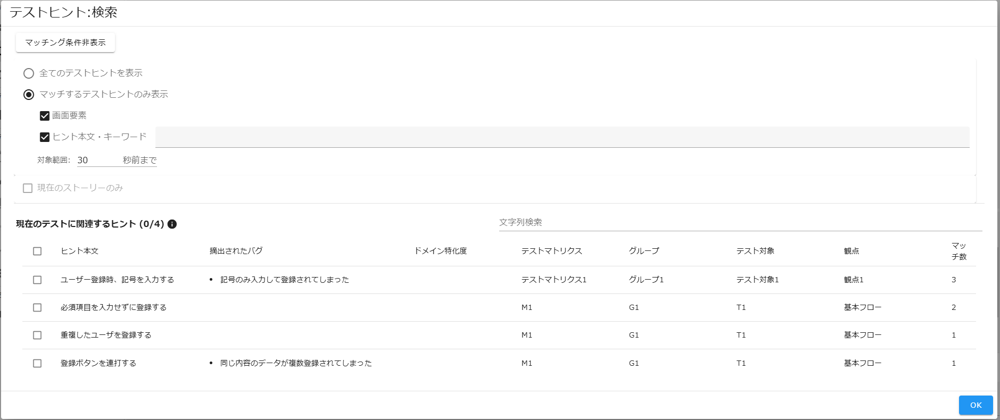
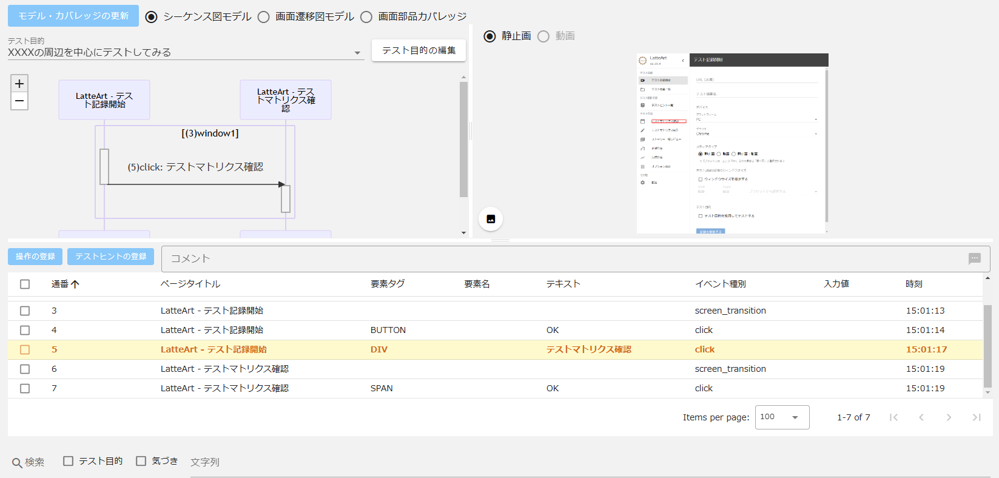
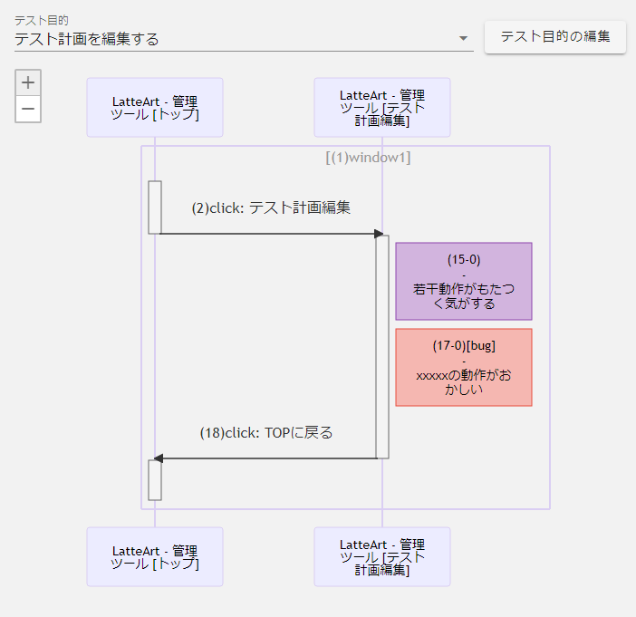
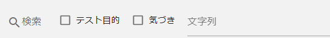

# テスト記録 操作説明書

テスト記録ではテスト対象サイト上で行われたユーザー操作を記録することができます。
本機能は以下の画面から構成されます。

- [テスト記録開始](#テスト記録開始)
  - [URL 入力欄](#url-入力欄)
  - [テスト結果名入力欄](#テスト結果名入力欄)
  - [デバイス](#デバイス)
  - [デバイスの詳細設定](#デバイスの詳細設定)
  - [メディアタイプ](#メディアタイプ)
  - [テスト目的](#テスト目的)
  - [記録を開始するボタン](#記録を開始するボタン)
- [テスト結果画面](#テスト結果画面)

  - [ヘッダー](#ヘッダー)
    - [URL 欄](#url-欄)
    - [テスト結果名欄](#テスト結果名欄)
    - [テスト開始/終了ボタン](#テスト開始終了ボタン)
    - [操作記録の一時停止/再開ボタン](#操作記録の一時停止再開ボタン)
    - [メニューボタン](#メニューボタン)
      - [テスト結果のエクスポート](#テスト結果のエクスポート)
      - [テストスクリプト生成](#テストスクリプト生成)
      - [テスト結果のリプレイ/リプレイの中止](#テスト結果のリプレイ中止)
      - [スクリーンショット出力](#スクリーンショット出力)
      - [テスト結果の比較](#テスト結果の比較)
      - [テスト結果の削除](#テスト結果の削除)
  - [フッター](#フッター)
    - [ブラウザバック・フォワードボタン](#ブラウザバックフォワードボタン)
    - [タブ・ウィンドウ切り替えボタン](#タブウィンドウ切り替えボタン)
    - [気づきの記録ボタン](#気づきの記録ボタン)
    - [メニューボタン](#メニューボタン-1)
      - [自動操作ボタン](#自動操作ボタン)
      - [自動入力ボタン](#自動入力ボタン)
      - [テストヒント検索ボタン](#テストヒント検索ボタン)
    - [経過時間](#経過時間)
  - [スクリーンショット出力ボタン](#スクリーンショット出力ボタン)
  - [モデル・カバレッジ更新ボタン](#モデルカバレッジ更新ボタン)
  - [シーケンス図モデル](#シーケンス図モデル)
  - [画面遷移図モデル](#画面遷移図モデル)
  - [画面要素カバレッジ](#画面要素カバレッジ)

- [テスト結果一覧](#テスト結果一覧)
  - [テスト結果のインポートボタン](#テスト結果のインポートボタン)
  - [テスト結果を読み込むボタン](#テスト結果を読み込むボタン)
  - [テスト結果名編集ボタン](#テスト結果名編集ボタン)
  - [テスト結果の削除ボタン](#テスト結果の削除ボタン)
  - [一覧の絞り込み](#一覧の絞り込み)

# テスト記録開始


新規テストの開始時の設定を入力し、テストの記録を開始することができます。  
新規のテストを行いたい場合等に使用してください。

:bulb: 過去のテスト結果は保存されているため、本画面を表示してしまった場合は、テスト結果一覧から「テスト結果を読み込むボタン」から再表示できます。

## URL 入力欄


テスト対象サイトの URL を入力する欄です。

## テスト結果名入力欄


テスト結果の名称を入力する欄です。
任意の名称を付与することができ、未記入の場合は自動的に付与されます。

## デバイス


デバイスの設定を行うことができます。

- プラットフォーム
  - テスト対象プラットフォームを指定する欄です。
- ブラウザ
  - テスト対象ブラウザを指定する欄です。
- ブラウザ起動時にリロードする
  - 記録開始後自動的にブラウザをリロードする秒数を指定する欄です。リロードさせない場合は 0 秒を指定してください。
  - :bulb: モバイル端末に対するテスト等で Chrome DevTools のリモートデバッグ機能を用いる際、接続された端末のブラウザ起動のタイミングによってはデバイスの認識が遅れ、ページを正しく表示できない場合があります。  
    その場合はデバイスが認識される秒数の後にリロードされるように本設定値で指定することで正しいページを表示させることができます。

## デバイスの詳細設定


USB で接続されているデバイスを選択することができます。  
「テスト対象設定」の「プラットフォーム」欄で`Android`もしくは`iOS`を選択した場合に活性化されます。

## メディアタイプ


記録時のメディア設定を行うことができます。

- 静止画  
  テスト画面を静止画で記録します。
- 動画  
  テスト画面を動画で記録します。
- 静止画＋動画  
  テスト画面を静止画と動画で記録します。

:bulb:動画に関する詳細は「[動画記録](../common/capture-video.md)」をご参照ください。

## テスト記録開始時のウィンドウサイズ


「ウィンドウサイズを指定する」にチェックを入れるとテスト対象のウィンドウサイズを指定することができます。

`Width` と `Height` には、前回のテスト記録で取得した最新の操作時のウィンドウサイズが保持されています。また、プリセットから選択することも可能です。

## テスト目的


「テスト目的を使用してテストする」にチェックを入れると最初のテスト目的を入力することができます。

:bulb: アドホックテスト等、特にテスト目的を決めずにテストを進めたい場合はチェックボックスを OFF のまま始めてください。

## 記録を開始するボタン


「URL 入力欄」に有効な URL を入力すると活性化され、押下するとブラウザが立ち上がり、「URL 入力欄」で入力された URL のページを表示し、記録が開始されます。

:bulb: 操作内容は`latteart-repository/`配下の`latteart.sqlite`に保存されます。  
:bulb: バージョン 1.7.5 以前の LatteArt の場合は`latteart-repository/public/test-results/`配下のディレクトリに保存されます。

:warning: LatteArt での記録中に画面遷移等で新しいページを開く際、ページが読み込まれる前に操作をすると LatteArt が正しく記録できない場合があります。完全にページがロードされてから操作するようにしてください。


また、記録中は左側のメニューバーにテスト結果画面へのショートカットメニューが表示されるため、設定画面など記録中に別画面を表示することができます。

:bulb:記録中にエラーや何らかの操作が必要なダイアログが表示された場合は、他の画面を表示中の場合でもテスト結果画面に自動で切り替わります。

# テスト結果画面


記録された操作郡の履歴、及び可視化されたモデルを確認できます。

## ヘッダー

### URL 欄


テスト対象サイトの URL を表示する欄です。任意の URL に変更すことができます。

### テスト結果名欄


テスト結果の名称を表示する欄です。任意の名称に変更することができます。

### テスト開始/終了ボタン


押下するとテストを開始できます。詳細は[記録を開始するボタン](#記録を開始するボタン)をご参照ください。  
記録開始後に再度押下するとブラウザが閉じ、記録が終了されます。

### 操作記録の一時停止/再開ボタン


テスト中に押下すると、LatteArt での操作記録を一時停止します。  
記録の停止中は、テスト対象サイト上でクリックやテキスト入力等の入力操作を行っても LatteArt に記録されません。  
停止中に再度押下すると、停止状態が解除され、以降の操作は通常通り LatteArt に記録されるようになります。

:bulb: テスト対象サイトによっては、LatteArt での記録中に画面要素を操作しても正しく動作しない場合がございます（クリックが反応しない等）。その場合は回避策として本機能をご利用ください。

:warning: テスト中に記録の一時停止を行った操作履歴は、「テスト結果のリプレイ」機能や「テストスクリプト生成」機能で利用した際に、正しく動作しない場合があります。

### メニューボタン


押下すると以下の機能一覧を表示します。

- テスト結果のエクスポート
- テストスクリプト生成
- テスト結果のリプレイ
- スクリーンショット出力
- テスト結果の比較
- テスト結果の削除

#### テスト結果のエクスポート

メニューボタンの一覧から押下するとエクスポートダイアログが表示され、現在表示しているテスト結果をエクスポートすることができます。
エクスポートファイル(zip)内の構成は以下の通り

- \{テスト結果名}\_YYYYDDMM_HHmmss.zip

```
  - スクリーンショット（静止画を記録している場合）
  - 動画（動画を記録している場合）
  - コメント情報(comments.json)
  - テスト結果情報(log.json)
  - 動的変更情報(mutations.json)
```

#### テストスクリプト生成

メニューボタンの一覧から押下すると現在表示しているテスト結果を元にテストスクリプトを生成します。  
詳細は「[テストスクリプト自動生成](../common/test-script-generation.md)」をご参照ください。

#### テスト結果のリプレイ・中止

メニューボタンの一覧から押下するとブラウザが立ち上がり、記録された操作が自動的に繰り返されます。操作の待ち時間はリプレイ時の設定によって変更がすることができます。
リプレイ開始後にメニューボタンの一覧から「リプレイの中止」を押下するとブラウザが閉じ、リプレイが中止されます。

また、リプレイ元のテスト結果とリプレイしたテスト結果を比較することもできます。  
詳細は「[テスト結果比較](../common/test-result-comparison.md)」をご参照ください。

#### スクリーンショット出力

メニューボタンの一覧から押下すると現在表示しているテスト結果のスクリーンショットをダウンロードすることができます。  
スクリーンショットファイル(zip)内の構成は以下の通り

- screenshots\_{テスト結果名}\_YYYYDDMM_HHmmss.zip

```
  - スクリーンショット(ファイル名：{連番}.webp/{連番}.png)
```

#### テスト結果の比較

読み込み中のテスト結果がリプレイで保存されたテスト結果の場合、リプレイ元のテスト結果と比較することができます。  
詳細は「[テスト結果比較](../common/test-result-comparison.md)」をご参照ください。

#### テスト結果の削除

メニューボタンの一覧から押下すると現在表示しているテスト結果を削除することができます。

## フッター


主に、記録中におけるコメントの付与やテスト対象ブラウザへの一部の操作を行うことができます。

### ブラウザバック・フォワードボタン


テスト中に押下すると、テスト対象ブラウザ上で「戻る」・「進む」が実行され、LatteArt に操作として記録されます。

:warning: 本ボタンを使わずに、ブラウザの「戻る」・「進む」をボタンを直接使用した場合、「戻る」・「進む」といった操作は記録されません。テスト中はテスト対象ブラウザの「戻る」・「進む」ボタンは使用せずに本ボタンを使用してください。

:warning: テスト対象サイト側でブラウザの「戻る」・「進む」機能を呼び出すというような実装がされている場合、LatteArt 側で管理している情報と正しく連動できなくなり、本ボタンの状態がおかしくなる場合があります。そのような実装がされている場合は、該当箇所の操作と本ボタンでの操作（ブラウザバック・フォワードの記録）は併用しないてください。

### タブ・ウィンドウ切り替えボタン


テスト中に押下するとダイアログが表示され、記録対象のタブ・ウィンドウを切り替えることができます。  
タブ・ウィンドウは検出された順に`window1:テスト対象ページタイトル`、`window2:テスト対象ページタイトル`という形で通番が振られて表示されます。

:warning: テスト対象ブラウザ上でアクティブなタブ・ウィンドウを切り替えた場合、LatteArt は自動的に新しくアクティブとなったタブ・ウィンドウを記録対象と認識しますが、ドメインの異なる画面を開いている他タブ・ウインドウに対しては自動的に切り替わりません。  
その場合は、本ボタンを使用して記録対象タブ・ウィンドウを手動で切り替えてください。

:warning: タブ・ウィンドウ切り替えダイアログは、本ボタン押下時以外に、ドメインの異なる別タブ・ウインドウが新しく開かれた際にも自動的に開かれます。

:warning: 非アクティブなタブ・ウィンドウは薄暗く表示され、クリックなどの操作を受け付けません。

### 気づきの記録ボタン


テスト開始時に**テスト目的を使用する**ように設定した場合は、テスト中に本ボタンを押下すると以下のダイアログが表示され、テスト目的・気づきを残すことができます。  
テスト目的に従ってテストした際の結果や次に行うテスト目的を入力することができます。

:bulb: 記録したテスト目的・気づきの編集・削除はシーケンス図、操作一覧からできます。


テスト中の気づきを記録する際、タグを付与することができます。  
タグはあらかじめ用意されているものの他、任意の文字列を入力して付与することもできます。  
プリセットのタグとして、以下のタグを用意しています。

- bug  
  完了になったセッション内に bug タグがついた気づきが存在する場合、ストーリーの摘出バグ数が加算されます。
- reported  
  LatteArt の他機能では利用されないため、単純なマーカーとして使用できます。BTS 等の LatteArt 外のシステムでバグを管理する際に、外部システム側に起票済みである旨を示すために使用すると便利です。


また、登録するスクリーンショットで現在のテスト画面を選択すると、気づき登録時のテスト画面のスクリーンショットを撮ることができます。  
直前の操作時のテスト画面を選択時は、「静止画を確認する」「動画を確認する」ボタンから直前の操作に紐づくテスト画面を確認することができます。


テスト開始時に**テスト目的を使用しない**ように設定した場合は、テスト中の気づきのみを入力できる以下のダイアログが表示されます。


### メニューボタン


押下すると以下の機能一覧を表示します。

- 自動操作
- 自動入力
- テストヒントを受ける

#### 自動操作

「自動操作：選択」ダイアログを表示します。自動操作セットが登録されている場合、活性化します。「自動操作」についての詳細は[「自動操作設定」](#自動操作設定)をご参照ください。

#### 自動入力

「自動入力：選択」ダイアログを表示します。有効な自動入力値セットがある場合、活性化します。「自動入力」についての詳細は[「自動入力設定」](#自動入力設定)をご参照ください。

#### テストヒントを受ける

テスト中に押下するとダイアログが表示され、現在のテストに関連するヒントが一覧で表示されます。



「現在のテストに関連するヒント」は、後述する「マッチング条件」に従って抽出されます。

#### マッチング条件

「全てのテストヒントを表示」と「マッチするテストヒントのみ表示」のいずれかの方式でテストヒントを抽出することができます。  
「マッチするテストヒントのみ表示」が選択されている場合、以下の条件を使ってテストヒントを抽出することができます。

- 画面要素
  - 有効の場合、登録済みのテストヒントに紐づけられた画面要素が、直近(※1)に行った操作で表示した画面内の要素と合致するものを抽出します。
- ヒント本文・キーワード
  - 有効の場合、登録済みのテストヒントの「ヒント本文」または「キーワード」が、入力欄に記載された単語と合致するものを抽出します。
  - :warning: 入力欄に記載する単語は、半角スペース区切りで設定してください。
  - :bulb: 入力欄のデフォルト値は「[テストヒント設定](../others/manual-config.md/#テストヒント設定)」に従って、直近(※2)に記録されたコメントから自動補完されます。

※1…最後に記録された操作の時刻から「対象範囲」で指定した秒数分前までの間  
※2…最後に記録されたコメントの時刻から「対象範囲」で指定した秒数分前までの間

また、「現在のストーリーのみ」が有効の場合、「全てのテストヒントを表示」「マッチするテストヒントのみ表示」によらず、抽出されたテストヒントは現在紐づいているストーリーに合致するものに絞り込まれます。

:bulb: 初期表示時は「マッチするテストヒントのみ表示」「画面要素」「ヒント本文・キーワード」が有効となっています。

#### 「現在のテストに関連するヒント」の表示順

- 表示されるテストヒントはヒント本文・キーワード、画面要素の一致数が多い順に降順で表示されます。
- カラムのソートなどで順番は変更可能です。
- テストヒント一覧の行をチェックするとチェックした行はグレーアウトし、次回ダイアログ表示時には一覧の最後尾に表示されます。  
   :bulb: チェックした行はテスト記録中のみ保持され、記録終了時にチェックは解除されます。

:bulb: 「現在のテストに関連するヒント」のラベル横の数字は、（マッチング数/全テストヒント数）を表しています。

### 経過時間


テスト開始からの経過時間が表示されます。

## スクリーンショット出力ボタン


押下すると、表示されているスクリーンショットをダウンロードできます。

## モデル・カバレッジ更新ボタン


操作履歴や設定が更新された場合に活性化され、押下すると「シーケンス図モデル」、「画面遷移図モデル」、「画面要素カバレッジ」の表示が最新化されます。

## シーケンス図モデル



テストの流れとテスト中に記録されたテスト目的・気づきを確認することができます。

### シーケンス図



テスト目的ごとにテストの大まかな流れを可視化したシーケンス図が表示されます。  
シーケンス図を表示するテスト目的は「テスト目的」プルダウンリストで切り替えることができます。  
また、プルダウンリスト横の「テスト目的の編集」ボタンからテスト目的の編集（内容の修正、紐づけ先の操作の変更）を行うことができます。

シーケンス図では以下情報が表示されます。

- 画面
  - 図内にアクター（図上部の四角）として表示されます。
  - クリックすると対応する操作のスクリーンショットが画面右上の表示領域に表示され、画面下部の「操作一覧」の対応する操作が選択状態となります。
- ウィンドウ
  - 図内に枠として表示されます。ウィンドウ枠のテキストには、`window1`や`window2`といったウィンドウ名が表示されます。
- 画面で行われた操作群
  - 図内にアクティベーションボックス（縦長の細い四角）で表示されます。
  - クリックすると対応する操作のスクリーンショットが画面右上の表示領域に表示され、画面下部の「操作一覧」の対応する操作が選択状態となります。
- 画面遷移
  - 図内に矢印として表示されます。
  - テキストをクリックすると対応する操作のスクリーンショットが画面右上の表示領域に表示され、画面下部の「操作一覧」の対応する操作が選択状態となります。
- テスト中の気付き
  - 図内に四角として表示されます。
    - `bug`タグが付与されている場合は赤色、それ以外は紫色で表示されます。
  - クリックすると対応する操作のスクリーンショットが画面右上の表示領域に表示され、画面下部の「操作一覧」の対応する操作が選択状態となります。
  - 右クリックすることで、気づきの編集（内容の修正、紐づけ先の操作の変更）・削除を行うことができます。

図左上の+/-ボタンで図の拡大/縮小が行えます。  
図内の「（数字）」は記録された操作の通番を意味します。

### 操作の登録ボタン


操作一覧のチェックボックスがチェックされた操作を自動操作セットとして登録するダイアログを表示します。

### テストヒントの登録ボタン


操作一覧のチェックボックスがチェックされた操作をテストヒントの対象範囲としてテストヒントを登録するダイアログを表示します。  
登録ダイアログの詳細は[「テストヒント登録ボタン」](../test-design-support//manual-test-design-support.md/#テストヒント登録ボタン)をご参照ください。

### コメント登録欄


テストヒントの登録・検索のためのコメントを入力し、ボタン押下で登録します。

### 操作一覧


テスト中に記録された操作履歴の以下情報がテーブルとして表示されます。  
また、自動入力および自動操作で実行された操作は、手動操作と区別できるようブルーで表示され、テスト記録の一時停止中の画面遷移操作と記録中に登録されたコメントはグレーで表示されます。

- チェックボックス
  - 自動操作用の操作セット登録のためのチェックボックスが表示されます。  
    :bulb:見出しのチェックボックスを押下すると表示されているページ範囲の全選択と全選択解除ができます。  
    :bulb:Shift キー押下による複数選択が行うことができます。  
    :bulb:次ページへ切替を行ってもチェックボックスの選択状態は維持されます。
- 通番
  - テストを行った順番が表示されます。
- ページタイトル
  - 操作が行われた画面のタイトルが表示されます。
- 要素タグ
  - 操作が行われた画面要素のタグが表示されます。
- 要素名
  - 操作が行われた画面要素の名前が表示されます。
- テキスト
  - 操作が行われた画面要素の表示文字列が表示されます。
- イベント種別
  - 操作により発火されるイベントの種別が表示されます。また、通常のイベントの他に LatteArt 独自の以下イベント種別も表示されます。
    - `start_capturing`
      - 記録開始したことを意味します。
    - `open_window`
      - 新規ウィンドウが開かれたことを意味します。
    - `screen_transition`
      - 画面遷移を検出したことを意味します。
    - `switch_window`
      - タブ・ウィンドウ切り替えが行われたことを意味します。
    - `browser_back`
      - LatteArt にて指示されたブラウザバックが行わえたことを意味します。
    - `browser_forward`
      - LatteArt にて指示されたブラウザフォワードが行われたことを意味します。
- 入力値
  - 操作にて入力された値が表示されます。
- 時刻
  - 操作を行った時刻が表示されます。

各行が 1 操作に対応し、操作に関連する画面要素の情報や入力値を確認することができ、各行をクリックすると、対応する操作のスクリーンショットが画面右上の表示領域に表示されます。  
また、テーブルの見出しをクリックすることでソート（昇順/降順/記録順）、テーブル下部で一度に表示される行数の変更や改ページを行うことができます。

### 検索欄



- テスト目的・気づきチェックボックス

  - チェックボックスに応じて「操作一覧」のテーブルをテスト目的や気づきを持つ行のみに絞り込むことができます。

- 文字列入力欄
  - 任意の文字列を入力すると、「操作一覧」のテーブルを指定の文字列を含む行のみに絞り込むことができます。

:warning: 絞り込みをリセットしたい場合は検索欄を空にしてください。

## 画面遷移図モデル

テスト中に到達した画面と各画面遷移時の情報を確認することができます。


### 画面遷移図


テスト中に記録した以下情報を可視化した画面遷移図が表示されます。

- 画面
  - 図内に四角として表示されます。
  - クリックすると対応する操作のスクリーンショットが画面右上の表示領域に表示され、画面下部の「入力値一覧」にクリックした画面から遷移する全ての画面遷移群の入力値情報が表示されます。
- 遷移契機
  - 図内に矢印として表示されます。
  - テキストをクリックすると対応する操作のスクリーンショットが画面右上の表示領域に表示され、画面下部の「入力値一覧」にクリックした画面遷移の入力値情報が表示されます。

図左上の+/-ボタンで図の拡大/縮小が行えます。

### 入力値一覧


画面遷移時、その画面の各画面要素に入力されている値のセットをテーブルで表示します。

各行は 1 画面要素に対応し、各画面遷移時における各画面要素に入力されていた値を確認することができ、各行をクリックすると、対応する画面要素のスクリーンショットが画面右上の表示領域に表示されます。  
同一画面遷移が複数回行われた場合は、それぞれの画面遷移時の入力値群が列として表示されます。  
また、テーブル下部で一度に表示される行数の変更や改ページを行うことができます。

入力値一覧の表示は以下のチェックボックスにより、カスタマイズすることができます。

- 明示的に入力された値以外をグレーアウトする
  - 本チェックボックスを ON にすると、テスト中の操作にて明示的に入力された値以外（デフォルト値等の元々画面要素に入っていた値）のセルをグレーアウトして表示します。
- hidden 要素は表示しない
  - ON にすると入力値一覧から hidden 要素が非表示になります。
- 入力値セット登録ボタン（＋ボタン）
  - 「自動入力：登録」ダイアログが開きます。該当する列の値を入力値セットとして登録することができます。「自動入力」についての詳細は[「自動入力設定」](#自動入力設定)をご参照ください。

## 画面要素カバレッジ


テスト中に到達した各画面内における、画面要素の操作網羅率を確認することができます。

:bulb: カバレッジの計算対象に含めるタグは設定画面にてカスタマイズできます。

各画面名をクリックすると、画面内の画面要素一覧が表示され、一度も操作されていない画面要素は赤色、操作済の画面要素は緑色の行として表示されます。

# テスト結果一覧


記録したテスト結果の一覧が表示され、以下の操作を行うことができます。

- テスト結果のインポート
- テスト結果を読み込む
- テスト結果名編集
- テスト結果の削除
- 一覧の絞り込み

## テスト結果のインポートボタン


押下するとインポートダイアログが表示され、選択したテスト結果をインポートすることができます。  
インポートしたテスト結果は「テスト結果を読み込むボタン」を押下することで読み込むことができます。  
インポートファイル(zip)内の構成は以下の通り

- \{テスト結果名}\_YYYYDDMM_HHmmss.zip

```
  - スクリーンショット（静止画を記録している場合）
  - 動画（動画を記録している場合）
  - コメント情報(comments.json)
  - テスト結果情報(log.json)
  - 動的変更情報(mutations.json)
```

:bulb: zip ファイル名はエクスポート時は上記のように出力されるがファイル名の指定は自由となります。  
:bulb: バージョン 1.7.5 以前の LatteArt のデータをインポートしたい場合は
`latteart-repository\public\test-results`配下の`session`から始まるフォルダ配下の全ての画像ファイルと log.json を選択して zip したものをインポートします。

## テスト結果を読み込むボタン


押下すると選択したテスト結果を読み込むことができます。  
読み込んだテスト結果はテスト結果画面ヘッダーの「テスト開始」ボタンを再度押下することで、セッションの続きからテストを行うことができます。

## テスト結果名編集ボタン


押下するとテスト結果名編集ダイアログが表示され、テスト結果名を編集することができます。

## テスト結果の削除ボタン


チェックボックスでテスト結果を選択し、一覧下部の「テスト結果の削除」ボタンを押下するとテスト結果を削除することができます。

## 一覧の絞り込み

　

一覧上部の「Search」部分で任意の文字列を入力すると一覧を絞り込むことができます。
