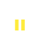
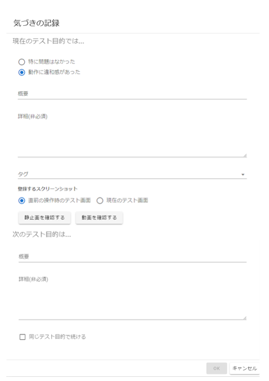
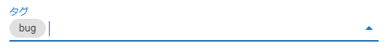
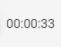
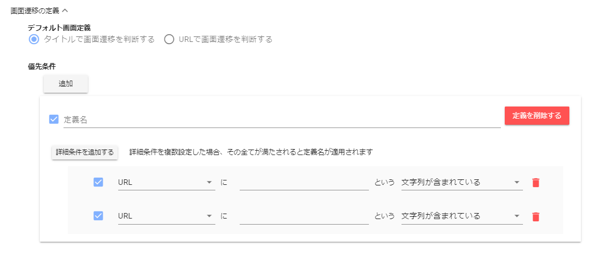

# Capturing Tool Manual

A capturing tool is a tool that captures user actions performed on the tested site.
This tool consists of the following screens.

- [Header](#header)
  - [URL input field](#url-input-field)
  - [Test result name input field](#test-result-name-input-field)
  - [Test start/end button](#test-startend-button)
  - [Operation capture pause/resume button](#operation-capture-pauseresume-button)
  - [History reset button](#history-reset-button)
  - [Past test result load button](#past-test-result-load-button)
  - [Menu button](#menu-button)
    - [Import data](#import-data)
    - [Generate script](#generate-script)
    - [Export data](#export-data)
    - [Play history/Stop playing history](#play-historystop-playing-history)
    - [Screenshot output](#screenshot-output)
    - [Delete test results](#deletettest-results)
  - [Language](#language)
  - [Repository URL input field](#repository-url-input-field)
  - [Connect button](#connect-button)
- [Footer](#Footer)
  - [Browser back/forward button](#browser-backforward-button)
  - [Tab window switching button](#tab-window-switching-button)
  - [Memo button](#memo-button)
  - [Screen switch button](#screen-switch-button)
  - [Elapsed time](#elapsed-time)
- [Setting screen](#setting-screen)
  - [Test target settings](#test-target-settings)
  - [Advanced device settings](#advanced-device-settings)
  - [Image compression settings](#image-compression-settings)
  - [Set screen element coverage](#set-screen-element-coverage)
  - [Screen transition definition](#screen-transition-definition)
- [History screen](#history-screen)
  - [Screenshot output button](#screenshot-output-button)
  - [Model coverage update button](#model-coverage-update-button)
  - [Sequence diagram model](#sequence-diagram-model)
  - [Screen transition diagram model](#screen-transition-diagram-model)
  - [Screen element coverage](#screen-element-coverage)

# Header


You can start and end tests, load past test results, replay captured actions, and more.

## URL input field


This is the field to enter the URL of the site to be tested.

## Test result name input field


This is a field to enter the name of the test result.
Any name can be given, and it will be given automatically if it is not entered.

## Test start/end button


If you enter a valid URL in the "URL input field", it will be activated, and when you press it, you can enter settings such as whether to test using the test purpose from the following dialog, and in that case, what to do with the first test purpose.

:bulb: If you want to proceed with the test without deciding the purpose of the test, such as an ad-hoc test, you can start by turning off the check box.

:bulb: If you are connected remotely, you can upload the test results to the remote connection when the test is finished.


When you press the "OK" button in the dialog, the browser will be launched, the page of the URL entered in the "URL input field" will be displayed, and recording will start.

:bulb: Operation contents are saved in `latteart.sqlite` under `latteart-repository/`.
:bulb: For LatteArt version 1.7.5 or earlier, it will be saved in the directory under `latteart-repository/public/test-results/`.

:warning: While capturing with LatteArt, when opening a new page by screen transition etc., LatteArt may not be able to capture correctly if you operate before the page is loaded. Please allow the page to fully load before proceeding.

If you press it again after capturing starts, the browser will close and capturing will end.

## Operation capture pause/resume button




When pressed during testing, operation capturing in LatteArt is paused.
While capturing is stopped, LatteArt will not record any input operations such as clicking or entering text on the test site.
If you press it again while stopped, the stopped state will be canceled and subsequent operations will be recorded in LatteArt as usual.

:bulb: Depending on the test site, even if you operate screen elements while capturing with LatteArt, it may not work properly (clicks do not respond, etc.). In that case, please use this function as a workaround.

:warning: The operation history that paused capturing during the test may not work properly when used with the "Replay history" function or "Generate script" function.

## History reset button


Press to clear the captured test history. Use this when you want to start the test from the beginning.

:bulb: Past test results are saved, so if you accidentally reset them, you can restore them by pressing the "Load past test results button".

## Past test result load button


When pressed, a list of saved test result names is displayed, and the selected test result can be loaded.
The loaded test results can be tested from the continuation of the session by pressing the "Test start button" again.

## Menu button


When pressed, the following function list is displayed.

- Import data
- Generate script
- Export data
- Play history/Stop playing history
- Screenshot output
- Delete test results

### Import data

When you press it from the list of menu buttons, you can get and display a list of zip file names under the `latteart-repository\public\imports` folder, and you can import the selected test results.
The imported test results can be read by selecting the test results from the "Load past test results button".
The contents in the import file (zip) are as follows.

- test_result_YYYYDDMM_HHmmss.zip

```
  - Screenshots
  - Test result information (log.json)
```

:bulb: The zip file name is output as above when exporting, but the file name can be specified freely.
:bulb: If you want to import LatteArt data before version 1.7.5, select and zipped all image files and log.json under the folder starting with `session` under `latteart-repository\public\test-results` and then import it.

### Generate script

When you press it from the list of menu buttons, a test script is generated based on the currently displayed test results.
For details, see "[Generate test script automatically](../common/test-script-generation.md)".

### Export data

You can export the currently displayed test results by pressing from the list of menu buttons.
The contents in the export file (zip) are as follows.

- test_result_YYYYDDMM_HHmmss.zip

```
   - Screenshots
   - Test result information (log.json)
```

### Play history/Stop playing history

When you press the button from the list of menu buttons, the browser is launched and the captured operation including the timing of the operation is automatically repeated as it is.
If you press "Stop Playing History" from the list of menu buttons after playback has started, the browser will close and playback will stop.

### Screenshot output

You can download a screenshot of the currently displayed test result by pressing it from the list of menu buttons.
The structure in the screenshot file (zip) is as follows.

- screenshots\_{test result name}\_YYYYDDMM_HHmmss.zip

```
  - Screenshots (file name: {serial number}.webp/{serial number}.png)
```

### Delete test results

You can delete the currently displayed test results by pressing from the list of menu buttons.

## Language


You can switch the display language.

- ja (Japanese)
- en (English)

## Repository URL input field


This is the field to enter the repository URL.
When you open the pull-down, repository URLs that have been connected in the past are displayed as selection candidates.

## Connect button


You can connect to the URL mentioned in Repository URL.
When you enter the URL in the repository URL input field, you can press the connect button.

:bulb:By specifying the repository URL of others (latteart-repositoryURL), you can access and update the data of others' environments.

# Footer


Mainly, you can add comments during capturing and perform some operations on the test target browser.

## Browser back/forward button


When pressed during the test, "Back" and "Forward" are executed on the test target browser and captured as operations in LatteArt.

:warning: If you use the browser's "back" and "forward" buttons directly without using this button, "back" and "forward" operations will not be captured. Please use this button instead of the "back" and "forward" buttons of the test target browser during the test.

:warning: If the test site is implemented to call the browser's "back" and "forward" functions, it will not be possible to correctly link with the information managed by LatteArt, and the state of this button will be strange. You might. If such an implementation is implemented, please do not use this button together with the operation of the corresponding part (capturing of browser back/forward).

## Tab window switching button


When pressed during the test, a dialog will be displayed, allowing you to switch between tabs and windows to be captured.
Tab windows are displayed with serial numbers in the form of `window1` and `window2` in the order they are detected.

:warning: When you switch the active tab/window on the tested browser, LatteArt automatically recognizes the newly active tab/window as the target for capturing, but other tabs with different domains open windows will not switch automatically.
In that case, use this button to manually switch the tab/window to be captured.

:warning: The tab/window switching dialog is automatically opened when a new tab/window is opened in addition to when this button is pressed.

:warning: Inactive tab windows are dimmed and do not accept clicks or other actions.

## Memo button


If you set **Use test purpose** at the start of the test, pressing this button during the test will display the following dialog and you can leave a memo.
In the memo, you can enter the result of testing according to the test purpose and the purpose of the next test.

:bulb: Recorded memos can be edited and deleted from the sequence diagram and operation list.



You can add tags when recording notes during the test.
In addition to the tags that are prepared in advance, you can also enter an arbitrary character string to add it.



If you set **Do not use test purpose** at the start of the test, you will see the following dialog where you can enter only your observations during the test.


## Screen switch button

When pressed, you can switch the screen of the currently displayed capturing tool.

- Switch to [Setting screen](#setting-screen)
  

- Switch to [History screen](#history-screen)
  

## Elapsed time



Elapsed time from the start of the test is displayed.

## Setting screen


You can set the test target and display settings for visualizing the captured operations.
Various settings are saved in real time when changed.

## Test target settings


You can set the test target.

- Platform
   - This field specifies the platform to be tested.
- Browser
   - This field specifies the browser to be tested.
- Reload on browser startup
   - A field to specify the number of seconds to automatically reload the browser after capturing starts. Specify 0 seconds if you do not want to reload.
   - :bulb: When using the remote debugging function of Chrome DevTools for testing on mobile devices, etc., the device recognition may be delayed depending on the timing of browser startup on the connected device, and the page may not be displayed correctly.
     In that case, you can display the correct page by specifying this setting value so that it will be reloaded after the number of seconds that the device is recognized.

## Advanced device settings


You can select a device connected by USB.
It is activated when `Android` or `iOS` is selected in the 'Platform' field of 'Test Target Settings'.

- Update device information
   - Press to search for connected devices again.
   - :bulb: If you connect the device after opening the settings screen, the information may not be up to date. In that case, please press this button to obtain the latest information.
- Device selection
   - You can select the device to be tested when there are multiple devices connected.
- OS version
   - Displays the OS version of the selected device under test.

## Image compression settings


You can configure compression settings for screenshot images.

- Compress captured screenshots
  - When turned ON, captured screenshots will be compressed and saved in the repository. It is effective when you want to save disk space.
- Delete original image
  - When turned ON, the original data before compression is deleted when compressing screenshots. If you want to keep the original data before compression as a backup, turn it off.

:warning: Image compression may fail if you continuously operate quickly or under high CPU load.

## Set screen element coverage


You can configure screen element coverage settings.

- Tags to include in coverage calculations
  - You can specify the tags to include in the calculation of screen element coverage.

## Screen transition definition



You can set the granularity to be recognized as a "screen" for each model on the history screen.

### Default screen definition

Select whether to recognize screens by page title or by URL.

- Judge the screen transition by the title.
   - When turned ON, screens with the same page title will be grouped together as the same screen in various models of the history screen.
- Judge the screen transition by URL.
   - When turned ON, screens with the same URL will be grouped together as the same screen in various models of the history screen.

### Priorities

A preferred screen definition that takes precedence over the default screen definition.
If you want to recognize only screens that meet specific conditions as other screens as an exception, please make detailed settings in this setting.
Priority conditions are grouped in order from the highest priority.

- Add button
  - Add a screen definition to be used preferentially.
- Enable/disable (priority condition) checkbox
  - ON enables the priority condition.
- Definition name
  - If all detailed conditions are met, the screens will be grouped together and replaced with the screen name specified in "Definition Name".
- Delete definition button
  - Delete definition.
- Button to add detailed conditions
  - Add detailed conditions.
- Detailed conditions
  - Enable/disable (detailed conditions) checkbox
    - When set to ON, detailed conditions for the corresponding row are enabled.
  - Detailed conditions (match type, text, match method)
    - The specified text is "URL/Title/Keyword" selected in Match Type and "Contains String/Matches String/Matches regular expression" selected in Match Method to determine if it matches.
  - Detailed condition delete button
    - Delete the detailed condition of the corresponding line. Displayed only when there are two or more detailed conditions. If you want to delete all detailed conditions, delete the definition.

# History screen


You can check the history of captured operations and the visualized model.

## Screenshot output button


When you press it, you can open the displayed screenshot in a separate tab and download it with any name.

## Model coverage update button


It is activated when the operation history and settings are updated, and when pressed, the display of "sequence diagram model", "screen transition diagram model", and "screen element coverage" is updated.

## Sequence diagram model


You can check the flow of the test and the notes recorded during the test (test purpose, what you noticed during the test).

### Sequence Diagram


A sequence diagram that visualizes the rough flow of the test and the following captured information is displayed.

- Screen
  - Shown in the diagram as an actor (the square at the top of the diagram).
  - When clicked, a screenshot of the corresponding operation will be displayed in the display area on the upper right of the screen, and the "operation list" display at the bottom of the screen will be narrowed down to only related operations.
- Window
  - Displayed as a frame in the diagram. The window border text displays the window names, such as `window1` and `window2`.
- Operations performed on the screen
  - Displayed as activation boxes (thin vertical squares) in diagrams.
  - When clicked, a screenshot of the corresponding operation will be displayed in the upper right display area of ​​the screen, and the "operation list" display at the bottom of the screen will be narrowed down to only the operations performed at that location.
- Screen transition
  - Appears as an arrow in the diagram.
  - If you click the text, a screenshot of the corresponding operation will be displayed in the upper right display area of ​​the screen, and the "operation list" display at the bottom of the screen will be narrowed down to only the operations performed on the transition source screen.
- Test purposes
  - Displayed as a frame in the diagram.
  - By right-clicking the text in the frame, you can edit the memo (modify the content, change the operation of the linked destination) or delete it.
- Awareness during testing
  - Appears as a square in the diagram.
    - If a `bug` tag is attached, it will be displayed in red, otherwise it will be displayed in purple.
  - When clicked, a screenshot of the corresponding operation will be displayed in the display area on the upper right of the screen, and the "operation list" display at the bottom of the screen will be narrowed down to only related operations.
  - By right-clicking, you can edit the memo (modify the content, change the operation of the linked destination) or delete it.

You can enlarge/reduce the figure with the +/- button on the upper left of the figure.
"(number)" in the figure means the serial number of the recorded operation.

### Filter reset button


Restores the display of the operation list narrowed down by the operation of the sequence diagram.

### Operation list


The following information of the operation history captured during the test is displayed as a table.

- serial number("通番")
  - The order in which the tests were performed is displayed.
- page title("ページタイトル")
  - The title of the screen where the operation was performed is displayed.
- element tag("要素タグ")
  - Displays the tag of the screen element where the operation was performed.
- element name("要素名")
  - Displays the name of the screen element where the operation was performed.
- text("テキスト")
  - Displays the display string of the screen element where the operation was performed.
- event type("イベント種別")
  - Displays the type of event triggered by the operation. In addition to normal events, the following event types unique to LatteArt are also displayed.
    - `screen_transition`
      - Means that a screen transition was detected.
    - `switch_window`
      - Means that a tab/window switch was performed.
    - `browser_back`
      - Means that the browser back indicated by the capturing tool was performed.
    - `browser_forward`
      - Means that the browser forward indicated by the capturing tool was performed.
- Input value("入力値")
  - Displays the value entered in the operation.
- Times of Day("時刻")
  - Displays the time when the operation was performed.

Each line corresponds to one operation, and you can check the information and input values of the screen elements related to the operation. Clicking each line displays the screenshot of the corresponding operation in the display area on the upper right of the screen.
Also, by clicking the table header, you can sort (ascending/descending/capturing order), change the number of rows displayed at one time, and change the page at the bottom of the table.

### Search field


- Purpose/awareness check box
  - Depending on the check box, you can narrow down the "Operation list" table to only rows with a purpose or awareness.

- Character string input field
  - By entering any character string, you can narrow down the "Operation list" table to only the rows that contain the specified character string.

:warning: Filtering by this input field will not be reset even if you press the "Filter reset button". If you want to reset the narrowing down in this search field, please empty the search field.

## Screen transition diagram model

You can check the screens reached during the test and the information at each screen transition.


### Screen transition diagram


A screen transition diagram that visualizes the following information recorded during the test is displayed.
A figure is generated for each recorded window, and you can select the figure to display in "Target tab/window(対象タブ/ウィンドウ)".

- Screen
  - Appears as a square in the diagram.
  - When clicked, a screenshot of the corresponding operation is displayed in the display area on the upper right of the screen, and the input value information of all screen transition groups that transition from the clicked screen is displayed in the "Input value list" at the bottom of the screen.
- Transition opportunity
  - Appears as an arrow in the diagram.
  - When you click the text, a screenshot of the corresponding operation is displayed in the upper right display area of ​​the screen, and the input value information of the clicked screen transition is displayed in the "Input value list" at the bottom of the screen.

You can enlarge/reduce the figure with the +/- button on the upper left of the figure.

### List of input values


At the time of screen transition, the set of values ​​entered in each screen element of that screen is displayed in a table.

Each line corresponds to one screen element, and you can check the values ​​entered for each screen element at each screen transition. Clicking on each line displays a screenshot of the corresponding screen element in the display area at the top right of the screen.
If the same screen transition is performed multiple times, the input value group at each screen transition is displayed as a column.
You can also change the number of rows displayed at one time and page breaks at the bottom of the table.

The display of the input value list can be customized by the following check boxes.

- Gray out values ​​other than explicitly entered values
  - When this check box is turned ON, cells other than the values ​​explicitly entered in the operation under test (values ​​originally included in screen elements such as default values) are displayed grayed out.
- do not show hidden elements
  - When set to ON, the hidden element is hidden from the input value list.

## Screen element coverage


You can check the operation coverage of screen elements in each screen reached during the test.

:bulb: Tags to be included in coverage calculation can be customized in the settings screen.

When you click each screen name, a list of screen elements in the screen is displayed. Screen elements that have not been operated are displayed in red, and screen elements that have been operated are displayed in green.
