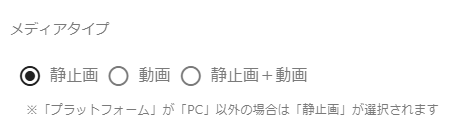

# テストの録画

テスト記録開始時に「メディアタイプ」で「静止画＋動画」を選択すると、テスト記録時にテスト中の画面を**動画** で記録するようになります。

:warning: 記録された動画は以下の機能では利用できません。

- スクリーンショット出力
- テストスクリプト生成（生成後の doc 上でのスクリーンショット表示）
- テスト結果の比較（画像・動画の比較）

## :warning: 記録時の注意

テストを始める前に事前準備として録画対象のウィンドウを選択する必要があります。  
記録を開始すると、共有ウィンドウ(録画対象のウィンドウ)を選択するダイアログが表示されます。

ダイアログ上で「ウィンドウ」タブからテスト対象のページが表示されているウィンドウを選択し、「共有」ボタンを押下します。  
以降、テスト対象のページで行った操作が録画されるようになります。

## メディアタイプ

テスト記録開始画面の「メディアタイプ」から設定ができます。  
メディアタイプを「静止画＋動画」に設定することでテスト画面を動画で記録することができます。

:warning:記録中に設定を変えることはできません。記録終了後に設定を変更し、テストを再開することは可能です。
