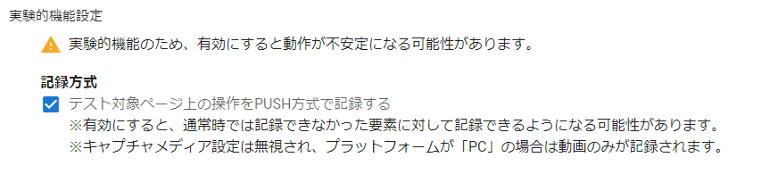

# テストの録画

「キャプチャメディア設定」の「メディアタイプ」で「静止画＋動画」または「実験的機能設定」の「テスト対象ページ上の操作を PUSH 方式で記録する」を ON にすると、テスト記録時にテスト中の画面を**動画** で記録するようになります。

:warning: 実験的機能のため、一部操作で正しく動作しない場合があります。 現時点で以下の機能を使用することできません。

- スクリーンショット出力
- テストスクリプト生成（生成後の doc 上でのスクリーンショット表示）
- テスト結果の比較（画像・動画の比較）

## :warning: 記録時の注意

テストを始める前に事前準備として録画対象のウィンドウを選択する必要があります。  
記録を開始すると、共有ウィンドウ(録画対象のウィンドウ)を選択するダイアログが表示されます。

ダイアログ上で「ウィンドウ」タブからテスト対象のページが表示されているウィンドウを選択し、「共有」ボタンを押下します。  
以降、テスト対象のページで行った操作が録画されるようになります。

## キャプチャメディア設定

設定画面の「キャプチャメディア設定」からキャプチャメディアの設定ができます。  
メディアタイプを静止画＋動画に設定することでテスト結果を動画で記録することができます。

:warning:記録中に設定を変えることはできません。記録終了後に設定を変更し、テストを再開することは可能です。

## 実験的機能設定

設定画面の「実験的機能設定」から設定ができます。  
「テスト対象ページ上の操作を PUSH 方式で記録する」を ON に設定することでテスト結果を動画で記録することができます。

:warning:記録中に設定を変えることはできません。記録終了後に設定を変更し、テストを再開することは可能です。  
:warning:実験的機能設定を ON にするとキャプチャメディア設定の選択は無効となります。
