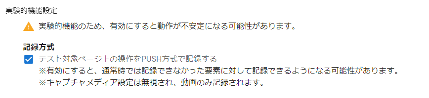

# 実験的機能設定

## 記録方式

設定画面の「実験的機能設定」から設定ができます。  
「テスト対象ページ上の操作を PUSH 方式で記録する」を ON に設定することで通常時では記録できなかった要素に対して記録ができるようになる可能性があります。

:warning:記録中に設定を変えることはできません。記録終了後に設定を変更し、テストを再開することは可能です。  
:warning:実験的機能設定を ON にするとキャプチャメディア設定の選択は無効となり、動画のみ記録されます。動画記録の詳細は「[動画記録](../common/capture-video.md)」をご参照ください。
