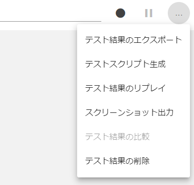
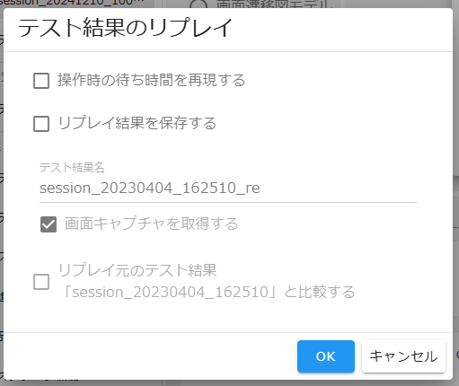
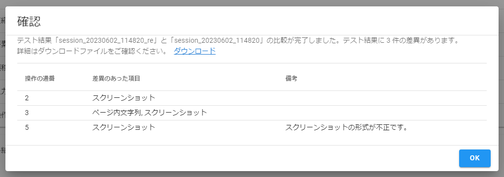
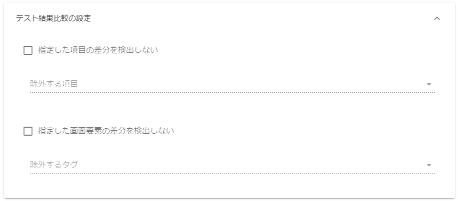
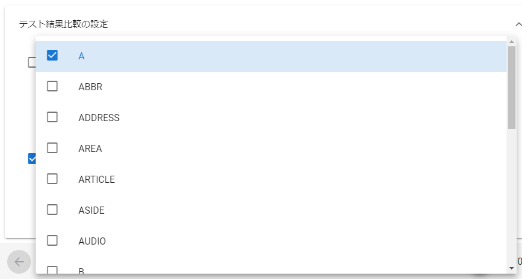

# テスト結果比較

既存のテスト結果とリプレイしたテスト結果の各操作を比較し、**操作後の画面状態(表示文言や画像等)** の差分を検出します。  
テスト結果比較機能はテスト記録機能でのみ利用可能です。

:warning: スクリーンショットの比較は現在 PNG 形式のみ対応しております。 **スクリーンショットの比較を行いたい場合は、設定画面の画像圧縮設定を png にしてください。**

テスト結果の比較を行うには、リプレイ時のテスト結果を保存する必要があります。  
保存方法については、「[リプレイ結果の保存](#リプレイ結果の保存)」を参照してください。

## 事前準備(リプレイ対象のテスト結果の準備)

テスト結果のリプレイを行うためには、事前にテスト記録機能で操作記録を行い、結果を保存しておく必要があります。  
操作記録についての詳細は「[LatteArt チュートリアル （操作記録編）](/docs/tutorial/capture/tutorial-capture.md)」をご確認ください。

## リプレイ結果の保存



リプレイ対象のテスト結果を読み込んだ状態で、テスト結果画面ヘッダ部のメニューボタンから「テスト結果のリプレイ」を選択するとダイアログが表示されます。



ダイアログ上で「リプレイ結果を保存する」チェックボックスを ON にし、「OK」ボタンからリプレイを実行すると、リプレイ時のテスト結果を保存することができます。

:bulb: 保存するテスト結果は任意の名前を付与することができます。  
:bulb: テスト結果を保存する際、画面キャプチャを取得するかどうか選択することができます。

また、「リプレイ元のテスト結果「xxxxxx」と比較する」チェックボックスを ON にすることで、保存したテスト結果をリプレイ元のテスト結果と差分比較することができます。



比較が完了すると確認ダイアログが表示され、出力された差分情報をダウンロードすることができます。  
差分情報の詳細は「[比較結果の確認](#比較結果の確認)」を参照してください。

## 既存のリプレイ結果の比較


一度保存したリプレイ結果は、テスト結果一覧画面から「テスト結果を読み込む」から読み込んだ後、テスト結果画面ヘッダ部のメニューボタンから「テスト結果の比較」を選択することで、いつでもリプレイ元のテスト結果と差分比較することができます。

:bulb: リプレイ元が見つからないテスト結果(リプレイ結果以外のテスト結果)を読み込んでいる場合は、「テスト結果の比較」は非活性になり選択できません。

## 比較結果の確認

テスト結果の比較を行うと、差分情報が zip ファイル(`compare_YYYYMMDD_HHmmss.zip`)で出力されます。  
出力ファイル(zip)内の構成は以下の通りです。

```bash
compare_YYYYMMDD_HHmmss/
    ├ screenshots/ # 差分画像
    │       ├ 3.png # 操作の通番.png
    │       └ 5.png # 操作の通番.png
    │
    └ result.json # 比較結果
```

### screenshots ディレクトリ

画像に差異があった場合、差分画像が出力されます。差分画像では差異があった箇所が赤く色付けされます。

### result.json

テスト結果比較の結果です(JSON 形式)。
差異は操作後の画面状態の内、以下項目に対して抽出されます。

| 項目名       | 説明               |
| ------------ | ------------------ |
| title        | ページタイトル     |
| url          | ページ URL         |
| elementTexts | ページ内文字列     |
| screenshot   | スクリーンショット |

```jsonc
{
  "targetNames": {
    "actual": "テスト結果1", // 比較先のテスト結果名
    "expected": "テスト結果2", // 比較元のテスト結果名
  },
  "result": {
    "isOk": false, // テスト全体の合否
    "steps": [
      {
        "isOk": false, // 操作毎の合否
        "items": {
          "title": {
            "isOk": true, // ページタイトルの合否
            "actual": "aaa", // 比較先のテスト結果側の値
            "expected": "aaa", // 比較元のテスト結果側の値
          },
          "url": {
            "isOk": true, // ページURLの合否
            "actual": "aaa",
            "expected": "aaa",
          },
          "elementTexts": {
            "isOk": false, // ページ内文字列の合否
            "actual": [
              { "tagname": "H1", "value": "aaa" },
              { "tagname": "A", "value": "aaa" },
              { "tagname": "A", "value": "aaa" },
            ],
            "expected": [
              { "tagname": "H1", "value": "bbb" },
              { "tagname": "A", "value": "bbb" },
              { "tagname": "A", "value": "bbb" },
            ],
          },
          "screenshot": {
            "isOk": false, // スクリーンショットの合否
            "diffFilePath": "screenshots/3.png", // 差分画像のファイルパス
          },
        },
      },
      {
        // ...
      },
      {
        // ...
      },
    ],
  },
}
```

## テスト結果比較の設定



設定画面の「テスト結果比較の設定」から比較対象等をカスタマイズできます。

### 指定した項目の差分を検出しない


操作後の画面状態の内、比較時に無視する項目を指定することができます。

### 指定した画面要素の差分を検出しない



比較時に無視する画面要素のタグ名を指定することができます。
