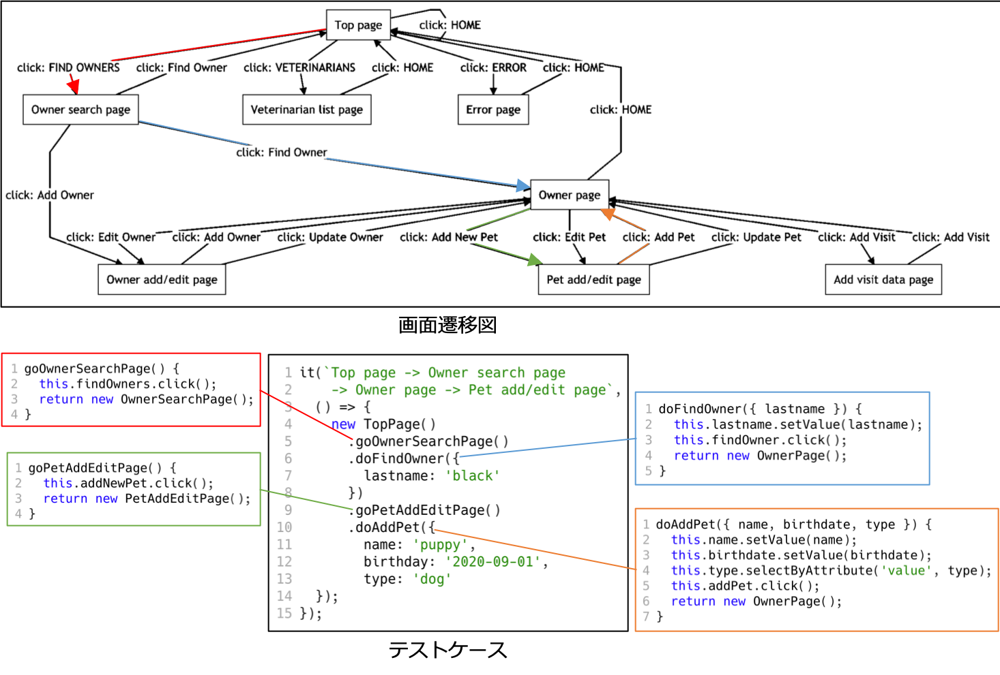

# テストスクリプト自動生成

テストで行われた操作を元に、スモークテスト向けの End-to-End テストスクリプトとして、ページオブジェクト（`page_objects`）・テストケース（`test.spec.js`）・テストデータ（`test_data`）が生成されます。  
テストスクリプトは JavaScript で記述されています。

また、`doc/index.html` に JSDoc を用いたテストスクリプトの説明書が生成されます。  
各ページオブジェクトとテストケースが画面遷移図やスクリーンショットを用いて説明されているため、生成されたテストスクリプトの理解に役立ちます。

## 生成されるテストスクリプトの特徴

- ページオブジェクトパターンを採用しており保守しやすい
  - ページオブジェクトは「画面遷移の定義」で定められた画面と一対一で対応
  - 1 つの画面で行われた操作をメソッドとして抽出
- テストで記録された全ての画面遷移を少なくとも一度は行う
- データ駆動テストに対応

### :warning: 制限事項

- テストで行った操作をそのまま再現するテストスクリプトではありません。
- 記録されていない操作や画面遷移はスクリプト化されません。
- 生成されたテストケースはアプリケーションの状態を考慮しないため、実行するために修正が必要な場合があります。

## 生成されるテストケースの例

各画面遷移を行うための操作がメソッドとしてページオブジェクト内に定義されます。  
テストケースはそれらのメソッドを呼び出すことで構成されます。

下図のテストケースは [Spring Petclinic](https://projects.spring.io/spring-petclinic/) に対して行われたテストを元に生成されたテストケースの 1 つです。  
このテストケースは赤・青・緑・橙の画面遷移があり、それぞれが 1 つのメソッド呼出と対応しています。

## オプション

生成時に以下のオプションが設定可能です。

- 記録された操作を再現するテストスクリプトを生成
  - チェックを入れると、テストで行った操作をそのまま再現するテストスクリプトを生成します。その場合、その他のオプションは全て無視されます。
- [multi-locator](https://github.com/latteart-org/multi-locator) を利用した頑健なテストスクリプトを生成（実験的）
  - :warning: 実験的ですが、チェックを入れると複数のロケーターを使用したテストスクリプトを生成します。
- カスタムボタン定義
  - デフォルト定義に加えてクリック対象とするタグ
    - デフォルト定義(`INPUT:type=submit`、`INPUT:type=button`、`BUTTON`、`A`)以外の、クリック操作をページオブジェクトのメソッド内に含めるタグを指定します。
      - `タグ名`を一覧から指定すると、該当するタグをクリック対象に指定できます。
      - `タグ名:属性=属性値`を一覧から指定すると、該当するタグのうち、指定した属性値を持つタグのみをクリック対象に指定できます。
        - (例) `INPUT:type=reset`
      - :warning: 実験的ですが一覧からの指定の他に直接入力による指定もできます。
- テストデータ
  - データ駆動方式を使用する
    - チェックを入れると、 `test_data/TestData.js` に定義されたデータを入力値とするテストを生成します。
    - チェックを入れない場合、`test.spec.js` に入力値が埋め込まれます。
  - 最大数
    - 画面ごとに生成されるテストデータの最大数を指定します。`0` を指定した場合は、具体的な値は生成されず雛形のみが生成されます。

## テストスクリプトの実行

テストスクリプトは [WebdriverIO](https://webdriver.io/) を用いて実行できます。

以下のテンプレートを用いることで、すぐにお試しいただくことができます。  
https://github.com/latteart-org/test_script_runner
