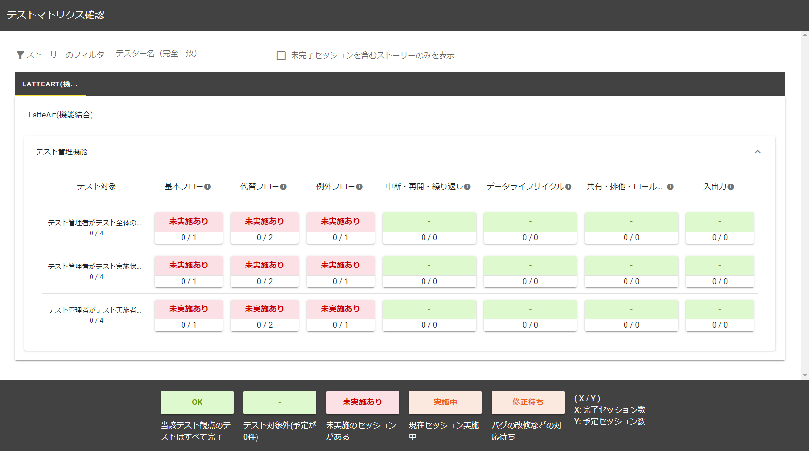
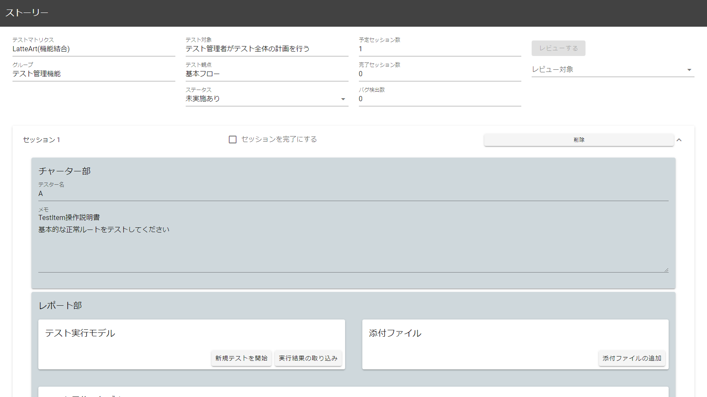
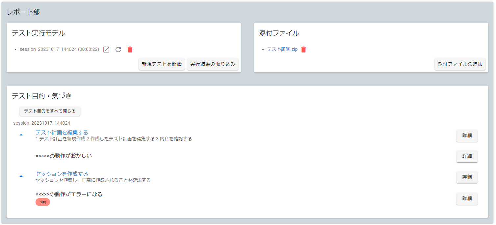
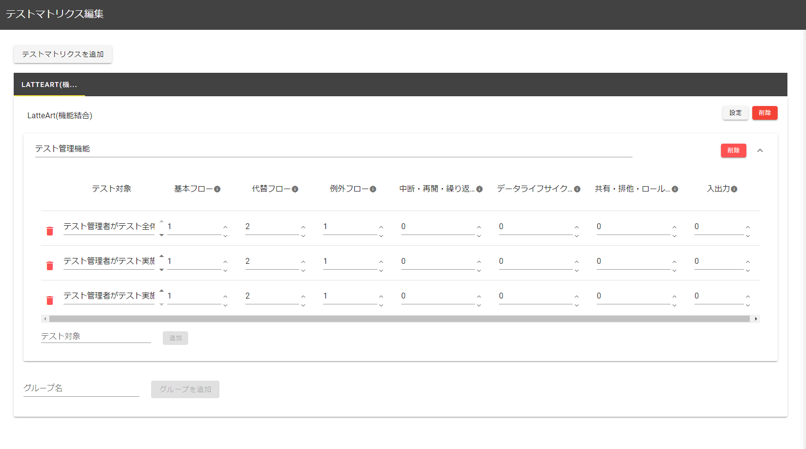
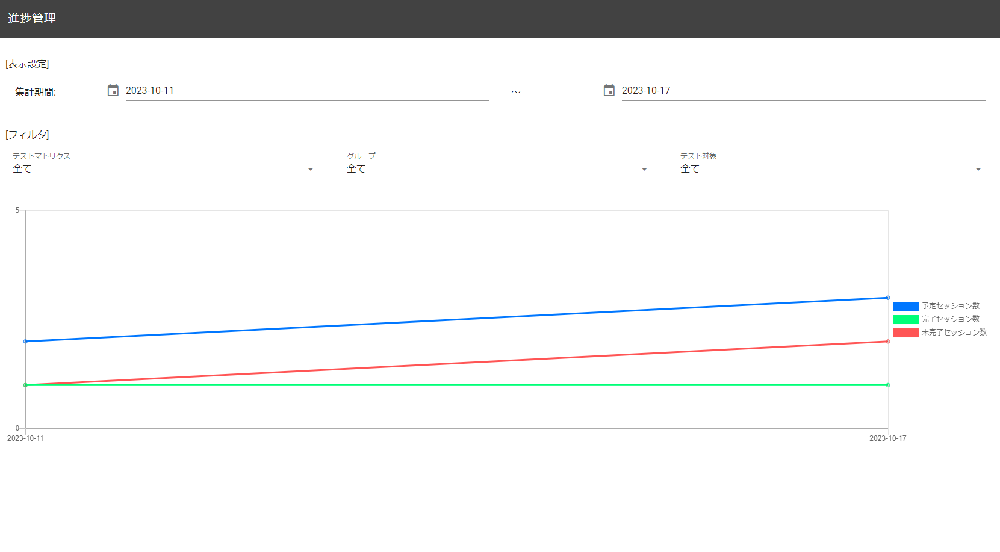
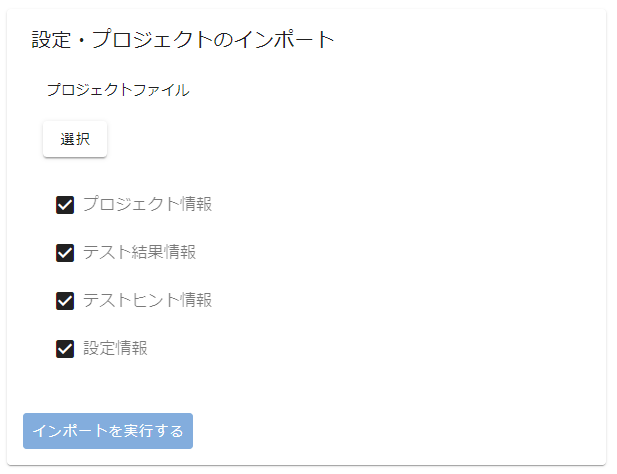

# テスト管理機能 操作説明書

テスト管理ではテスト計画、進捗確認などをすることができます。  
本機能は以下の画面から構成されます。

- [テストマトリクス確認](#テストマトリクス確認)
- [ストーリー編集画面](#ストーリー編集画面)
  - [ストーリーのステータス](#ストーリーのステータス)
  - [セッションレビューボタン](#セッションレビューボタン)
  - [セッション](#セッション)
- [レビュー画面](#レビュー画面)
  - [テストストーリーへ戻るボタン](#テストストーリーへ戻るボタン)
  - [レビュー用操作履歴](#レビュー用操作履歴)
- [テストマトリクス編集](#テストマトリクス編集)
  - [テストマトリクス追加ボタン](#テストマトリクス追加ボタン)
  - [テストマトリクス編集欄](#テストマトリクス編集欄)
  - [グループ・テスト対象編集欄](#グループ・テスト対象編集欄)
- [ストーリー一括レビュー](#ストーリー一括レビュー)
  - [レビューボタン](#レビューボタン)
- [進捗管理](#進捗管理)
- [品質管理](#品質管理)
- [オプション機能](#オプション機能)

# テストマトリクス確認



「[テストマトリクス編集](#テストマトリクス編集)」から登録したテストマトリクス一覧をタブごとに管理して確認できます。  
任意のテスト対象・テスト観点のセルをクリックすることで対応するストーリー編集画面に遷移できます。  
テストマトリクスが 1 つ以上作成されている場合のみ表示できます。

## ストーリーのフィルタ


入力するとテスター名が一致するセッションを含むストーリーのみの表示に絞り込むことができます。  
また、未完了セッションを含むストーリーのみ表示にチェックを入れると未完了セッションを含むストーリーのみの表示に絞り込むことができます。

# ストーリー編集画面



テストマトリクスで選択したストーリーについて、セッションの作成・編集を行うことができます。


また、ストーリーを開いた履歴を過去 5 つ分、左側のメニューバーの「最近読み込んだストーリー」欄に表示されるため、テストマトリクス確認画面からストーリーを開くことなく、ショートカットとしてストーリー編集画面を表示することができます。

## ストーリーのステータス


ストーリーのステータスを変更することができます。

:warning: 自動で変更はされないため、ストーリーの状況に応じてテスト管理者が適宜手動で変更してください。

## セッションレビューボタン


テスト結果が読み込まれたセッション群からレビュー対象のセッションを選択し、ボタンを押下すると「[レビュー画面](#レビュー画面)」が表示されます。  
複数のセッションを選択することで同時にレビューすることができます。

## セッション

1 回のセッションにおける、テスト実施者への指示やテスト実施者から受け取ったテストの読み取り・確認を行うことができます。

### セッション完了チェックボックス


押下するとセッションが完了状態になり、ストーリー完了セッション数が加算されます。  
また、完了になったセッション内に bug タグがついた気づきが存在する場合、ストーリーのバグ検出数が加算されます。

### セッション削除ボタン


押下するとセッションが削除されます。

### チャーター部


テスト実施者への指示として、以下項目を記載できます。

- テスター名
  - テスト実施者の名前を記載してください。
- メモ
  - テスト時にテスト実施者が使用する資材(操作説明書等)やセッションを行う際に特に注意すべき点がある場合等、テスト実施者へのより細かい指示を記載してください。

### レポート部



セッションに紐づけたテスト結果の新規作成、テスト結果の読み込み、テスト証跡等のファイルの添付や、テスト実施者が実際に挙げた気づきを一覧で確認することができます。

- テスト実行モデル

  - 「新規テストを開始」ボタンでテストを新規で開始することができます。そのテストの結果はセッションに紐づけられます。
  - 「実行結果の取り込み」ボタンで記録されたテスト結果を読み込むことができます(複数読み込み可)。
  - 読み込んだテスト結果は「[レビュー画面](#レビュー画面)」で詳細を確認することができます。
  - テスト結果ごとについているアイコンから以下の操作ができます。

    | ボタン                                                              | 機能                       |
    | ------------------------------------------------------------------- | -------------------------- |
    | <div align='center'></div> | テスト結果を履歴画面に表示 |
    | <div align='center'></div>            | 再読込                     |
    | <div align='center'></div>            | セッションから外す         |

- 添付ファイル
  - 任意のファイルを添付することができます。テスト証跡等を添付したい場合に使用してください。
  - 添付したファイルはゴミ箱アイコンのボタンから削除することができます。
- テスト目的・気づき
  - 読み込んだテスト結果内に記録されている「テスト目的」とその目的に紐づく「気づき」が表示されます。
  - 各テスト目的・気づきの「詳細」ボタンを押下すると詳細情報を確認することができます。  
    また、気づきの詳細情報ダイアログからはタグの変更を行うことができ、プリセットとして以下のタグが用意されています。
    - bug  
      完了になったセッション内に bug タグがついた気づきが存在する場合、ストーリーの摘出バグ数が加算されます。
    - reported  
      LatteArt の他機能では利用されないため、単純なマーカーとして使用できます。BTS 等の LatteArt 外のシステムでバグを管理する際に、外部システム側に起票済みである旨を示すために使用すると便利です。
  - 「テスト目的をすべて閉じる/テスト目的をすべて開く」ボタンを押下するとテスト目的を一括開閉することができます。

# レビュー画面


テスト実施者が行ったセッションのレビューを行うことができます。


また、レビューを行っている間、左側のメニューバーの「現在のレビュー」欄にレビュー画面へのショートカットメニューが表示されるため、ストーリー編集画面など別画面と行き来しながらレビューを行うことができます。

## スクリーンショット出力ボタン


押下するとレビュー画面で表示しているテスト結果のスクリーンショットをダウンロードすることができます。  
スクリーンショットファイル(zip)内の構成は以下の通り

- screenshots\_{テスト結果名}\_YYYYDDMM_HHmmss.zip

```
  - スクリーンショット(ファイル名：{連番}.webp/{連番}.png)
```

## テストスクリプト生成ボタン


レビュー画面で表示しているテスト結果のテストスクリプトを生成します。  
選択オプションや処理はメイン画面「[テストスクリプト生成ボタン](#テストスクリプト生成ボタン)」と同様。

## レビュー用操作履歴

「[テスト記録の履歴画面](/docs/manual/capture/manual-capture.md#履歴画面)」と同じようにシーケンス図モデルや画面遷移図モデルで確認ができます。  
レビュー画面でも操作履歴に対する編集は可能となっており、操作一覧の操作を右クリックすることで、気づきや目的を追加することができます。

複数のセッションをレビュー対象として選択した場合は、以下のように表示されます。


- シーケンス図モデル
  - シーケンス図上部の「テスト結果名」プルダウンリストで選択されたテスト結果について、シーケンス図や操作一覧が表示されます。
- 画面遷移図モデル
  - レビュー対象とした全てのセッションのテスト結果を統合した画面遷移図・入力値一覧が表示されます。
- 画面部品カバレッジ
  - レビュー対象とした全てのセッションのテスト結果を統合した画面部品カバレッジが表示されます。

# テストマトリクス編集



プロジェクト全体のテストの計画を行うことができます。  
本画面で使用する各用語の説明は以下になります。

- テスト対象
  - テスト対象となる項目です。
  - :bulb: 例えば、機能結合テストの場合は「ユースケース」、処理結合テストの場合は「画面」や「機能」が相当します。
- グループ
  - テスト対象をまとめたグループです。
- テスト観点
  - 各テスト対象に対して実施するテストの観点です。
- テストマトリクス
  - テストを管理する単位です。
  - 機能結合テストと処理結合テストのように異なるスコープのテストを行う場合等、別のテスト観点のセットを用いてテストを行いたい場合は、テストマトリクスを分けてください。

## テストマトリクス追加ボタン


押下すると以下のようなテストマトリクス作成ダイアログが表示され、任意のテスト観点のテストマトリクスを作成することができます。  
ゴミ箱マーク右横の矢印を押下すると詳細入力欄が表示され、観点の説明を入力することができます。  
観点入力欄横の矢印で観点の順番を変更することができます。  
複数テストマトリクスを作成した場合は、タブで切り替えることができます。


テスト観点のセットはプリセットのものを使用することもできますが、独自のテスト観点を作成することもできます。

## テストマトリクス編集欄


テストマトリクスに対する設定・削除やグループの追加を行うことができます。

### テストマトリクス設定ボタン


押下するとテストマトリクス設定ダイアログが表示され、テストマトリクス名やテスト観点の再設定を行うことができます。

### テストマトリクス削除ボタン


押下するとテストマトリクスが削除されます。

### グループ追加ボタン


任意の名称を指定し、「グループを追加」ボタンを押下することでグループを追加できます。

## グループ・テスト対象編集欄


グループの削除、テスト対象の追加・削除や、テスト対象に対して、各観点で実施するテストの予定セッション数を指定できます。  
また、テスト対象左のごみ箱アイコンのボタンにより、テスト対象を削除できます。  
各観点の右にある info マークにカーソルを合わせるとテスト対象の詳細を確認することができます。

### グループ削除ボタン


押下するとグループが削除されます。

### テスト対象追加ボタン


任意の名称を指定し、「追加」ボタンを押下することでテスト対象を追加できます。

# ストーリー一括レビュー


テスト結果が紐づけられているセッションを持つストーリーの一覧が表示され、チェックしたストーリーを一括でレビューできます。  
本画面はテストマトリクスが 1 つ以上作成されている場合のみ表示できます。


ストーリーのフィルタ欄からテストマトリクス・グループ・テスト対象・テスト観点でストーリーの表示を絞り込むことができます。

:bulb: 絞り込みの項目はすべて部分一致となっています。

## レビューボタン


レビューしたいストーリーを選択し、「レビューする」ボタンを押下すると「[レビュー画面](#レビュー画面)」が表示されます。

# 進捗管理



セッションの消化状況をバーンダウンチャートで確認できます。

期間・テストマトリクス・グループ・テスト対象で表示結果のフィルタリングができます。  
本画面はセッションが 1 つ以上作成されている場合のみ表示できます。

# 品質管理


PB 曲線とバグ検出数（完了済みとなっているセッションの内 bug タグが付いている気づきの件数）を確認できます。

テストマトリクス・グループ・テスト対象で表示結果のフィルタリングができます。  
また、バグ検出数は全件数と１セッションあたりの件数を切り替えて確認ができます。  
本画面はセッションが 1 つ以上作成されている場合のみ表示できます。

# オプション機能


オプション機能の一覧が表示され、以下の操作を行うことができます。

- スナップショット出力
- テストスクリプト生成
- 設定・プロジェクトのインポート
- 設定・プロジェクトのエクスポート

## スナップショット出力


「スナップショットを出力する」ボタンを押下すると、すべてのテスト計画やセッションのスナップショットが zip ファイルとして出力されます。  
ボタンはテストマトリクスが 1 つ以上作成されている場合のみ活性化されます。

出力されるスナップショットは閲覧専用のビューアである HTML と、テストマトリクスごとにセッションに添付されたテスト結果の「テスト目的」「テスト中の気づき」といったデータを一覧化した Excel ファイルから構成されます。
HTML は Web サーバ上に配置することで確認できます。確認する際はローカルサーバ等に以下のように zip ファイルの中身を配置してください。

```bash
Webサーバの公開ディレクトリ/
  ├─ assets/
  ├─ data/
  ├─ favicon.ico
  └─ index.html
```

:warning: Excel ファイルのファイル名は`テストマトリクス名.xlsx`で出力されますが、テストマトリクス名にファイルパスとして使用できない記号が含まれている場合、その記号は`_`に置換されて出力されます。

### テストスクリプト生成


「テストスクリプトを生成する」ボタンを押下すると、登録されたすべてのセッションを元にテストスクリプトを生成します。  
テスト結果が紐づくセッションが 1 つ以上作成されている場合のみボタンが活性化されます。  
詳細は「[テストスクリプト自動生成](../common/test-script-generation.md)」をご参照ください。

### 設定・プロジェクトのインポート



「選択」ボタンを押下するとファイル選択ダイアログが表示され、プロジェクト情報、テスト結果情報、テストヒント情報、設定情報のチェックボックスでインポート対象が選択できます。  
「インポートを実行する」ボタンを押下すると、データがインポートされます。

:bulb: プロジェクト情報とは、テストマトリクス確認画面で表示されている全てのテストマトリクスを指します。

インポートファイル(zip)内の構成は以下の通り

- project_YYYYDDMM_HHmmss.zip

```
  - projects/
      └ プロジェクトID/
        ├ ストーリーID/
        │   └ セッションID/
        │     └ attached/
        │       └ 添付ファイル
        └ プロジェクト情報(project.json)
  - test-results/
      └ テスト結果ID/
        ├ スクリーンショット
        ├ コメント情報(comments.json)
        ├ テスト結果情報(log.json)
        └ 動的変更情報(mutations.json)
  - test-hints/
      └ テストヒント情報(test-hints.json)
  - config/
      └ 設定情報(config.json)
```

:bulb: zip ファイル名はエクスポート時は上記のように出力されるがファイル名の指定は自由となります。  
:bulb: 過去バージョンからデータをインポートしたい場合は
`latteart-repository\public`配下を選択し、zip にしたものをインポートします。

#### 設定・プロジェクトのエクスポート


プロジェクト情報、テスト結果情報、テストヒント情報、設定情報のチェックボックスでエクスポート対象が選択できます。
「エクスポートを実行する」ボタンを押下すると、データがエクスポートされます。

エクスポートファイル(zip)内の構成は以下の通り

- project_YYYYDDMM_HHmmss.zip

```
  - projects/
      └ プロジェクトID/
        ├ ストーリーID/
        │   └ セッションID/
        │     └ attached/
        │       └ 添付ファイル
        └ プロジェクト情報(project.json)
  - test-results/
      └ テスト結果ID/
        ├ スクリーンショット
        ├ コメント情報(comments.json)
        ├ テスト結果情報(log.json)
        └ 動的変更情報(mutations.json)
  - test-hints/
      └ テストヒント情報(test-hints.json)
  - config/
      └ 設定情報(config.json)
```
