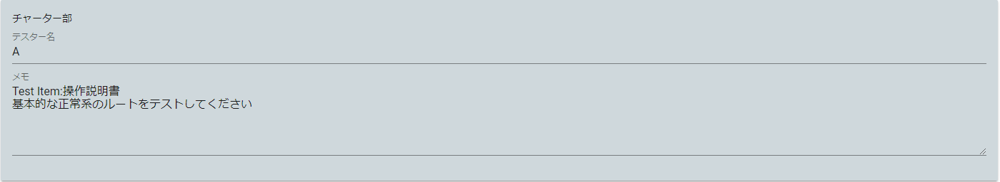
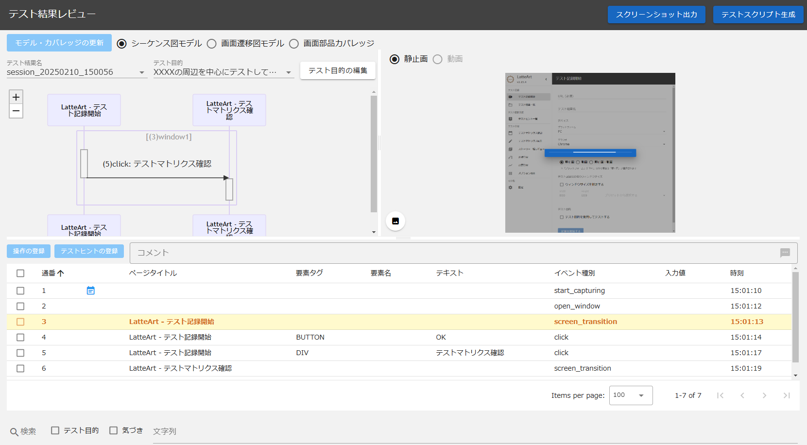

# 管理ツール 操作説明書

管理ツールはテスト管理を行うツールです。
本ツールは以下の画面から構成されます。

- [メイン画面](#メイン画面)
  - [ヘッダー](#ヘッダー)
  - [テスト管理情報](#テスト管理情報)
- [テスト計画編集画面](#テスト計画編集画面)
  - [テストマトリクス追加ボタン](#テストマトリクス追加ボタン)
  - [テストマトリクス編集欄](#テストマトリクス編集欄)
  - [グループ・テスト対象編集欄](#グループテスト対象編集欄)
  - [TOP に戻るボタン](#top-に戻るボタン)
- [ストーリー編集画面](#ストーリー編集画面)
  - [ストーリーのステータス](#ストーリーのステータス)
  - [セッションレビューボタン](#セッションレビューボタン)
  - [セッション](#セッション)
- [レビュー画面](#レビュー画面)
  - [テストストーリーへ戻るボタン](#テストストーリーへ戻るボタン)
  - [設定ボタン](#設定ボタン-1)
  - [レビュー用操作履歴](#レビュー用操作履歴)
- [設定画面](#設定画面)
  - [画面要素カバレッジの設定](#画面要素カバレッジの設定)
  - [画面遷移の定義](#画面遷移の定義)

# メイン画面

## ヘッダー


### テスト管理情報切り替えタブ


表示中の以下テスト管理情報を切り替えることができます。

- TOP
  - テストマトリクスを表示します。
- 進捗管理
  - 進捗状況を表示します。
  - テストマトリクスが 1 つ以上作成されている場合のみ切り替えできます。
- 品質管理
  - 品質状況を表示します。
  - テストマトリクスが 1 つ以上作成されている場合のみ切り替えできます。

各テスト管理情報の詳細は、「[テスト管理情報](#テスト管理情報)」を参照してください。

### テスト計画編集ボタン


押下すると「[テスト計画編集画面](#テスト計画編集画面)」を表示します。

### 設定ボタン


押下すると「[設定画面](#設定画面)」を表示します。

### オプション機能ボタン


押下すると以下のオプション機能の一覧を表示します。

- スナップショット出力
- テストスクリプト生成
- 設定・プロジェクトのインポート
- 設定・プロジェクトのエクスポート

#### スナップショット出力

オプション機能の一覧から押下すると、すべてのテスト計画やセッションのスナップショットが zip ファイルとして出力されます。
スナップショットはサーバーを介さない閲覧用（編集不可）の HTML と、テストマトリクスごとにセッションに添付されたテスト結果の「テスト目的」「テスト中の気づき」といったデータを一覧化した Excel ファイルから構成されます。

:warning: Excel ファイルのファイル名は`テストマトリクス名.xlsx`で出力されますが、テストマトリクス名にファイルパスとして使用できない記号が含まれている場合、その記号は`_`に置換されて出力されます。

#### テストスクリプト生成

オプション機能の一覧から押下すると登録された全てのセッションを元にテストスクリプトを生成します。
詳細は「[テストスクリプト自動生成](../common/test-script-generation.md)」をご参照ください。

#### 設定・プロジェクトのインポート

オプション機能の一覧から押下するとインポート対象ファイル選択ダイアログが表示されます。


「選択」ボタンを押下するとファイル選択ダイアログが表示され、プロジェクト情報、テスト結果情報、設定情報のチェックボックスでインポート対象を選択可能です。  
OK ボタンを押下し、データがインポートされます。

:bulb: プロジェクト情報とは、管理ツールで表示されている全てのテストマトリクスを指します。

インポートファイル(zip)内の構成は以下の通り

- project_YYYYDDMM_HHmmss.zip

```
  - projects/
      └ プロジェクトID/
        ├ ストーリーID/
        │   └ セッションID/
        │     └ attached/
        │       └ 添付ファイル
        └ プロジェクト情報(project.json)
  - test-results/
      └ テスト結果ID/
        ├ スクリーンショット
        └ テスト結果情報(log.json)
  - config/
      └ 設定情報(config.json)
```

:bulb: zip ファイル名はエクスポート時は上記のように出力されるがファイル名の指定は自由となります。  
:bulb: 過去バージョンからデータをインポートしたい場合は
`latteart-repository\public`配下を選択し、zip にしたものをインポートします。

#### 設定・プロジェクトのエクスポート

オプション機能の一覧から押下するとエクスポート対象選択ダイアログが表示されます。


プロジェクト情報、テスト結果情報、設定情報のチェックボックスでエクスポート対象を選択可能です。  
OK ボタンを押下し、データがエクスポートされます。

エクスポートファイル(zip)内の構成は以下の通り

- project_YYYYDDMM_HHmmss.zip

```
  - projects/
      └ プロジェクトID/
        ├ ストーリーID/
        │   └ セッションID/
        │     └ attached/
        │       └ 添付ファイル
        └ プロジェクト情報(project.json)
  - test-results/
      └ テスト結果ID/
        ├ スクリーンショット
        └ テスト結果情報(log.json)
  - config/
      └ 設定情報(config.json)
```

### 言語


表示言語を切り替えることができます。

- ja（日本語）
- en（英語）

### リポジトリ URL 入力欄


リポジトリ URL を入力する欄です。  
プルダウンを開くと過去に接続したリポジトリ URL が選択候補として表示されます。

### 接続ボタン


リポジトリ URL に記載された URL に接続することができます。  
リポジトリ URL 入力欄に URL を入力すると接続ボタンが押下可能となります。

:bulb:他者のリポジトリ URL（latteart-repositoryURL）を指定することで、他者の環境のデータへアクセス、更新することができます。

## テスト管理情報

プロジェクトの以下情報を確認することができます。

- テストマトリクス
- 進捗状況
- 品質状況

各情報を表示する画面の詳細を以下に示します。

### テストマトリクス


「[テスト計画編集画面](#テスト計画編集画面)」から登録したテストマトリクス一覧をタブごとに管理して確認できます。
任意のテスト対象・テスト観点のセルをクリックすることで対応するストーリー編集画面に遷移できます。

### 進捗状況


直前に表示していたテストマトリクスについて、セッションの消化状況をバーンダウンチャートで確認できます。

期間・グループ・テスト対象で表示結果のフィルタリングができます。

### 品質状況


直前に表示していたテストマトリクスについて、PB 曲線と起票されたバグ起票状況を確認できます。

グループ・テスト対象で表示結果のフィルタリングができます。
また、バグ起票状況は全件数と１セッションあたりの件数を切り替えて確認ができます。

# テスト計画編集画面


プロジェクト全体のテストの計画を行うことができます。
本画面で使用する各用語の説明は以下になります。

- テスト対象
  - テスト対象となる項目です。
    :bulb: 例えば、機能結合テストの場合は「ユースケース」、処理結合テストの場合は「画面」や「機能」が相当します。
- グループ
  - テスト対象をまとめたグループです。
- テスト観点
  - 各テスト対象に対して実施するテストの観点です。
- テストマトリクス
  - テストを管理する単位です。
  - 機能結合テストと処理結合テストのように異なるスコープのテストを行う場合等、別のテスト観点のセットを用いてテストを行いたい場合は、テストマトリクスを分けてください。

## テストマトリクス追加ボタン


押下すると以下のようなテストマトリクス作成ダイアログが表示され、任意のテスト観点のテストマトリクスを作成することができます。
ゴミ箱マーク右横の矢印を押下すると詳細入力欄が表示され、観点の説明を入力することができます。
観点入力欄横の矢印で観点の順番を変更することができます。
複数テストマトリクスを作成した場合は、タブで切り替えることができます。


テスト観点のセットはプリセットのものを使用することもできますが、独自のテスト観点を作成することもできます。

## テストマトリクス編集欄


テストマトリクスに対する設定・削除やグループの追加・削除が行えます。

### テストマトリクス設定ボタン


押下するとテストマトリクス設定ダイアログが表示され、テストマトリクス名やテスト観点の再設定を行うことができます。

### テストマトリクス削除ボタン


押下するとテストマトリクスが削除されます。

### グループ追加ボタン


押下するとグループが追加されます。

:warning: 新規で追加されたグループはデフォルトで「グループ」という名称が付与されるため、適宜変更してください。

## グループ・テスト対象編集欄


グループの削除、テスト対象の追加・削除や、テスト対象に対して、各観点で実施するテストの予定セッション数を指定できます。
また、テスト対象左のごみ箱アイコンのボタンにより、テスト対象を削除できます。
各観点の右にある info マークにカーソルを合わせるとテスト対象の詳細を確認することができます。

### グループ削除ボタン


押下するとグループが削除されます。

### テスト対象追加ボタン


任意の名称を指定し、「追加」ボタンを押下することでテスト対象を追加できます。

## TOP に戻るボタン


押下すると「[メイン画面](#メイン画面)」に戻ります。

変更は自動で保存されます。

# ストーリー編集画面


テストマトリクスで選択したストーリーについて、セッションの作成・編集を行うことができます。

## ストーリーのステータス


ストーリーのステータスを変更することができます。

:warning: 自動で変更はされないため、ストーリーの状況に応じてテスト管理者が適宜手動で変更してください。

## セッションレビューボタン


テスト結果が読み込まれたセッション群からレビュー対象のセッションを選択し、ボタンを押下すると「[レビュー画面](#レビュー画面)」が表示されます。
複数のセッションを選択することで同時にレビューすることができます。

## セッション

1 回のセッションにおける、テスト実施者への指示やテスト実施者から受け取ったテストの読み取り・確認を行うことができます。

### セッション完了チェックボックス


押下するとセッションが完了状態になり、ストーリー完了セッション数が加算されます。
また、完了になったセッション内に起票状態のバグ・気づきが存在する場合、ストーリーの摘出バグ数が加算されます。

### セッション削除ボタン


押下するとセッションが削除されます。

### チャーター部



テスト実施者への指示として、以下項目を記載できます。

- テスター名
  - テスト実施者の名前を記載してください。
- メモ
  - テスト時にテスト実施者が使用する資材(操作説明書等)やセッションを行う際に特に注意すべき点がある場合等、テスト実施者へのより細かい指示を記載してください。

### レポート部


記録ツールの起動、テスト結果の読み込み、テスト証跡等のファイルの添付や、テスト実施者が実際に挙げた気づきを一覧で確認することができます。

- テスト実行モデル
  - 記録ツールを管理ツールから起動することができます。
    - テスト結果が読み込まれていない場合は新規でテスト結果が作成され、読み込まれている場合は、読み込まれているテスト結果が記録ツールを起動した際に表示されます。
  - 記録ツールで記録されたテスト結果を読み込むことができます。
  - 読み込んだテスト結果は「[レビュー画面](#レビュー画面)」で詳細を確認することができます。
  - 読み込んだテスト結果は再読込アイコンのボタンから再読込することができます。
  - 読み込んだテスト結果はゴミ箱アイコンのボタンから削除することができます。
- 添付ファイル
  - 任意のファイルを添付することができます。テスト証跡等を添付したい場合に使用してください。
  - 添付したファイルはゴミ箱アイコンのボタンから削除することができます。
- テスト目的・気づき
  - 読み込んだテスト結果内に記録されている「テスト目的」とその目的に紐づく「気づき」が表示されます。
  - 各テスト目的・気づきの「詳細」ボタンを押下すると詳細情報を確認することができます。
  - 「テスト目的をすべて閉じる/テスト目的をすべて開く」ボタンを押下するとテスト目的を一括開閉することができます。

# レビュー画面


テスト実施者が行ったセッションのレビューを行うことができます。

## テストストーリーへ戻るボタン


押下すると「[ストーリー編集画面](#ストーリー編集画面)」に戻ります。

## スクリーンショット出力ボタン


押下するとレビュー画面で表示しているテスト結果のスクリーンショットをダウンロードすることができます。  
スクリーンショットファイル(zip)内の構成は以下の通り

- screenshots\_{テスト結果名}\_YYYYDDMM_HHmmss.zip

```
  - スクリーンショット(ファイル名：{連番}.webp/{連番}.png)
```

## テストスクリプト生成ボタン


レビュー画面で表示しているテスト結果のテストスクリプトを生成します。
選択オプションや処理はメイン画面「[テストスクリプト生成ボタン](#テストスクリプト生成ボタン)」と同様。

## 設定ボタン


押下すると「[設定画面](#設定画面)」を表示します。

## レビュー用操作履歴

「[記録ツールの履歴画面](/docs/manual/capture/manual-capture.md#履歴画面)」と同じようにシーケンス図モデルや画面遷移図モデルで確認ができます。  
レビュー画面でも記録ツールのように操作履歴に対する編集は可能となっており、操作一覧の操作を右クリックすることで、気づきや目的を追加することができます。

複数のセッションをレビュー対象として選択した場合は、以下のように表示されます。



- シーケンス図モデル
  - シーケンス図上部の「テスト結果名」プルダウンリストで選択されたテスト結果について、シーケンス図や操作一覧が表示されます。
- 画面遷移図モデル
  - レビュー対象とした全てのセッションのテスト結果を統合した画面遷移図・入力値一覧が表示されます。
- 画面部品カバレッジ
  - レビュー対象とした全てのセッションのテスト結果を統合した画面部品カバレッジが表示されます。

# 設定画面


記録された操作群を可視化する際の表示設定と自動入力・自動操作の設定を行えます。
各種設定は変更時にリアルタイムで保存されます。

## 画面要素カバレッジの設定


画面要素カバレッジに関する設定を行うことができます。

- カバレッジ計算に含めるタグ
  - 画面要素カバレッジの計算に含めるタグを指定することができます。

## 画面遷移の定義


レビュー画面での各種モデルで「画面」として認識する粒度を設定することができます。

### デフォルト画面定義

ページタイトルで画面を認識するか、URL で画面を認識するかを選択します。

- タイトルで画面遷移を判断する。
  - ON にすると、履歴画面の各種モデルでページタイトルの同じ画面が同一画面としてまとめられるようになります。
- URL で画面遷移を判断する。
  - ON にすると、履歴画面の各種モデルで URL の同じ画面が同一画面としてまとめられるようになります。

### 優先条件

優先的に使用する画面定義で、デフォルト画面定義よりも優先されます。
特定の条件を満たす画面のみ例外的に別の画面と認識させたい場合は本設定にて詳細な設定を行ってください。
優先条件は最上位から順にマッチしたものがまとめられます。

- 追加ボタン
  - 優先的に使用する画面定義を追加します。
- 有効/無効（優先条件） チェックボックス
  - ON にすると、優先条件が有効になります。
- 定義名
  - 詳細条件をすべて満たすと同一画面としてまとめられ、「定義名」で指定した画面名に置き換えられます。
- 定義削除ボタン
  - 定義を削除します。
- 詳細条件を追加するボタン
  - 詳細条件を追加します。
- 詳細条件
  - 有効/無効（詳細条件）チェックボックス
    - ON にすると、該当行の詳細条件が有効になります。
  - 詳細条件（マッチ種別・テキスト・マッチ方法）
    - 指定されたテキストがマッチ種別で選択した「URL/タイトル/キーワード」に、マッチ方法で選択した「文字列が含まれている/文字列と一致している/正規表現がマッチしている」でマッチしているか判定します。
  - 詳細条件削除ボタン
    - 該当行の詳細条件を削除します。詳細条件が 2 行以上存在する場合のみ表示されます。詳細条件を全て削除したい場合は定義を削除してください。

## 自動入力設定


操作記録時に使用する入力値セットを事前に登録しておくと、操作記録中に該当画面を開いた際に自動で入力要素(テキストボックスやチェックボックス等)に値を入力することができます。
テスト中に頻繁に同じ値を入力する場合等に有効です。

- 入力値を登録するポップアップを自動表示するチェックボックス
  - ON にすると、入力要素を自動検知し、記録中に「自動入力：登録」ダイアログが開きます。
- 入力値を選択するポップアップを自動表示するチェックボックス
  - ON にすると、記録中に登録している入力値セットに該当する画面を開くと「自動入力：選択」ダイアログが開きます。
- 入力値セットの追加
  - 入力値セットを追加します。「自動入力：登録」ダイアログを利用せず、手動で入力値セットを追加する場合に利用します。

:warning: ポップアップ自動表示時の「自動入力：登録」ダイアログと「自動入力：選択」ダイアログは記録ツールでのみ表示されるため、詳細は[記録ツール 操作説明書](/docs/manual/capture/manual-capture.md)を参照してください。

### 入力値セット

- 有効/無効（入力値セット）チェックボックス
  - ON にすると、入力値セットが有効になります。
- 入力値セット名
  - 入力値セットの名前です。
- 入力値セット削除ボタン
  - 入力値セットを削除します。
- url
  - 入力値セットの対象となる画面の url です。対象画面の url と title が入力値セットの url と title に一致することで自動入力が使用できます。
- title
  - 入力値セットの対象となる画面の title です。対象画面の url と title が入力値セットの url と title に一致することで自動入力が使用できます。
- 有効/無効（入力値）チェックボックス
  - ON にすると、入力値が有効になります。
- Locator Type
  - 自動入力対象となる画面要素の Locator のタイプです。ID と xpath を選択できます。
- Locator Match Type
  - 自動入力対象となる画面要素と Locator との一致の仕方を指定します。
    - Locator Type が ID の場合は equals（完全一致）と contains（部分一致）を指定できます。
    - xpath の場合は equals（完全一致）のみの指定になります。
- Locator
  - 自動入力対象となる画面要素の Locator です。ID を指定した場合は ID、xpath を指定した場合は xpath を入力します。
- 入力値
  - 入力要素に入力する値を設定します。
- 入力値削除ボタン
  - 入力値を削除します。

## 自動操作設定


操作記録時に使用する操作セットを事前に登録しておくと、操作記録中に自動で操作を実行することができます。
テスト中に頻繁に同じ操作をする場合等に有効です。

### 操作セット

- 有効/無効（操作セット）チェックボックス
  - ON にすると、操作セットが有効になります。
- 操作セット名
  - 操作セットの名前です。
- 詳細ボタン
  - 操作セットの内容を一覧で確認するダイアログが表示されます。
- 操作セット削除ボタン
  - 操作セットを削除します。
- 操作セット詳細
  - 操作セットの詳細です。登録時に補足やメモとして登録した内容が表示されます。
