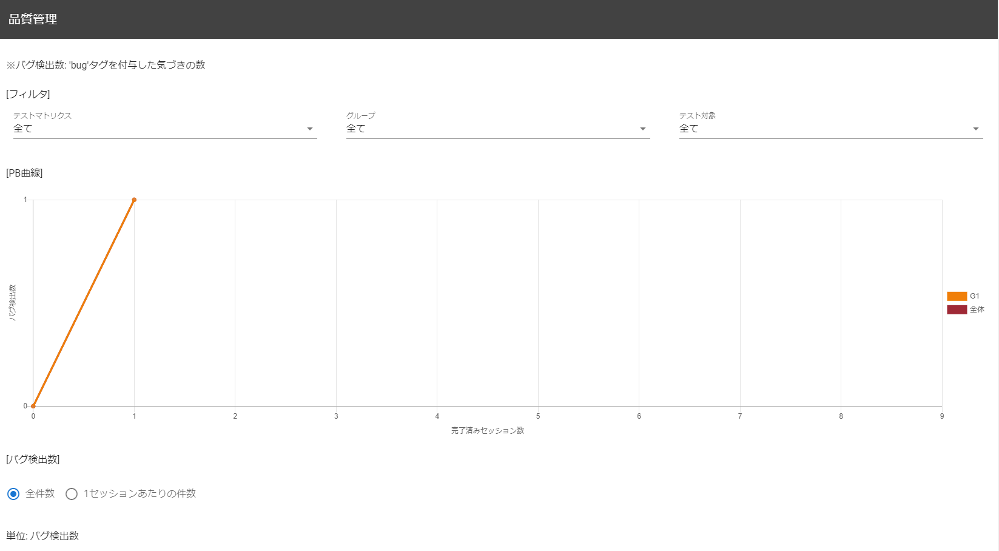
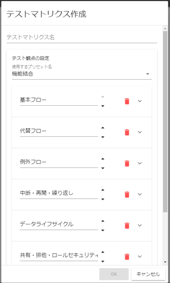
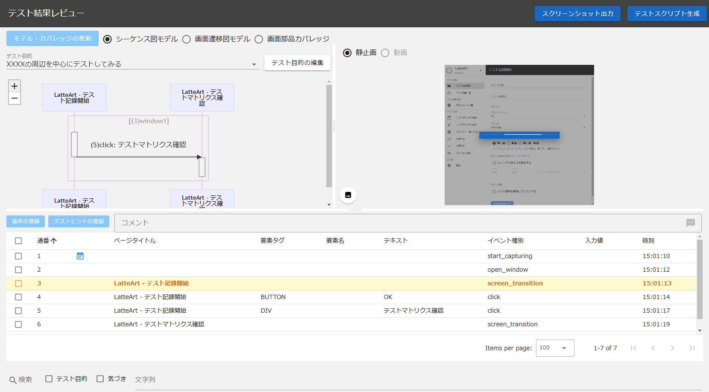
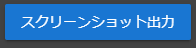

# Management Tool Manual

A management tool is a tool that performs test management.
This tool consists of the following screens.

- [Main screen](#main-screen)
  - [Header](#header)
  - [Test management information](#test-management-information)
- [Test plan edit screen](#test-plan-edit-screen)
  - [Add test matrix button](#add-test-matrix-button)
  - [Edit test matrix](#edit-test-matrix)
  - [Edit field for group test](#edit-field-for-group-test)
  - [Button to return to TOP](#button-to-return-to-top)
- [Story edit screen](#story-edit-screen)
  - [Story Status](#story-status)
  - [Session review button](#session-review-button)
  - [Session](#session)
- [Review screen](#review-screen)
  - [Return to test story button](#return-to-test-story-button)
  - [Screenshot output button](#screenshot-output-button)
  - [Test script generation button](#test-script-generation-button)
  - [Capture settings button](#capture-settings-button)
  - [Operation history for review](#operation-history-for-review)
- [Setting screen](#setting-screen)
  - [Set screen element coverage](#set-screen-element-coverage)
  - [Screen transition definition](#screen-transition-definition)

# Main screen

## Header


### Test management information switching tab


You can switch between the following test management information that is being displayed.

- TOP
   - Display the test matrix.
- Progress management
   - Show progress.
   - Can be switched only when one or more test matrices have been created.
- quality management
   - Display quality status.
   - Can be switched only when one or more test matrices have been created.

For details of each test management information, see "[Test management information](#test-management-information)".

### Edit Test Plan Button


When pressed, "[Test plan edit screen](#test-plan-edit-screen)" will be displayed.

### Capture Settings Button


When pressed, "[Setting screen](#setting-screen)" will be displayed.

### Option function button


Press to display the list of optional functions below.

- snapshot output
- test script generation
- Data import
- Data export

#### snapshot output

When pressed from the list of optional functions, all test plans and session snapshots are output as a zip file.
A snapshot consists of an HTML file for browsing (not editable) without going through a server, and an Excel file that lists data such as "test purpose" and "notices during the test" of the test results attached to the session for each test matrix. increase.

:warning: The file name of the Excel file is output as `test_matrix_name.xlsx`, but if the test matrix name contains a symbol that cannot be used as a file path, that symbol will be replaced with `_` and output. 

#### Generate Test Script

When pressed from the list of optional functions, a test script is generated based on all registered sessions.
For details, see "[Generate test script automatically](../common/test-script-generation.md)".

#### Data Import

When you press from the list of optional functions, the import target file selection dialog is displayed.


A list of zip file names under the `latteart-repository\public\imports` folder is acquired and displayed in the pull-down list, and the import target can be selected with the check boxes for project information and test result information.
Press the OK button and the data will be imported.

:bulb: Project information refers to all test matrices displayed in the administration tool.

The contents in the import file (zip) is as follows

- project_YYYYDDMM_HHmmss.zip

```
  - projects/
      └ Project ID/
        ├ Story ID/
        │ └ Session ID/
        │   └ attached/
        │     └ Attachment
        └ Project information (project.json)
  - test-results/
      └ Test result ID/
        ├ Screenshot
        └ Test result information (log.json)

```

:bulb: The zip file name is output as above when exporting, but the file name can be specified freely.
:bulb: If you want to import data from the previous version, select `latteart-repository\public` and import the zip file.

#### Data Export

When you press from the list of optional functions, the export target selection dialog is displayed.


Project information and test result information checkboxes allow you to select export targets.
Press the OK button and the data will be exported.

The contents in the export file (zip) is as follows.

- project_YYYYDDMM_HHmmss.zip

```
  - projects/
      └ Project ID/
        ├ Story ID/
        │ └ Session ID/
        │   └ attached/
        │     └ Attachment
        └ Project information (project.json)
  - test-results/
      └ Test result ID/
        ├ Screenshot
        └ Test result information (log.json)

```

### Language


You can switch the display language.

- ja (Japanese)
- en (English)

### Repository URL input field


This is the field to enter the repository URL.
When you open the pull-down, repository URLs that have been connected in the past are displayed as selection candidates.

### Connect button


You can connect to the URL mentioned in repository URL.
When you enter the URL in the repository URL input field, you can press the connect button.

:bulb: By specifying the repository URL of others (latteart-repositoryURL), you can access and update the data of others' environments.

## Test management information

You can check the following information of the project.

- Test matrix
- Progress
- Quality status

Details of the screens that display each information are shown below.

### Test Matrix


You can manage and check the list of test matrices registered from "[Test plan edit screen](#test-plan-edit-screen)" for each tab.
By clicking any test target/test viewpoint cell, you can transition to the corresponding story edit screen.

### Progress


You can check the completion status of the session on the burndown chart for the test matrix that was displayed immediately before.

You can filter the display results by period, group, and test target.

### Quality status



You can check the PB curve and the filed bug filed status for the previously displayed test matrix.

You can filter the displayed results by group test target.
In addition, you can check the bug reporting status by switching between all cases and the number of cases per session.

# Test plan edit screen


You can plan the tests for the entire project.
The terms used on this screen are explained below.

- Test target
   - Items to be tested.
     :bulb: For example, "use case" corresponds to a function integration test, and "screen" or "function" corresponds to a process integration test.
- Group
   - A group of test targets.
- Test viewpoint
   - It is the aspect of the test to be performed for each test object.
- Test matrix
   - A unit that manages tests.
   - If you want to test using different sets of test viewpoints, such as when performing tests in different scopes such as functional integration tests and process integration tests, please separate the test matrices.

## Add test matrix button


When you press it, the following test matrix creation dialog will be displayed, and you can create a test matrix from any test perspective.
When you press the arrow to the right of the trash can mark, the detail input field is displayed and you can enter the explanation of the viewpoint.
You can change the order of viewpoints with the arrows next to the viewpoint input field.
If you have created multiple test matrices, you can switch between them using the tabs.



You can use a preset set of test viewpoints, or you can create your own test viewpoints.

## Edit test matrix


You can set/delete the test matrix and add/delete groups.

### Test matrix setting button


When you press it, the test matrix setting dialog is displayed, and you can reconfigure the test matrix name and test viewpoint.

### Delete test matrix button


When pressed, the test matrix is deleted.

### Add Group button


Press to add a group.

:warning: Newly added groups are given the name "グループ" by default, so please change it accordingly.

## Edit field for group test


You can delete groups, add/delete test targets, and specify the number of scheduled test sessions to be performed from each viewpoint for test targets.
You can also delete the test target with the trash can icon button on the left of the test target.
Hover the cursor over the info mark to the right of each viewpoint to see details about the test target.

### Delete group button


Press to delete the group.

### Add test target button


You can add a test target by specifying an arbitrary name and pressing the "Add" button.

## Button to return to TOP


Press to return to "[Main screen](#main-screen)".

Changes are saved automatically.

# Story edit screen


You can create and edit sessions for stories selected in the test matrix.

## Story Status


You can change the story status.

:warning: This is not automatically changed, so the test administrator should change it manually as appropriate according to the story situation.

## Session review button


Select the session to be reviewed from among the sessions loaded with the test results, and press the button to display the "[Review screen](#review-screen)".

## Session

In a single session, you can give instructions to testers and read and review tests received from testers.

### Session complete checkbox


When pressed, the session will be completed and the number of story completed sessions will be added.
Also, if there are bugs/notices that have been submitted in the completed session, the number of extracted bugs in the story will be added.

### Delete session button


Press to delete the session.

### Charter section


The following items can be included as instructions to the tester.

- Tester name("テスター名")
   - Please state the name of the tester.
- Notes("メモ")
   - Please provide more detailed instructions to the testers, such as the materials (operation manuals, etc.) that the testers will use during the test, and if there are any special points to note when conducting the session.

### Report section


You can start the recording tool, load test results, attach files such as test trails, and check the list of observations actually made by the tester.

- Test execution model("テスト実行モデル")
  - You can launch the recording tool from the administration tool.
    - If the test result is not loaded, a new test result will be created, and if it is loaded, the loaded test result will be displayed when the recording tool is started.
  - You can read the test results captured by the capturing tool.
  - You can check the details of the loaded test results on "[Review screen](#review-screen)".
  - The loaded test results can be reloaded from the reload icon button.
  - Loaded test results can be deleted from the trash can icon button.
- Attachments("添付ファイル")
  - You can attach any file. Use this when you want to attach a test trail, etc.
  - Attached files can be deleted from the trash can icon button.
- Tests performed("実施されたテスト")
  - The "test purpose" recorded in the loaded test result is displayed.
- Awareness during testing("テスト中の気づき")
  - "Notices" recorded in the loaded test results are displayed.
  - You can check detailed information by pressing the "詳細" button for each notice.

# Review screen



You can review sessions conducted by testers.

## Return to test story button


Press to return to the "[Story edit screen] (#story-edit-screen)".

## Screenshot output button



You can download the screenshot of the test result displayed on the review screen by pressing it.
The structure in the screenshot file (zip) is as follows.

- screenshots\_{test result name}\_YYYYDDMM_HHmmss.zip

# Review screen


You can review sessions conducted by testers.

## Return to test story button


Press to return to the "[Story edit screen](#story-edit-screen)".

## Screenshot output button


You can download the screenshot of the test result displayed on the review screen by pressing it.
The structure in the screenshot file (zip) is as follows

- screenshots\_{test result name}\_YYYYDDMM_HHmmss.zip

```
   - Screenshot(file name: {serial number}.webp/{serial number}.png)
```

## Test script generation button


Generate a test script for the test results displayed on the review screen.
Selection options and processing are the same as the main screen "[Test script generation button](#test-script-generation-button)".

## Capture settings button


When pressed, "[Setting screen] (#setting-screen)" will be displayed.

## Operation history for review

You can check the sequence diagram model and screen transition diagram model in the same way as "[History screen of the capturing tool](/docs/manual/capture/manual-capture.md#history-screen)".
In addition, unlike the capturing tool, you cannot edit the operation history on the review screen, but by right-clicking the balloon of "Notice during the test" on the sequence diagram, you can save the "Notice during the test" to the bug tracking system, etc. You can choose to vote.
:warning: LatteArt itself does not have a bug tracking function / a function to link with a bug tracking system.

# Setting screen


You can configure display settings when visualizing recorded operations.
Various settings are saved in real time when changed.

## Set screen element coverage


You can configure screen element coverage settings.

- Tags to include in coverage calculations
  - You can specify the tags to include in the calculation of screen element coverage.

## Screen transition definition


You can set the granularity to recognize as "screen" for each model on the review screen.

### Default screen definition

Select whether to recognize screens by page title or by URL.

- Judge the screen transition by the title.
   - When turned ON, screens with the same page title will be grouped together as the same screen for each model of the history screen.
- Judge the screen transition by URL.
   - When turned ON, screens with the same URL will be grouped together as the same screen in for each model of the history screen.

### Priority condition

A preferred screen definition that takes precedence over the default screen definition.
If you want to recognize only screens that meet specific conditions as other screens as an exception, please make detailed settings in this setting.
Priority conditions are grouped in order from the highest priority.

- Add button
  - Add a screen definition to be used preferentially.
- Enable/disable (priority condition) checkbox
  - ON enables the priority condition.
- Definition name
  - If all detailed conditions are met, the screens will be grouped together and replaced with the screen name specified in "Definition Name".
- Delete definition button
  - Delete definition.
- Button to add detailed conditions
  - Add advanced conditions.
- Detailed conditions
  - Enable/disable (detailed conditions) checkbox
    - When set to ON, detailed conditions for the corresponding row are enabled.
  - Detailed conditions (match type, text, match method)
    - The specified text is "URL/Title/Keyword" selected in Match Type and "Contains String/Matches String/Matches regular expression" selected in Match Method to determine if it matches.
  - Detailed condition delete button
    - Delete the detailed condition of the corresponding line. Displayed only when there are two or more detailed conditions. If you want to delete all detailed conditions, delete the definition.
