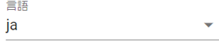
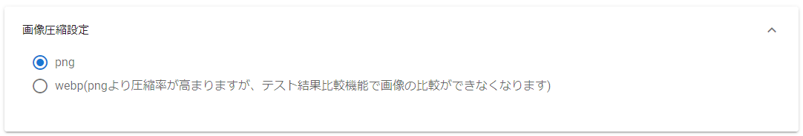
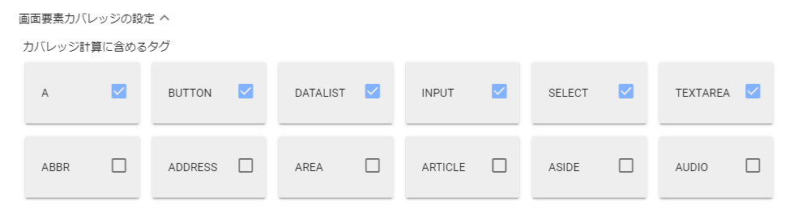
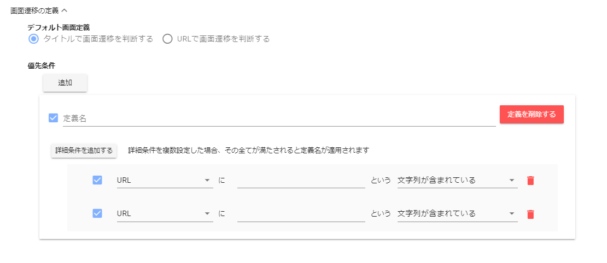
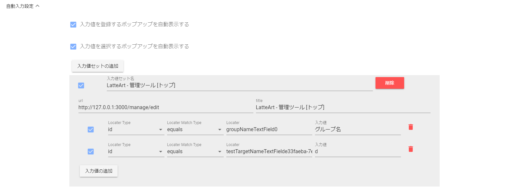
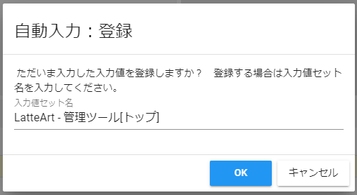
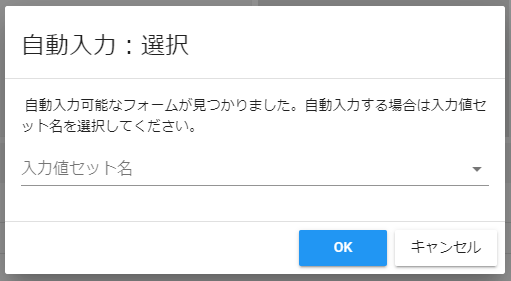
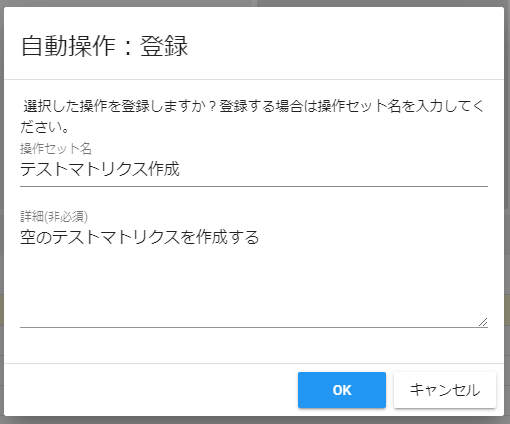
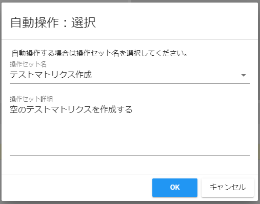

# 設定 操作説明書

テスト対象の設定や記録された操作群を可視化する際の表示設定を行えます。  
各種設定は変更時にリアルタイムで保存されます。

- [言語](#言語)
- [リポジトリ URL](#リポジトリ-url)
- [テスト対象設定](#テスト対象設定)
- [画面圧縮設定](#画面圧縮設定)
- [画面要素カバレッジの設定](#画面要素カバレッジの設定)
- [画面遷移の定義](#画面遷移の定義)
- [自動入力設定](#自動入力設定)
- [自動操作設定](#自動操作設定)
- [テスト結果比較の設定](#テスト結果比較の設定)
- [実験的機能設定](#実験的機能設定)

## 言語

表示言語を切り替えることができます。

- ja（日本語）
- en（英語）

## リポジトリ URL

リポジトリ URL を入力する欄です。  
プルダウンを開くと過去に接続したリポジトリ URL が選択候補として表示されます。  
接続ボタンを押下すると記載された URL に接続することができます。
リポジトリ URL 入力欄に URL を入力すると接続ボタンが押下可能となります。

:bulb:他者のリポジトリ URL（latteart-repositoryURL）を指定することで、他者の環境のデータへアクセス、更新することができます。

## 画面圧縮設定

記録時の静止画の圧縮設定を行うことができます。

- png  
  ON にすると、取得したスクリーンショットを png 形式にしてリポジトリに保存するようになります。
- webp  
  ON にすると、取得したスクリーンショットを webp 形式にしてリポジトリに保存するようになります。ディスク容量を節約したい場合に有効です。  
  :warning:png より圧縮率が高まりますが、テスト結果比較機能で画像の比較ができなくなります

:warning: 続けて素早く操作を行う、もしくは CPU に高負荷がかかっている状態だと画像の圧縮に失敗することがあります。

## 画面要素カバレッジの設定

画面要素カバレッジに関する設定を行うことができます。

- カバレッジ計算に含めるタグ
  - 画面要素カバレッジの計算に含めるタグを指定することができます。

## 画面遷移の定義

履歴画面での各種モデルで「画面」として認識する粒度を設定することができます。

### デフォルト画面定義

ページタイトルで画面を認識するか、URL で画面を認識するかを選択します。

- タイトルで画面遷移を判断する。
  - ON にすると、履歴画面の各種モデルでページタイトルの同じ画面が同一画面としてまとめられるようになります。
- URL で画面遷移を判断する。
  - ON にすると、履歴画面の各種モデルで URL の同じ画面が同一画面としてまとめられるようになります。

### 優先条件

優先的に使用する画面定義で、デフォルト画面定義よりも優先されます。  
特定の条件を満たす画面のみ例外的に別の画面と認識させたい場合は本設定にて詳細な設定を行ってください。  
優先条件は最上位から順にマッチしたものがまとめられます。

- 追加ボタン
  - 優先的に使用する画面定義を追加します。
- 有効/無効（優先条件） チェックボックス
  - ON にすると、優先条件が有効になります。
- 定義名
  - 詳細条件をすべて満たすと同一画面としてまとめられ、「定義名」で指定した画面名に置き換えられます。
- 定義削除ボタン
  - 定義を削除します。
- 詳細条件を追加するボタン
  - 詳細条件を追加します。
- 詳細条件
  - 有効/無効（詳細条件）チェックボックス
    - ON にすると、該当行の詳細条件が有効になります。
  - 詳細条件（マッチ種別・テキスト・マッチ方法）
    - 指定されたテキストがマッチ種別で選択した「URL/タイトル/キーワード」に、マッチ方法で選択した「文字列が含まれている/文字列と一致している/正規表現がマッチしている」でマッチしているか判定します。
  - 詳細条件削除ボタン
    - 該当行の詳細条件を削除します。詳細条件が 2 行以上存在する場合のみ表示されます。詳細条件を全て削除したい場合は定義を削除してください。

## 自動入力設定

操作記録時に使用する入力値セットを事前に登録しておくと、操作記録中に該当画面を開いた際に自動で入力要素(テキストボックスやチェックボックス等)に値を入力することができます。  
テスト中に頻繁に同じ値を入力する場合等に有効です。

- 入力値を登録するポップアップを自動表示するチェックボックス
  - ON にすると、入力要素を自動検知し、「自動入力：登録」ダイアログが開きます。
- 入力値を選択するポップアップを自動表示するチェックボックス
  - ON にすると、登録している入力値セットに該当する画面を開くと「自動入力：選択」ダイアログが開きます。
- 入力値セットの追加
  - 入力値セットを追加します。「自動入力：登録」ダイアログを利用せず、手動で入力値セットを追加する場合に利用します。

### 入力値セット

- 有効/無効（入力値セット）チェックボックス
  - ON にすると、入力値セットが有効になります。
- 入力値セット名
  - 入力値セットの名前です。
- 入力値セット削除ボタン
  - 入力値セットを削除します。
- url
  - 入力値セットの対象となる画面の url です。対象画面の url と title が入力値セットの url と title に一致することで自動入力が使用できます。
- title
  - 入力値セットの対象となる画面の title です。対象画面の url と title が入力値セットの url と title に一致することで自動入力が使用できます。
- 有効/無効（入力値）チェックボックス
  - ON にすると、入力値が有効になります。
- Locator Type
  - 自動入力対象となる画面要素の Locator のタイプです。ID と xpath を選択できます。
- Locator Match Type
  - 自動入力対象となる画面要素と Locator との一致の仕方を指定します。
    - Locator Type が ID の場合は equals（完全一致）と contains（部分一致）を指定できます。
    - xpath の場合は equals（完全一致）のみの指定になります。
- Locator
  - 自動入力対象となる画面要素の Locator です。ID を指定した場合は ID、xpath を指定した場合は xpath を入力します。
- 入力値
  - 入力要素に入力する値を設定します。
- 入力値削除ボタン
  - 入力値を削除します。

### 「自動入力：登録」ダイアログ

履歴画面-画面遷移図モデル-入力値一覧から入力値セット登録ボタンを押下したときに表示されます。  
また、「入力値を登録するポップアップを自動表示する」を ON に設定すると自動で表示されます。  
表示タイミングは、キャプチャー中の画面に入力要素が存在し、その画面から他の画面への遷移時です。  
入力値セット名を入力し、OK ボタンを押下すると入力値セットが登録されます。  
Locator は対象の入力要素に ID が設定されていれば ID、設定されていない場合は xpath が登録されます。

### 「自動入力：選択」ダイアログ

テスト記録中にフッターから自動入力ボタンを押下したときに表示されます。  
また、「入力値を選択するポップアップを自動表示する」を ON に設定すると自動で表示されます。  
表示タイミングは、入力値セットの url と title に一致した画面に遷移時です。  
セレクトボックスで入力値セットを選択し、OK ボタンを押下すると自動入力が実行されます。

## 自動操作設定

操作記録時に使用する操作セットを事前に登録しておくと、操作記録中に自動で操作を実行することができます。  
テスト中に頻繁に同じ操作をする場合等に有効です。

### 操作セット

- 有効/無効（操作セット）チェックボックス
  - ON にすると、操作セットが有効になります。
- 操作セット名
  - 操作セットの名前です。
- 詳細ボタン
  - 操作セットの内容を一覧で確認するダイアログが表示されます。
- 操作セット削除ボタン
  - 操作セットを削除します。
- 操作セット詳細
  - 操作セットの詳細です。登録時に補足やメモとして登録した内容が表示されます。

### 「自動操作：登録」ダイアログ

履歴画面-シーケンス図モデル-操作一覧のチェックボックスをチェックし、操作の登録ボタンを押下したときに表示されます。  
操作セット名を入力し、OK ボタンを押下すると操作セットが登録されます。  
操作セット詳細は任意の項目です。

### 「自動操作：選択」ダイアログ

テスト記録中にフッターから自動操作ボタンを押下した時に表示されます。  
セレクトボックスで操作セットを選択し、OK ボタンを押下すると自動操作が実行されます。

## テスト結果比較の設定

テスト結果比較時に除外する項目や要素を設定することができます。  
詳細は「[テスト結果比較](../common/test-result-comparison.md)」をご参照ください。

## 実験的機能設定

テスト記録時の実験的機能の設定をすることができます。  
詳細は「[実験的機能](../common/experimental-feature.md)」をご参照ください。
