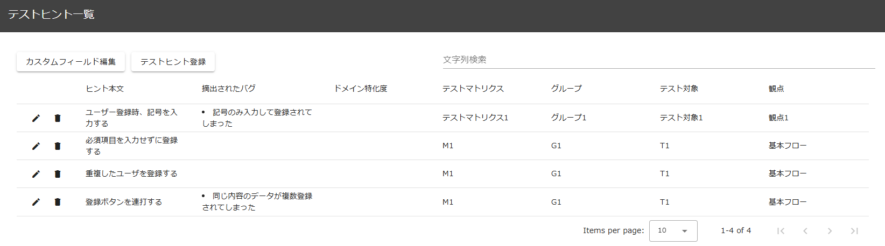

# テスト設計支援 操作説明書

テスト設計支援では探索的テストを実施する上で有用なテストヒント(テストケース)を登録しておくことで、テスト中に任意のタイミングで表示することができます。  
また、テストヒントの登録はテスト記録中以外でも一覧画面または履歴画面から行うことができます。
本機能は以下の画面から構成されます。

- [テストヒント一覧](#テストヒント一覧)
  - [カスタムフィールド編集ボタン](#カスタムフィールド編集ボタン)
  - [テストヒント登録ボタン](#テストヒント登録ボタン)
  - [テストヒント編集ボタン](#テストヒント編集ボタン)
  - [テストヒントの削除ボタン](#テストヒントの削除ボタン)
  - [一覧の絞り込み](#一覧の絞り込み)

# テストヒント一覧

登録したテストヒントの一覧が表示され、以下の操作を行うことができます。

- カスタムフィールド編集ボタン
- テストヒント登録ボタン
- 一覧の絞り込み
- テストヒントの編集ボタン
- テストヒントの削除ボタン

## カスタムフィールド編集ボタン

 

押下するとカスタムフィールド編集ダイアログが表示され、以下の必須項目以外のカラムを追加・編集・削除することができます。

- 必須項目
  - ヒント本文
  - テストマトリクス
  - グループ
  - テスト対象
  - 観点

## テストヒント登録ボタン

押下するとテストヒント登録ダイアログが表示され、テストヒントを登録することができます。  
履歴画面で対象範囲を選択して登録ダイアログを表示した際の挙動は以下の通りです。  
:bulb: テストヒント一覧からダイアログを表示した場合はすべて空欄で表示されます。

- ストーリーに紐づくテスト結果を表示している場合、ストーリー情報(テストマトリクス、グループ、テスト対象、観点)がデフォルトで表示されます。
- テストヒント設定に基づき、キーワード欄に対象となるコメントから作成されたキーワードが半角スペース区切りで表示されます。
- テストヒント設定に基づき、画面要素欄に対象となる操作の画面要素が表示されます。  
  :warning: キーワードは編集可能ですが、半角スペース区切りで設定してください。  
  :warning: キーワードの自動補完はテストヒントの設定で指定したタグ作成設定によって作成されます。自動補完に関しては「[テストヒント設定](../others/manual-config.md/#テストヒント設定)」を参照してください。  
  :warning: テストヒント登録ダイアログ表示時、テスト結果がストーリーに紐づいている場合は、ストーリー情報（テストマトリクス、グループ、テスト対象、観点）がデフォルトで表示されます。ただし、記録中ではない場合、テストヒント一覧画面から登録ダイアログを表示するとストーリー情報は空欄となります。

## テストヒントの編集ボタン

　

押下するとテストヒント編集ダイアログが表示され、テストヒントを編集することができます。

## テストヒントの削除ボタン

　

押下すると確認ダイアログが表示され、OK ボタンを押下するとテストヒントを削除することができます。

## 一覧の絞り込み

一覧上部の「文字列検索」部分で任意の文字列を入力すると一覧を絞り込むことができます。
