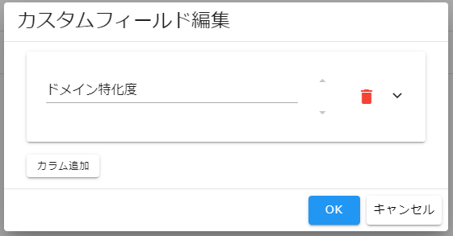

# テスト設計支援 操作説明書

テスト設計支援は探索的テストを実施する際に動的に行っているテスト設計を補助するための機能です。
本機能は以下の画面から構成されます。

- [テストヒント一覧](#テストヒント一覧)
  - [カスタムフィールド編集ボタン](#カスタムフィールド編集ボタン)
  - [テストヒント登録ボタン](#テストヒント登録ボタン)
  - [テストヒント編集ボタン](#テストヒント編集ボタン)
  - [テストヒントの削除ボタン](#テストヒントの削除ボタン)
  - [一覧の絞り込み](#一覧の絞り込み)

# テストヒント一覧

テストヒント一覧では、探索的テストでテストを考えるためのヒントを一覧で表示され、以下の操作を行うことができます。

- カスタムフィールド編集
- テストヒント登録
- 一覧の絞り込み
- テストヒントの編集
- テストヒントの削除

## カスタムフィールド編集ボタン

 

押下するとカスタムフィールド編集ダイアログが表示され、以下の項目以外のカラムを追加・編集・削除することができます。

- ヒント本文
- テストマトリクス
- グループ
- テスト対象
- 観点
- 摘出されたバグ

:bulb: デフォルトでは「ドメイン特化度」がカスタムフィールドの一つとして用意されており、例えばドメイン特化度:1 では特定のドメインに限定しない汎用的に適用可能なヒントとして、ドメイン特化度:5 では特定のドメインに特化したヒントとしてそれぞれ定義することで、テストヒント検索時の絞り込みに活用することができます。

:bulb: 実際に実施したテストを元にヒントを登録する場合、テストで検出できたバグの内容を補足情報として「摘出されたバグ」欄に記載しておくことで、検出が期待できるバグの例をテストヒントの利用者に伝えることができます。

## テストヒント登録ボタン

押下するとテストヒント登録ダイアログが表示され、テストヒントを登録することができます。  
また、テスト結果画面で対象範囲を選択して登録ダイアログを表示した場合は以下の情報がデフォルト値として入力されます。

- ストーリー情報
  - ストーリーに紐づくテスト結果を表示している場合、ストーリー情報(テストマトリクス、グループ、テスト対象、観点)がデフォルトで入力されます。
- キーワード
  - [テストヒント設定](../others/manual-config.md/#テストヒント設定)に基づき、対象となるコメントから作成されたキーワードが半角スペース区切りで入力されます。  
    :warning: キーワードは、半角スペース区切りで設定してください。
- 画面要素
  - テストヒント設定に基づき、対象となる操作の画面要素が入力されます。

## テストヒントの編集ボタン

　

押下するとテストヒント編集ダイアログが表示され、テストヒントを編集することができます。

## テストヒントの削除ボタン

　

押下すると確認ダイアログが表示され、OK ボタンを押下するとテストヒントを削除することができます。

## 一覧の絞り込み

一覧上部の「文字列検索」部分で任意の文字列を入力すると一覧を絞り込むことができます。
