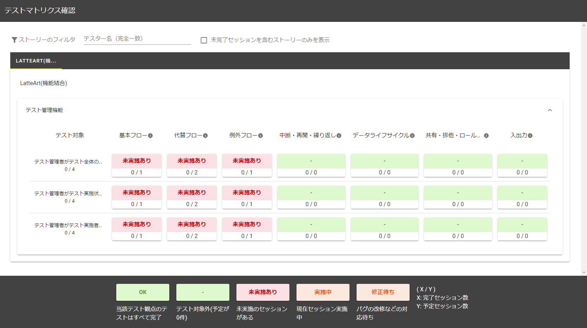
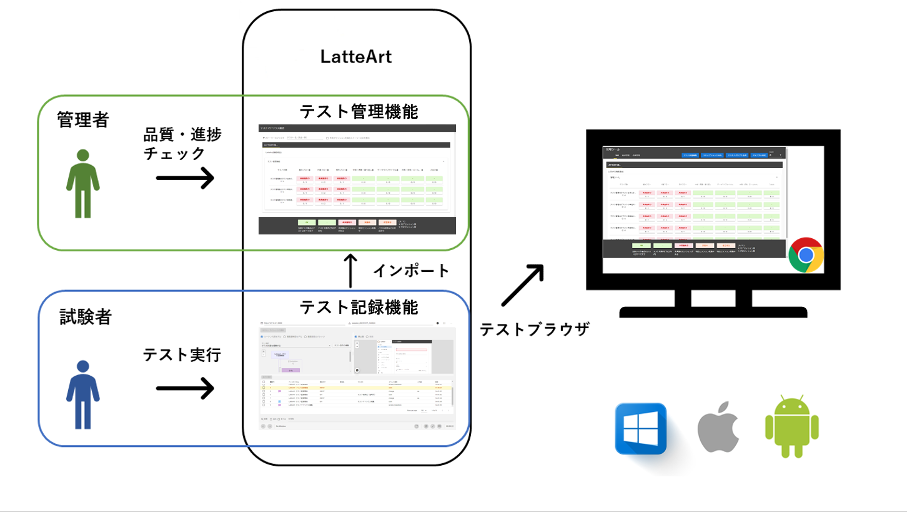

# LatteArt 導入手順書

本書では、LatteArt をインストールし、テストの記録を開始するまでの手順を説明します。

# 事前準備

1. Chrome のバージョンに対応した`ChromeDriver`をダウンロードし、パスを通します。
   - ダウンロードサイト (https://chromedriver.chromium.org/downloads)
1. `cwebp`をインストールし、パスを通します。
   - ダウンロードサイト (https://developers.google.com/speed/webp/docs/precompiled)
1. テスト対象の Web アプリケーションに Google Chrome からアクセスできることを確認します。

:bulb: Edge を使用する場合は、手順１で Chrome ではなく、Edge のバージョンに対応した`edgedriver`をダウンロードし、パスを通します。

- ダウンロードサイト（https://developer.microsoft.com/ja-jp/microsoft-edge/tools/webdriver/）

# インストール

GitHub の [Releases](https://github.com/latteart-org/latteart/releases) から最新版をダウンロードして下さい。

ダウンロードした zip ファイルを解凍すると、以下のディレクトリ構成になっています。

```bash
latteart
      ├─ capture.bat
      ├─ manage.bat
      ├─ launch.config.json
      ├─ launch.exe
      ├─ latteart
      ├─ latteart-capture-cl
      └─ latteart-repository
```

# ツール構成

LatteArt は以下の 2 つのツールで構成されています。

- **記録ツール（capture.bat）**: テスターの操作・気付きの記録

<div align="center">
    
</div><br>

- **管理ツール（manage.bat）**: テストの計画・結果の管理

<div align="center">
    
</div><br>

以下の図は LatteArt の全体像を表したものです。
管理者（テスト管理者）は、管理ツールを用いてテストの品質や進捗のチェックを行います。
試験者（テスト実施者）は、記録ツールを用いてテスト対象 Web アプリケーションのテストを実行します。テスト結果は、管理ツールへインポートします。

<div class="column">
  
</div>

# ツール起動

解凍したディレクトリの中の起動用スクリプトを実行します。

- 記録ツール: `capture.bat`
- 管理ツール: `manage.bat`

すると、以下のメッセージが表示されたコマンドプロンプトと共に LatteArt を動作させるための Web サーバが立ち上がり、ブラウザ上でツールの画面が表示されます。

```
capture: http://127.0.0.1:3000?capture=http://127.0.0.1:3001&repository=http://127.0.0.1:3002
manage: http://127.0.0.1:3000?mode=manage&capture=http://127.0.0.1:3001&repository=http://127.0.0.1:3002
```

:bulb: サーバが起動していれば、以下 URL をブラウザで直接開いても利用できます。

- 記録ツール: http://127.0.0.1:3000
- 管理ツール: http://127.0.0.1:3000?mode=manage

すぐにテストを開始する場合は「[LatteArt チュートリアル （操作記録編）](/docs/tutorial/capture/tutorial-capture.md)」をご参照ください。

LatteArt を用いたテストの考え方、および実践については 「[LatteArt チュートリアル （テスト実践編）](/docs/tutorial/management/tutorial-management.md)」をご参照ください。

## 起動スクリプトの設定

- LatteArt(記録ツール、管理ツール)を表示するブラウザの変更

  `launch.config.json` の `browser` を変更してください。
  `null` もしくは未設定の場合、OS に設定されているデフォルトのブラウザで Latteart が起動します。

  指定可能なブラウザは以下です。

  | OS      | ブラウザ       | 設定値          |
  | ------- | -------------- | --------------- |
  | Windows | Google Chrome  | `chrome`        |
  |         | Microsoft Edge | `msedge`        |
  | Mac     | Google Chrome  | `google chrome` |

  ```jsonc
  {
    "browser": "chrome"
    // ...
  }
  ```

- 起動スクリプトが起動する各サーバのポート変更

  `servers` 配下の変更したいサーバの `env.port` と `http.url` を変更してください。

  :warning: `env.port` と `http.url` のポート部分は同じ値をいれてください。

  ```jsonc
  {
    // ...
    "servers": [
      {
        "name": "latteart-repository",
        // ...
        "env": { "port": "13002" },
        "http": {
          "url": "http://localhost:13002"
          // ...
        }
      }
      // ...
    ]
  }
  ```

# ツール終了

起動時に立ち上がったコマンドプロンプトのウィンドウを閉じて終了します。

:warning: ブラウザ上で LatteArt のタブを閉じるだけではサーバは終了しません。

# Mac での利用（実験的）

ダウンロードした zip ファイルを解凍すると、以下のディレクトリ構成になっています。

```bash
latteart/
      ├─ capture.command
      ├─ manage.command
      ├─ launch.config.json
      ├─ launch
      ├─ latteart/
      ├─ latteart-capture-cl/
      └─ latteart-repository/
```

以下のファイルに実行権限を付与します。

```bash
chmod +x ./capture.command
chmod +x ./manage.command
chmod +x ./launch
chmod +x latteart/latteart
chmod +x latteart-capture-cl/latteart-capture-cl
chmod +x latteart-repository/latteart-repository
```

以下起動用スクリプトを実行すると LatteArt が起動し、Windows 版と同様に利用できます。

- 記録ツール: `capture.command`
- 管理ツール: `manage.command`

:bulb: 「ダウンロードしたアプリケーションの実行許可」を求められた場合は、「システム環境設定の」の「セキュリティとプライバシー」から許可してください。
:bulb: `開発元を検証できないため開けません`というメッセージのダイアログが表示された場合は、一旦「キャンセル」を選択し、「システム環境設定の」の「セキュリティとプライバシー」から許可してください。
:bulb: `開発元を検証できません。開いてもよろしいですか?`というメッセージのダイアログが表示された場合は、「開く」を選択してください。
