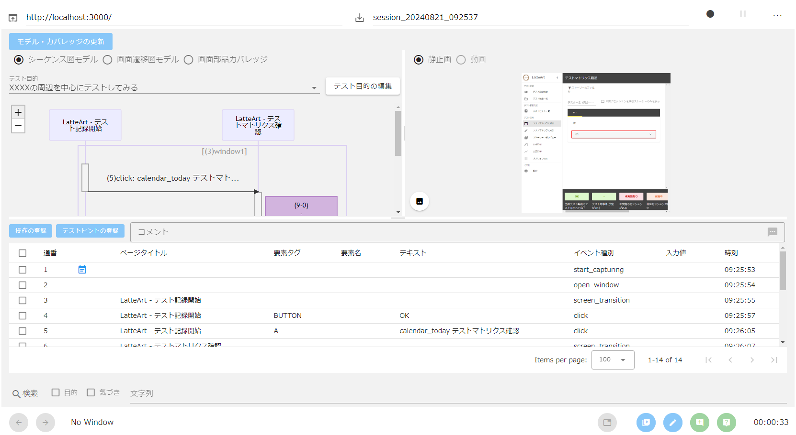

# LatteArt 導入手順書

本書では、LatteArt をインストールし、テストの記録を開始するまでの手順を説明します。

# 事前準備

1. Chrome のバージョンに対応した`ChromeDriver`をダウンロードし、パスを通します。
   - ダウンロードサイト (https://chromedriver.chromium.org/downloads)
1. `cwebp`をインストールし、パスを通します。
   - ダウンロードサイト (https://developers.google.com/speed/webp/docs/precompiled)
1. テスト対象の Web アプリケーションに Google Chrome からアクセスできることを確認します。

# インストール

GitHub の [Releases](https://github.com/latteart-org/latteart/releases) から最新版をダウンロードして下さい。 

ダウンロードした zip ファイルを解凍すると、以下のディレクトリ構成になっています。

```bash
latteart
      ├─ capture.bat
      ├─ manage.bat
      ├─ launch.config.json
      ├─ launch.exe
      ├─ latteart
      ├─ latteart-capture-cl
      └─ latteart-repository
```

# ツール構成

LatteArt は以下の 2 つのツールで構成されています。

- **記録ツール（capture.bat）**: テスターの操作・気付きの記録

<div align="center">
    
</div><br>

- **管理ツール（manage.bat）**: テストの計画・結果の管理

<div align="center">
    
</div><br>

以下の図は LatteArt の全体像を表したものです。
管理者（テスト管理者）は、管理ツールを用いてテストの品質や進捗のチェックを行います。
試験者（テスト実施者）は、記録ツールを用いてテスト対象 Web アプリケーションのテストを実行します。テスト結果は、管理ツールへインポートします。

<div class="column">
  
</div>

# ツール起動

解凍したディレクトリの中の起動用スクリプトを実行します。

- 記録ツール: `capture.bat`
- 管理ツール: `manage.bat`

すると、以下のメッセージが表示されたコマンドプロンプトと共に LatteArt を動作させるための Web サーバが立ち上がり、ブラウザ上で記録ツールの画面が表示されます。

```
capture: http://127.0.0.1:3000
manage: http://127.0.0.1:3000?mode=manage
```

:bulb: サーバが起動していれば、以下 URL をブラウザで直接開いても利用できます。

- 記録ツール: http://127.0.0.1:3000
- 管理ツール: http://127.0.0.1:3000?mode=manage
  
すぐにテストを開始する場合は「[LatteArt チュートリアル （操作記録編）](/docs/tutorial/capture/tutorial-capture.md)」をご参照ください。

LatteArt を用いたテストの考え方、および実践については 「[LatteArt チュートリアル （テスト実践編）](/docs/tutorial/management/tutorial-management.md)」をご参照ください。

# ツール終了

起動時に立ち上がったコマンドプロンプトのウィンドウを閉じて終了します。

:warning: ブラウザ上で LatteArt のタブを閉じるだけではサーバは終了しません。
