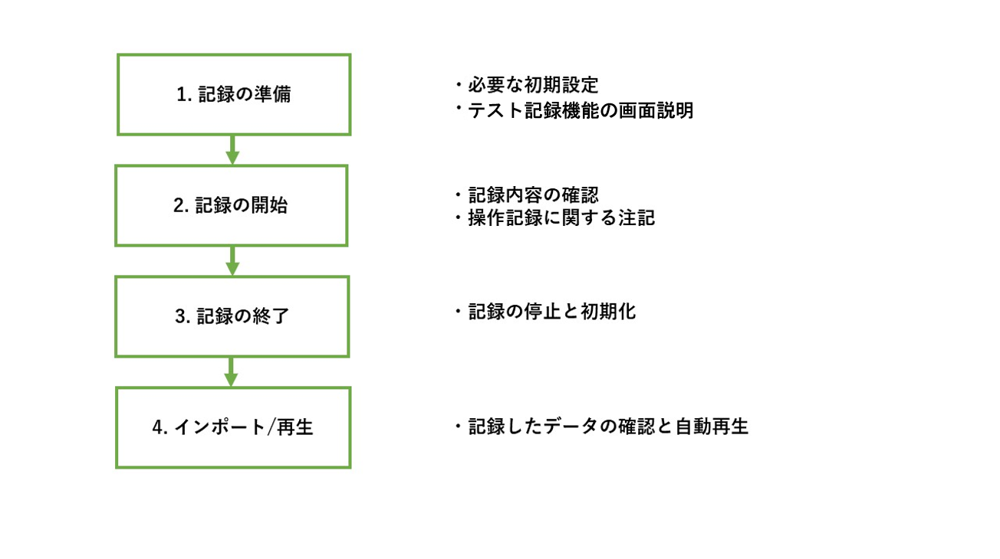
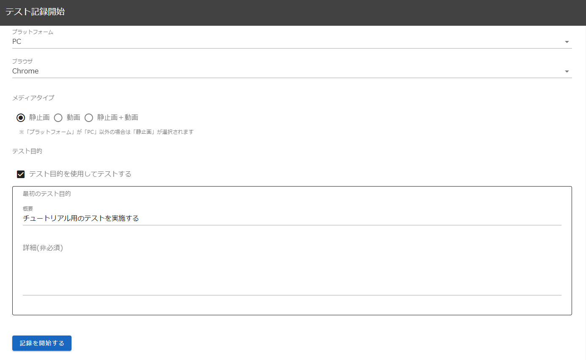
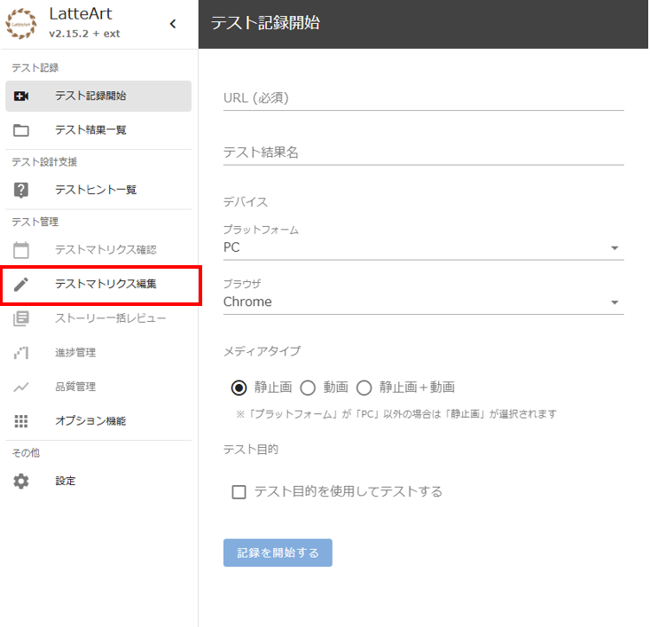
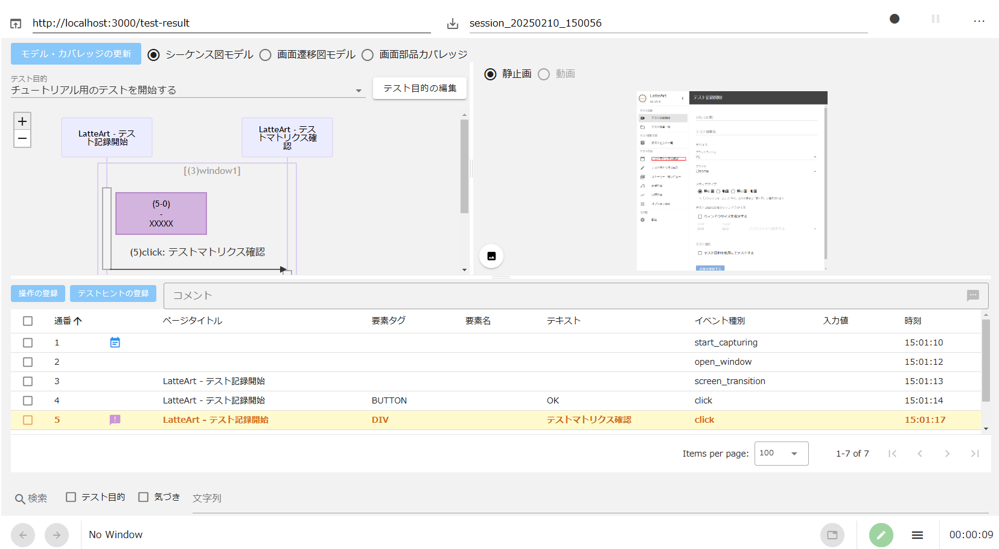
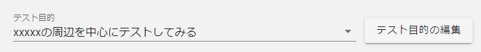
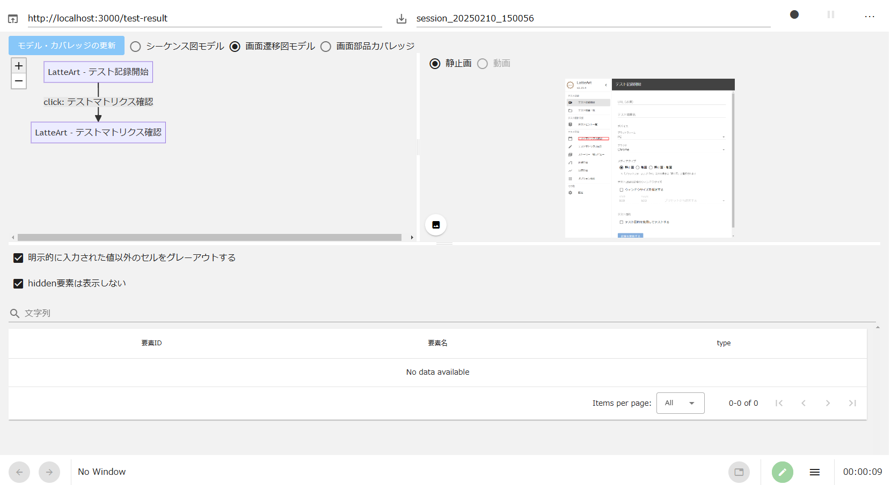
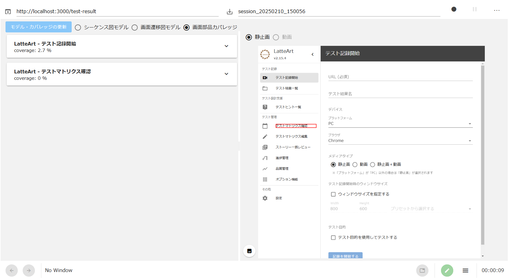

# LatteArt チュートリアル（操作記録編）

# 目次

- [操作記録のチュートリアル](#操作記録のチュートリアル)
  - [記録ツールの起動](#記録ツールの起動)
  - [記録ツールの初期設定](#記録ツールの初期設定)
  - [操作記録の開始](#操作記録の開始)
  - [テスト対象アプリケーションの操作](#テスト対象アプリケーションの操作)
  - [テスト中にメモをとる](#テスト中にメモをとる)
  - [操作記録の確認](#操作記録の確認)
  - [操作記録の終了](#操作記録の終了)
  - [画面のリセット](#画面のリセット)
  - [操作記録の読み込み](#操作記録の読み込み)
  - [操作記録のリプレイ](#操作記録のリプレイ)
  - [テストスクリプト生成](#テストスクリプト生成)
  - [データインポート](#データインポート)
  - [データエクスポート](#データエクスポート)
  - [スクリーンショット出力](#スクリーンショット出力)
  - [テスト結果の削除](#テスト結果の削除)
- [おわりに](#おわりに)

# この資料について

本書では、ツールの導入として「操作記録機能」を中心に説明します。

LatteArt を用いたテストの考え方、およびテストの実施方法については 「[LatteArt チュートリアル （テスト実践編）](/docs/tutorial/management/tutorial-management.md)」で説明しています。
また、各機能の詳細は「[記録ツール 操作説明書](/docs/manual/capture/manual-capture.md)」で説明しています。

# 操作記録のチュートリアル

本章では「記録ツール」を使用した操作の流れを紹介します。



## 記録ツールの起動

- インストールした環境で「記録ツール」を起動します。
  - 解凍した zip ファイル内の`capture.bat`をダブルクリックすると以下のメッセージが表示されたコマンドプロンプトが立ち上がり、ブラウザ上で記録ツールの画面が表示されます。

```
capture: http://127.0.0.1:3000?capture=http://127.0.0.1:3001&repository=http://127.0.0.1:3002
manage: http://127.0.0.1:3000?mode=manage&capture=http://127.0.0.1:3001&repository=http://127.0.0.1:3002
```

## 記録ツールの初期設定

- 画面上部の必要情報を記載し、テストを開始します。
  - 「URL」にテスト対象アプリケーションの URL を入力してください。
    - 本チュートリアルでは、LatteArt の管理ツールの画面にテストを行いましょう。`http://127.0.0.1:3000?mode=manage`を入力してください。
  - テスト結果に名前を付けたい場合は「URL」の右側の「テスト結果名」を入力してください。
    - テスト結果名は省略可です。その場合、自動的にテスト結果名`session_YYYYMMDD_HHmmss`が付与されます。
  - 「テスト結果名」の右側にある「テスト開始ボタン（丸いボタン）」を押下してください。

<div align="center">
 
</div>

## 操作記録の開始

- ダイアログが表示され、どのようにテストを行うかを指定します。今回はチェックボックスは ON のままで、最初のテスト目的を入力し、「OK」ボタンを押下してください。
  - テスト目的を記録することで、後でそれぞれのテストの意図を振り返ることができます。

<div align="center">
 
</div><br>

- ダイアログの「OK」ボタンを押下すると、新しいブラウザで指定の URL のページが表示され、記録が開始されます。また、記録ツールは自動的に**履歴画面**に画面が切り替わります。
  - 履歴画面と設定画面は、記録ツール右下のボタンからいつでも相互に切り替えることができます。

<div align="center">
 
</div>

## テスト対象アプリケーションの操作

- 実際にテスト対象アプリケーションを操作して、異なる画面に遷移させてみましょう。
  - 図では「テスト計画編集」ボタンを押下しています。

<div align="center">
 
</div>

- ボタンを押下すると、ボタンの周りに一瞬赤枠（LatteArt で記録されたことを示す目印）が表示され、画面が遷移します。
  - 入力フォームへの記入等、様々な操作を試してみましょう。

## テスト中にメモをとる

- テスト目的に沿ったテストが一区切りついた時や、違和感のある動作を見つけた場合は、記録ツールのフッターの以下ボタンからメモを残すことができます。

<div align="center">

</div><br>

- ボタンを押下すると以下のダイアログが表示され、メモを入力できます。

<div align="center">

</div>

## 操作記録の確認

- 操作した内容を LatteArt で確認してみましょう。履歴画面の「モデル・カバレッジの更新」ボタンを押下すると、最新の操作履歴を元に LatteArt で表示されている各種情報が更新されます。

<div align="center">

</div>

:bulb:「モデル・カバレッジの更新」が画面内に無い場合は、記録ツール右下のボタンから画面を切り替えてください。

### シーケンス図モデル

シーケンス図モデルは以下のような内容を確認したい場合に用います。

- どのようなタイミングでテスターが気付きをメモしたか
- 各操作がどのような目的で行われたか
- どのタイミングで画面遷移が行われたか
- 1 つ 1 つの操作の内容

次に具体的な画面を用いて説明します。

- 「モデル・カバレッジの更新」下部のラジオボタンで「シーケンス図モデル」を選択します。

テスト目的ごとに実施したテストの大まかな流れと、残したメモの情報がシーケンス図で表示されます。

<div align="center">

</div><br>

シーケンス図で表示する「テスト目的」はシーケンス図の上のプルダウンリストから切り替えることができます。

<div align="center">
 
</div><br>

メモで記録した「テスト中の気づき」はシーケンス図上に紫色の吹き出しで表示されます。カーソルを合わせることで詳細を確認できます。

<div align="center">
 
</div><br>

下部の表では全ての操作や、操作された Web 要素の属性等の情報を確認できます。また、「検索欄」で目的や気づきのチェックボックスにチェックを入れると目的や気づきのみの操作履歴を検索することができ、文字列入力欄にに文字列を入れることで、文字列を含む操作履歴を検索することができます。

<div align="center">
 
</div><br>

### 画面遷移図モデル

画面遷移図モデルは以下のような内容を確認したい場合に用います。

- テストでどのような画面遷移が確認されたか
- 各画面でどのような入力値の組み合わせが試されたか

次に具体的な画面を用いて説明します。

- 「モデル・カバレッジの更新」下部のラジオボタンで「画面遷移図モデル」を選択します。

実施したテスト内での画面遷移情報が画面遷移図で表示されます。また、下部の表にて画面遷移時に各画面でどのような入力値の組み合わせが試されたのかを確認できます。今回は入力値を入れずに画面遷移をしたので空欄になっています。

<div align="center">
 
</div>

### 画面要素カバレッジ

画面要素カバレッジは、各画面でどの Web 要素がテストで操作されたかを確認したい場合に用います。

- 「モデル・カバレッジの更新」下部のラジオボタンで「画面要素カバレッジ」を選択します。

各画面の要素に対する操作状況が表示されます。

<div align="center">
 
</div><br>

各画面のパネルをクリックすると、テスト中に操作した要素は薄緑色、操作していない要素はピンク色で表示されます。

<div align="center">
 
</div><br>

:bulb: カバレッジの計算対象に入れるタグは設定画面で指定することができます。設定画面についての詳細は[記録ツール 操作説明書](/docs/manual/capture/manual-capture.md)をご確認ください。

## 操作記録の終了

- 操作がすべて完了したら、記録ツール上部のテスト終了ボタン（赤い丸ボタン）を押下します。

<div align="center">
 
</div><br>

ボタンが赤色から黒色に変わります。

<div align="center">
 
</div>

## 画面のリセット

- 画面をリセットしたい場合は、画面上部の履歴リセットボタンを押下することで、テスト履歴をクリアし、画面を初期状態に戻すことができます。
  - 記録した内容は削除されず残るため、後述の「操作記録の読み込み」で再度呼び出せます。

<div align="center">
 
</div>

## 操作記録の読み込み

既存のファイルに追加で操作を記録したい場合や、過去のテストの内容を閲覧したい場合に用います。

操作記録のデータは[データエクスポート](#データエクスポート)により他開発者への操作記録の展開ができます。

- リポジトリに保存されているテスト結果を読み込みます。
  - 過去のテスト結果の読み込みボタンを押下します。
  - 過去セッション記録の一覧が表示されるので任意のセッションを選択します。

<div align="center">
 
</div><br>

:bulb: 他開発者のテスト結果を読み込みたい場合は、事前にテスト結果をエクスポートしたファイルを共有フォルダ等を経由して受け渡し、テスト結果を読み込みたい側の LatteArt の`latteart-repository/public/imports/` ディレクトリ配下にコピーし、[データインポート](#データインポート)し、テスト結果を読み込んでください。

:warning: テスト結果名は、テスト結果ディレクトリ配下の`log.json`内の`name`欄で確認できます。

## 操作記録のリプレイ

- テストを再現したい場合、およびスクリーンショットや各種モデルだけではテストの内容を理解しにくい場合に用います。

- メニューボタンの一覧から「テスト結果のリプレイ」を選択をすることで、記録時の操作ログを元に、ブラウザの操作を再現することができます。

## テストスクリプト生成

- 現在表示しているテスト結果を元にテストスクリプトを生成します。
  詳細は「[テストスクリプト自動生成](/docs/manual/common/test-script-generation.md)」をご参照ください。

## データインポート

- 旧バージョンでテスト記録や他開発者の記録操作を閲覧したい場合に用います。

- リポジトリの`latteart-repository\public\imports`フォルダ配下に置かれている zip ファイルをインポートします。
  - メニューボタンの一覧からテスト結果のインポートを押下します。
  - zip ファイル一覧が表示されるのでファイルを選択します。

## データエクスポート

- 他開発者へテスト結果を渡したい場合に用います。

- メニューボタンの一覧からテスト結果のエクスポートを押下すると現在表示しているテスト結果をエクスポートすることができます。

## スクリーンショット出力

- テスト結果の全スクリーンショットを出力したい場合に用います。

- メニューボタンの一覧から押下すると現在表示しているテスト結果のスクリーンショットをダウンロードすることができます。

## テスト結果の削除

- テスト結果を削除したい場合に用います。

- メニューボタンの一覧から押下すると現在表示しているテスト結果を削除することができます。

# おわりに

本書では、LatteArt の「操作記録機能」を中心に紹介しました。

LatteArt を用いてテストを行う方は、「[LatteArt チュートリアル（テスト実践編）](/docs/tutorial/management/tutorial-management.md)」もご参照下さい。
