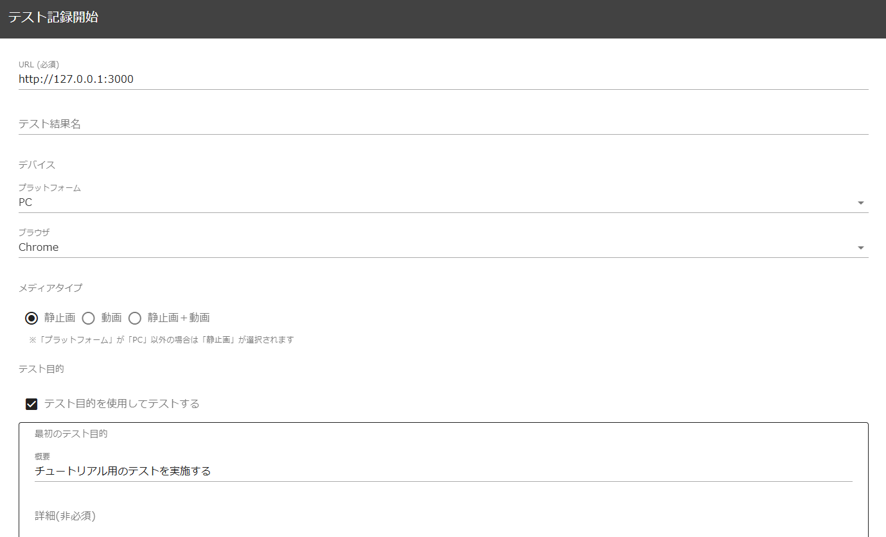
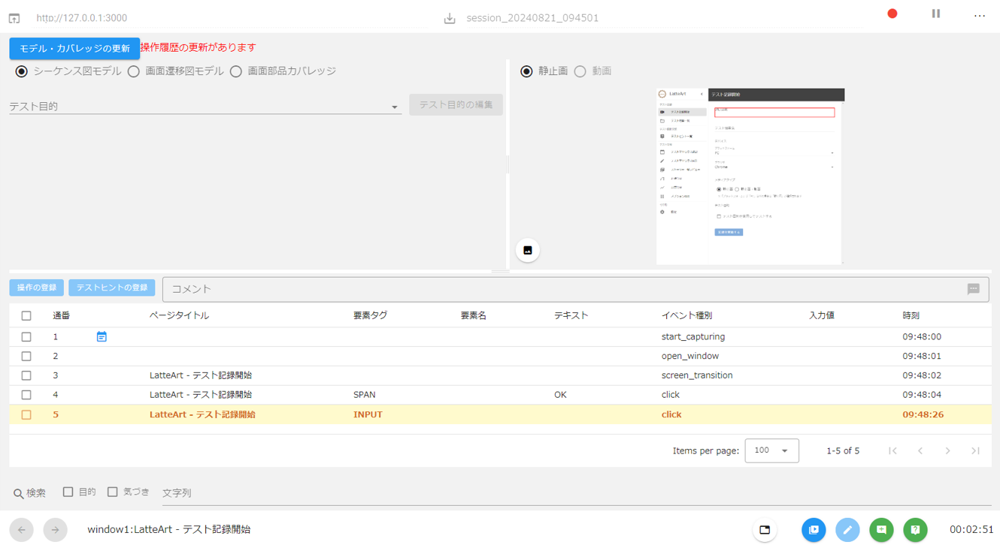
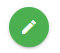
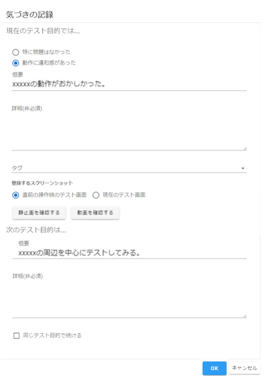
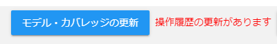
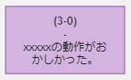
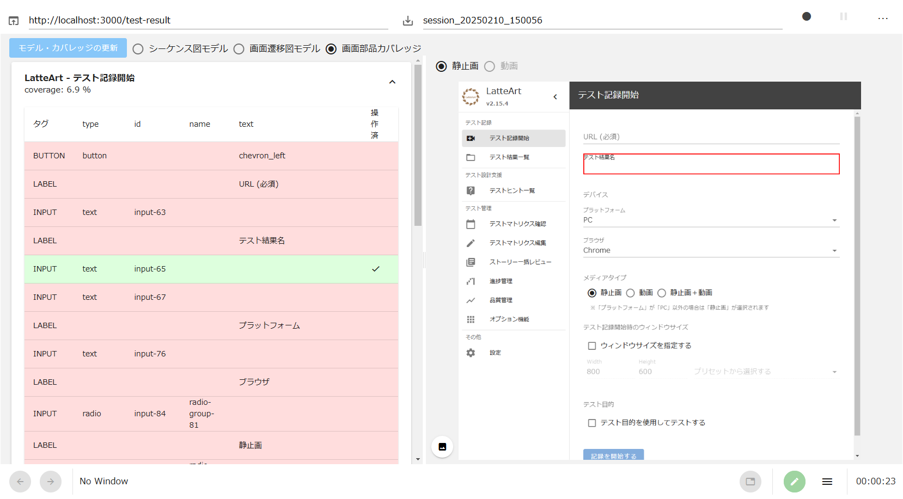

# LatteArt Tutorial (operation capturing)

# Table of Contents

- [Operation Capturing Tutorial](#operation-capturing-tutorial)
  - [Start capturing tool](#start-capturing-tool)
  - [Initial settings for capturing tools](#initial-settings-for-capturing-tools)
  - [Start operation capture](#start-operation-capture)
  - [Test target application operation](#test-target-application-operation)
  - [Take notes during the test](#take-notes-during-the-test)
  - [Confirmation of operation captures](#confirmation-of-operation-captures)
  - [End operation capture](#end-operation-capture)
  - [Reset screen](#reset-screen)
  - [Load operation capture](#load-operation-capture)
  - [Replay operation capture](#replay-operation-capture)
  - [Generate script](#generate-script)
  - [Import data](#import-data)
  - [Export data](#export-data)
  - [Screenshot output](#screenshot-output)
  - [Delete test results](#delete-test-results)
- [Conclusion](#Conclusion)

# About this docoment

This document mainly explains the "operation capturing function" as an introduction to the tool.

The concept of testing using LatteArt and how to execute the test are explained in "[LatteArt Tutorial (test management)](/docs/tutorial/management/tutorial-management.md)".
Details of each function are explained in "[Capturing Tool Operation Manual](/docs/manual/capture/manual-capture.md)".

# Operation Capturing Tutorial

This chapter introduces the flow of operations using the "Capturing Tool".


## Start capturing tool

- Start "Capturing Tool" in the installed environment.
   - Double-click `capture.bat` in the decompressed zip file to launch a command prompt with the following message and display the capturing tool screen on the browser.

```
capture: http://127.0.0.1:3000?capture=http://127.0.0.1:3001&repository=http://127.0.0.1:3002
manage: http://127.0.0.1:3000?mode=manage&capture=http://127.0.0.1:3001&repository=http://127.0.0.1:3002
```

## Initial settings for capturing tools

- Enter the required information at the top of the screen and start the test.
  - Enter the URL of the application under test in "URL".
    - In this tutorial, let's test the screen of LatteArt's administration tool. Enter `http://127.0.0.1:3000?mode=manage`.
  - If you want to name the test result, enter "テスト結果名" on the right side of "URL".
    - The test result name can be omitted. In that case, the test result name `session_YYYYMMDD_HHmmss` is automatically given.
  - Press the "Test start button (round button)" on the right side of "テスト結果名".

<div align="center">
 
</div>

## Start operation capture

- A dialog will appear to specify how the test should be done. This time, leave the check box ON, enter the first test purpose, and press the "OK" button.
  - Record test objectives so you can later review the intent of each test.

<div align="center">
 
</div><br>

- When you press the "OK" button in the dialog, the page of the specified URL will be displayed in a new browser and capturing will start. Also, the recording tool automatically switches to the **history screen**.
  - You can switch between the history screen and the setting screen at any time from the button at the bottom right of the capturing tool.

<div align="center">
 
</div>

## Test target application operation

- Let's actually operate the application under test and make a transition to a different screen.
  - In the figure, the "テスト計画編集" button is pressed.

<div align="center">
 
</div>

- When you press the button, a red frame (a mark indicating that it was recorded with LatteArt) is displayed around the button for a moment, and the screen transitions.
  - Let's try various operations such as filling in the input form.

## Take notes during the test

- When the test meets the purpose of the test, or if you find an unusual behavior, you can leave a memo from the following button in the footer of the capturing tool.

<div align="center">

</div><br>

- When you press the button, the following dialog is displayed and you can enter a memo.

<div align="center">

</div>

## Confirmation of operation captures

- Let's check the operation contents in LatteArt. When you press the "モデル・カバレッジの更新" button on the history screen, various information displayed in LatteArt will be updated based on the latest operation history.

<div align="center">

</div>

:bulb:If "モデル・カバレッジの更新" is not on the screen, switch the screen from the button at the bottom right of the recording tool.

### Sequence diagram model

The sequence diagram model is used when you want to check the following contents.

- At what timing did the tester take notes
- For what purpose each operation was performed
- At what timing the screen transition was performed
- Content of each operation

Next, we will explain using specific screens.

- Select "シーケンス図モデル" in the radio button at the bottom of "モデル・カバレッジの更新".

The rough flow of the executed test and the information of the memo left are displayed in the sequence diagram.

<div align="center">

</div><br>

The "test purpose" recorded in the memo is displayed in a frame on the sequence diagram. You can see more details by hovering over the text.

<div align="center">
 
</div><br>

"Awareness during the test" recorded in the memo is displayed in a purple balloon on the sequence diagram. Hover over to see details.

<div align="center">
 
</div><br>

In the table below you can see all the operations and information such as the attributes of the web elements that were manipulated. In addition, if you check the check box of the purpose or awareness in the "検索" column, you can search the operation history only for the purpose or awareness. By entering a character string in the character string input field, you can search for operation logs that include the character string.

<div align="center">
 
</div><br>

### Screen transition diagram model

The screen transition diagram model is used when you want to check the following contents.

- What kind of screen transitions were confirmed in the test
- What combinations of input values were tried on each screen

Next, we will explain using specific screens.

- Select "画面遷移図モデル" from the radio button at the bottom of "モデル・カバレッジの更新".

The screen transition information in the executed test is displayed in the screen transition diagram. Also, in the table at the bottom, you can check what combinations of input values were tried on each screen when transitioning between screens. This time, the screen is changed without entering the input value, so it is blank.

<div align="center">
 
</div>

### Screen element coverage

Screen element coverage is used when you want to see which web elements were manipulated by the test on each screen.

- Select "画面要素カバレッジ" from the radio button at the bottom of "モデル・カバレッジの更新".

Displays the operation status for each screen element.

<div align="center">
 
</div><br>

When you click on a panel on each screen, the elements you manipulated during the test are displayed in light green, and the elements you did not manipulate are displayed in pink.

<div align="center">
 
</div><br>

:bulb: The tags to be included in coverage calculation can be specified on the setting screen. For details on the setting screen, please refer to [Capturing Tool Operation Manual](/docs/manual/capture/manual-capture.md).

## End operation capture

- When all the operations are completed, press the end test button (red circle button) at the top of the capturing tool.

<div align="center">
 
</div><br>

The button will change from red to black.

<div align="center">
 
</div>

## Reset screen

- If you want to reset the screen, press the history reset button at the top of the screen to clear the test history and return the screen to its initial state.
   - Since the captureed contents are not deleted and remain, they can be recalled by "Load operation capture" described later.

<div align="center">
 
</div>

## Load operation capture

It is used when you want to capture additional operations in an existing file or when you want to view the contents of past tests.

Operation capture data can be exported to other developers by [Export data] (#export-data).

- Load test results stored in the repository.
   - Press "過去のテスト結果の読み込み" button.
   - A list of past session captures will be displayed, so select any session.

<div align="center">
 
</div><br>

:bulb: If you want to read the test results of other developers, pass the file that you exported the test results in advance via a shared folder, etc., copy it under the directory `latteart-repository/public/imports/` of the LatteArt on the side where you want to read the test results, and click [Import data](#import-data) to load the test results.

:warning: You can check the test result name in the `name` field in `log.json` under the test result directory.

## Replay operation capture

- It is used when you want to reproduce part or all of the test, and when it is difficult to understand the contents of the test only with screenshots and various models.

- By selecting "履歴を再生する" from the menu button list or selecting "自動再生" from the menu displayed by right-clicking inside the frame, browser operations can be reproduced based on the operation log at the time of recording. can do.

## Generate script

- Generate a test script based on the currently displayed test results.
  For details, please refer to "[Automatic test script generation](/docs/manual/common/test-script-generation.md)".

## Import data

- Used when you want to view test records or other developer's capturing operations in the old version.

- Import the zip file located under the `latteart-repository\public\imports` folder of the repository.
  - Press the data import from the list of menu buttons.
  - A list of zip files will be displayed, so select the file.

## Export data

- Used when you want to pass test results to other developers.

- You can export the currently displayed test results by pressing from the list of menu buttons.

## Screenshot output

- Used when you want to output all screenshots of test results.

- You can download a screenshot of the currently displayed test result by pressing it from the menu button list.

## Delete test results

- Used when you want to delete test results.

- You can delete the currently displayed test results by pressing from the list of menu buttons.

# Conclusion

In this manual, we have mainly introduced LatteArt's operation capturing function.

For those who use LatteArt for testing, please also refer to "[LatteArt Tutorial (test management)](/docs/tutorial/management/tutorial-management.md)".
