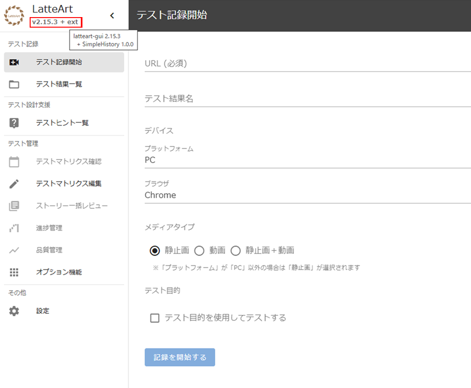
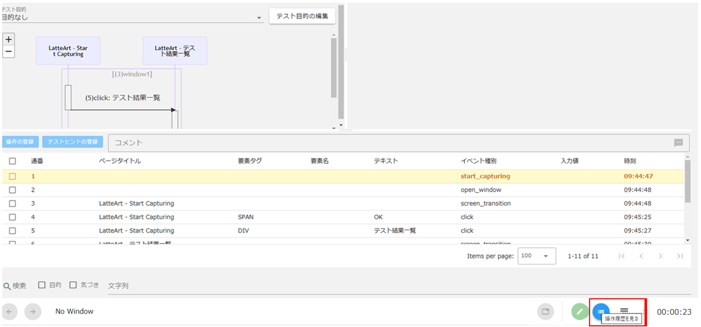

# Latteart チュートリアル（Extension開発）

## チュートリアルの目次

- [拡張機能の概要](#拡張機能の概要)
- [開発前の準備作業](#開発前の準備作業)
- [拡張機能の開発手順](#拡張機能の開発手順)
  - [拡張機能用フォルダを作成する](#拡張機能用フォルダを作成する)
  - [コンポーネントを作成する](#コンポーネントを作成する)
  - [言語ファイルを作成する](#言語ファイルを作成する)
  - [エントリーポイントを作成する](#エントリーポイントを作成する)
  - [Latteartに拡張機能を登録する](#Latteartに拡張機能を登録する)
- [開発した機能の動作確認](#開発した機能の動作確認)

## 拡張機能の概要

本チュートリアルで作成する拡張機能は、テスト結果画面のフッターに専用ボタンを追加し、クリックすることで簡易操作履歴を表示するダイアログを開きます。

:bulb: この拡張機能はTypeScript、Vue3、Vuetify3、vue-i18nを使用しています。

<div>
  
</div><br />

## 開発前の準備作業

開発環境の準備をします。「[LatteArt へのコントリビューション 開発環境のセットアップ](/docs/contributing_ja.md#開発環境のセットアップ)」を参照してください。

## 拡張機能の開発手順

### 拡張機能用フォルダを作成する

拡張機能に必要なファイルを管理するためのフォルダを作成します。本チュートリアルでは、追加する機能を「simple-history」とするため、フォルダ名も「simple-history」とします。

作成場所はvscodeのワークスペース上の `/root/latteart-gui/src/extentions` 配下です。この場所に拡張機能関連のファイルを集約することで、構成をわかりやすく保つことができます。

<div>
  
</div><br />

### コンポーネントを作成する

以下2つのコンポーネントを作成します。

- ダイアログのコンポーネント
- ダイアログを開くボタンのコンポーネント

後述のコードを参考に、それぞれコンポーネントを作成してください。
コンポーネントは先ほど作成した「simple-history」配下に配置してください。

:bulb: ファイルの保存場所はプロジェクトルールに従って適宜決定してください。

#### ダイアログのコンポーネント (`simple-history/SimpleHistoryDialog.vue`)

- `$t(...)` は、i18nの機能を利用して、対応する言語リソースからテキストを取得するための関数です。言語リソースは後述する[言語ファイルを作成する](#言語ファイルを作成する)をご参照ください。
- latteart-repository 経由でAPIサービスを利用しています。APIの詳細な仕様については[REST API リファレンス](https://latteart-org.github.io/latteart/docs/api/latteart-repository/rest/)をご参照ください。

```vue
<template>
  <v-dialog :model-value="opened" persistent width="800">
    <template #default>
      <v-card :title="$t('simple-history.dialog.header')">
        <v-card-text>
          <v-row v-for="(item, index) in items" :key="index" class="px-10 py-2">
            {{ item.title }} - {{ item.type }} - {{ item.tagname }}
          </v-row>
        </v-card-text>
        <v-card-actions>
          <v-spacer></v-spacer>
          <v-btn color="blue" variant="elevated" @click="$emit('close')">{{
            $t("common.close")
          }}</v-btn>
        </v-card-actions>
      </v-card>
    </template>
  </v-dialog>
</template>

<script lang="ts">
import { computed, defineComponent, ref, toRefs, watch } from "vue";
import { useRootStore } from "@/stores/root";
import { useOperationHistoryStore } from "@/stores/operationHistory";

type SimpleHistoryItem = {
  title: string;
  tagname: string;
  type: string;
};

type TestStep = {
  operation: { title: string; elementInfo?: { tagname: string }; type: string };
};

export default defineComponent({
  props: {
    opened: { type: Boolean, default: false, required: true },
  },
  emits: ["close"],
  setup(props) {
    const items = ref<SimpleHistoryItem[]>([]);

    // 読み込み対象のテスト結果ID
    const targetTestResultId = computed(() => {
      return useOperationHistoryStore().testResultInfo.id;
    });

    // latteart-repositoryのURL
    const repositoryUrl = computed(() => {
      return useRootStore().repositoryService?.serviceUrl ?? "";
    });

    // テスト結果をlatteart-repositoryから取得する
    const loadTestResult = async () => {
      // latteart-repository の API を呼び出す
      const response = await fetch(
        `${repositoryUrl.value}/api/v1/test-results/${targetTestResultId.value}`,
        { method: "GET" }
      );

      // レスポンスを画面に表示する情報に変換する
      if (response.ok) {
        const testResult = await response.json();
        items.value = testResult.testSteps.map((testStep: TestStep) => {
          return {
            title: testStep.operation.title,
            tagname: testStep.operation.elementInfo?.tagname,
            type: testStep.operation.type,
          };
        });
      }
    };

    // ダイアログを開いた際にテスト結果をlatteart-repositoryから読み込む関数を呼び出す
    const { opened } = toRefs(props);
    watch(opened, async () => {
      if (opened.value) {
        await loadTestResult();
      }
    });

    return { items, loadTestResult };
  },
});
</script>
```

#### ダイアログを開くボタンのコンポーネント (`simple-history/OpenSimpleHistoryDialogButton.vue`)

```vue
<template>
  <div>
    <v-btn
      color="blue"
      icon="list"
      size="small"
      :title="$t('simple-history.button.title')"
      @click="openedDialog = true"
    />

    <simple-history-dialog
      :opened="openedDialog"
      @close="openedDialog = false"
    />
  </div>
</template>

<script lang="ts">
import { defineComponent, ref } from "vue";
import SimpleHistoryDialog from "./SimpleHistoryDialog.vue";

export default defineComponent({
  components: {
    "simple-history-dialog": SimpleHistoryDialog,
  },

  setup() {
    const openedDialog = ref(false);

    return {
      openedDialog,
    };
  },
});
</script>
```

### 言語ファイルを作成する

現在は日本語と英語の2言語のみ対応しているため、本チュートリアルでは日本語用と英語用の言語ファイルを作成します。
言語ファイルは先ほど作成した「simple-history」配下に配置してください。

#### 日本語の言語ファイル (`simple-history/message_ja.json`)

```json
{
  "simple-history": {
    "dialog": {
      "header": "簡易操作履歴"
    },
    "button": {
      "title": "操作履歴を見る"
    }
  }
}
```

#### 英語の言語ファイル (`simple-history/message_en.json`)

```json
{
  "simple-history": {
    "dialog": {
      "header": "Simple History"
    },
    "button": {
      "title": "Show History"
    }
  }
}
```

### エントリーポイントを作成する

拡張機能で使用するファイルは、すべて `index.ts` にまとめる必要があります。以下に `GuiExtention` 型の各項目の説明とサンプルコードを示します。

#### `GuiExtension` 型の各項目

- **name**: 拡張機能の名前
- **version**: 拡張機能のバージョン
- **components.contents**: 拡張機能で追加したコンポーネントの使用場所（`contents` はテスト結果画面のフッターに表示します）
- **plugin**: Vueのplugin機能（拡張機能で作成した全コンポーネントを登録します）
- **messages**: 言語ファイル

#### エントリーポイント (`simple-history/index.ts`)

```ts
import type { GuiExtension } from "..";
import messageJa from "./message_ja.json";
import messageEn from "./message_en.json";
import OpenSimpleHistoryDialogButton from "./OpenSimpleHistoryDialogButton.vue";
import SimpleHistoryDialog from "./SimpleHistoryDialog.vue";

export const SimpleHistoryExtension: GuiExtension = {
  name: "SimpleHistory",
  version: "1.0.0",
  components: {
    contents: [
      {
        name: "OpenSimpleHistoryDialogButton",
      },
    ],
  },
  plugin: {
    install(app: any) {
      app.component(
        "OpenSimpleHistoryDialogButton",
        OpenSimpleHistoryDialogButton
      );
      app.component("SimpleHistoryDialog", SimpleHistoryDialog);
    },
  },
  messages: {
    ja: messageJa,
    en: messageEn,
  },
};
```

ここまでで作成した各ファイルを配置すると以下のようなフォルダ構成となります。

<div>
  
</div><br />

### Latteartに拡張機能を登録する

拡張機能を、Latteart本体に認識させるためにvscodeのワークスペース上の `/root/latteart-gui/src/extentions/index.ts` に登録する必要があります。このファイルは、アプリケーション内で使用するすべての拡張機能を一元管理します。

```ts
import { SimpleHistoryExtension } from "./simple-history"; // 今回追加する拡張機能

/**
 * Extension.
 */
export type GuiExtension = {
  name?: string;
  version?: string;
  components: {
    contents?: { name: string }[];
    configs?: { name: string; title: string }[];
    globals?: { name: string }[];
  };
  plugin: { install(app: any): void };
  messages: { ja: Record<string, any>; en: Record<string, any> };
};

export const extensions: GuiExtension[] = [
  SimpleHistoryExtension, // 今回追加する拡張機能
];
```

## 開発した機能の動作確認

Latteartを起動すると、画面の左上にバージョン情報が表示されます。この部分にカーソルを合わせると、Latteartのバージョンと現在インストールされている拡張機能のバージョンがポップアップで表示されます。

<div>
  
</div><br />

キャプチャーを開始し、テスト結果画面の右下に表示されている青色のボタンにカーソルをあわせると「操作履歴を見る」とポップアップが表示されます。

<div>
  
</div><br />

さらに、この青色のボタンをクリックすると簡易操作履歴ダイアログが開きます。

<div>
  
</div><br />
