# LatteArt Tutorial (test management)

# Table of Contents

- [Background of this technology](#background-of-this-technology)
- [Concept of testing using LatteArt](#concept-of-testing-using-latteart)
  - [Set the view point of test](#set-the-view-point-of-test)
  - [Stories and Sessions](#stories-and-sessions)
  - [How to proceed with the test](#how-to-proceed-with-the-test)
- [Tutorial for testing with LatteArt](#tutorial-for-testing-with-latteArt)
  - [Test planning](#test-planning)
  - [Session allocation](#session-allocation)
  - [Confirmation of test results](#confirmation-of-test-results)
- [Support functions](#support-functions)
  - [Check progress](#check-progress)
  - [Check quality](#check-quality)
  - [Output result](#output-result)
  - [Generate test script](#generate-test-script)
  - [Data import](#data-import)
  - [Data export](#data-export)

# About this document

This document is an explanation of the concept of testing using LatteArt and a tutorial for testing.

For test capturing, please refer to "[LatteArt Tutorial (Capturing operatoins)](/docs/tutorial/capture/tutorial-capture.md)".

# Background of this technology

## Problems

1. In descriptive tests, which have been widely used in the past, there is a tendency to create test design documents and procedure manuals for the purpose of satisfying pre-planned index values, which is wasteful. Exploratory testing, on the other hand, is less accountable and serves only as an adjunct to descriptive testing.
2. Non-essential work such as creating test trails to ensure accountability may be done.
3. Automation is essential for repetitive regression tests, but implementation of test scripts is time-consuming and requires a lot of maintenance work to keep up with software evolution.

## Reference: Descriptive test and Exploratory test

### Descriptive test

- Design the test in advance and implement the test accordingly.
- Good accountability, but high cost of documentation.

### Exploratory test

- No detailed test design is done in advance, but the tester's knowledge is used flexibly while executing the test.
- Efficient bug detection, but low accountability, test quality depends on tester skill.

## Goals

LatteArt aims to combine the merits of descriptive and exploratory testing by realizing the following:

- Executed tests and trails are automatically collected as test activity data (solution of problem 2).
- Instead of conducting tests aimed at clearing the index values planned in advance, we select the parts to be tested and concentrate on them and conduct exploratory tests to improve the efficiency of the tests (solution of problem 1).
  - The areas to be tested and the sufficiency of the tests can be determined by analyzing test activity data.
- Reduce regression testing labor by utilizing test activity data and automatically generating highly maintainable test scripts (solution of problem 3).

# Concept of testing using LatteArt

This chapter explains the concept of testing using LatteArt.
At LatteArt, we aim to conduct tests with high agility by conducting test management in units of **combination of test target functions and testing viewpoints** and repeatedly conducting exploratory tests.

The figure below shows the outline of the assumed test process, and the test proceeds by repeating a series of cycles.

 

There are various methods of exploratory testing in general, but LatteArt incorporates the ideas of **exploratory testing with test charters** and **session-based exploratory testing**.

## Set the view point of test

The test charter generally specifies the following:

- Where (what) to test
- How to test
- What kind of bugs are you looking to find

However, due to the high degree of freedom in the rules, this alone makes testing difficult to manage.
LatteArt makes it easier to manage tests by setting a rough test perspective in advance.

LatteArt's default test viewpoints are the following seven items.
The test viewpoint can be freely customized.

| Test Viewpoint                   | Overview                                                                                                                                   |
| -------------------------------- | ------------------------------------------------------------------------------------------------------------------------------------------ |
| Basic flow                       | Search for bugs in the flow that achieves the function under test in common usage.                                                         |
| Alternate flow                   | Search for bugs in the flow that achieves the test target function while performing uncommon or special operations.                        |
| Exception flow                   | Search for bugs in flows that fail to achieve the functionality under test due to errors or injustices.                                    |
| Suspend/Resume/Cancel            | Search for bugs while making twists and turns by interrupting work, restarting it, and repeating it.                                       |
| Data life cycle                  | Search for bugs by focusing on the flow of data generation -> update -> deletion.                                                          |
| Shared/Exclusive/Role/Security   | Search for bugs in functions and data during login, startup, and normal use from the perspective of sharing, exclusion, and role security. |
| Input/Output                     | Search for bugs related to input/output of external files and external interfaces.                                                         |

 

For each function to be tested, we will proceed with the test so that the set test viewpoint is satisfied.
By doing so, you can grasp the current status of the test in a tabular format like the one below.
LatteArt calls this a **test matrix**.

| Target     | View point 1 | View point 2 | ... | View point N |
| ---------- | ------------ | ------------ | --- | ------------ |
| Function A | OK           | OK           | ... | OK           |
| Function B | OK           | In Progress  | ... | OK           |
| Function C | OK           | NG           | ... | Not Executed |

## Stories and Sessions

LatteArt calls a **Story** a set of a test feature and a test view point.
For example, "Testing Alternate Flows for Login Functionality" is a story.

When we run exploratory tests on each story, we divide the tests into time frames called **sessions**.
The approximate length of one session is **30 to 120 minutes**.
Managing by story and testing by session makes it easier to estimate man-hours and manage progress.

## How to proceed with the test

The following roles are defined to facilitate testing using LatteArt.

- Test administrator (hereafter, **administrator**)
  - Summarize the results of each test and confirm the content and sufficiency of defects.
- Tester (hereafter, **Tester**)
  - Conduct exploratory tests and report results to management.
  - An administrator may also serve as a tester.

It is recommended that the test be conducted using the following process.

1. Test planning
    - An administrator defines a matrix of tested features and test view points, and estimates the number of sessions for each story.
2. Session Allocation
    - An administrator decides which stories to run next and assigns sessions to testers.
3. Test execution
    - Conduct sessions assigned to testers.
4. Confirmation of test results
    - Administrators review test results.
5. Repeat steps 2-4 until the planned test is complete.

:bulb: **At LatteArt, administrators use the 'Management Tool' and testers use the 'Capturing Tool'.**

# Tutorial for testing with LatteArt

This chapter describes the test flow using LatteArt.

For details on each function of the management tool, refer to "[Management Tool Operation Manual](../../manual/management/manual-management.md)".

## Test planning

- Double-click `manage.bat` surrounded by a red frame in the unzipped file.

 

Immediately after starting the management tool, the following screen will be displayed.
(The test matrix will be displayed after executing the test plan.)

- To create a test plan, press the "テスト計画編集" button.

 

 

- Click the"テストマトリクスを追加" button.

 

 

- Enter any name in"テストマトリクス名".
- Select a test viewpoint preset.
  - You can create a new viewpoint by pressing "テスト観点追加".
  - You can delete a viewpoint by pressing the trash can button.
  - By pressing the arrow next to the trash can button, you can display the detailed entry field of the viewpoint and enter it.
  - The default test viewpoints (7 items) are pre-registered including details.

 

 

- After creating the test matrix, press the "グループを追加" button to register the group.
  - Groups are used when you want to manage test results for each function group for a large test target.

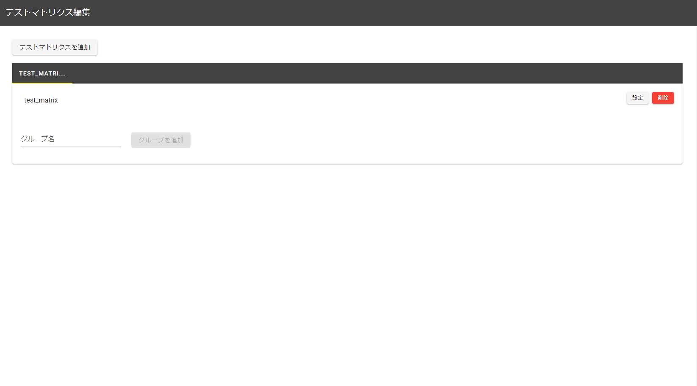 

 

- Fill in the group name and enter the function to be tested.
  - For example, the "user management" group includes "user addition/user deletion/user update" functions.

 

 

- Estimate the number of sessions for each story and enter the number.
- Press the "TOP に戻る" button.

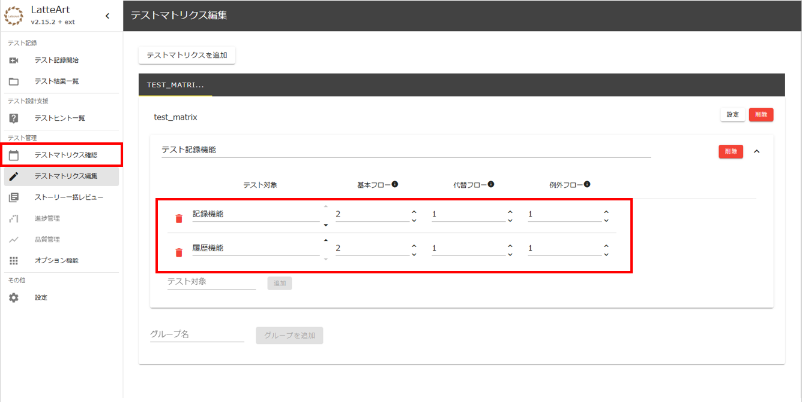 

 

- The test matrix created earlier is displayed on the top screen.
  - Each story is color-coded to help you understand the test status.

 

## Session allocation

Describes the procedure for assigning sessions to testers.

- Clicking on the "未実施あり" area surrounded by a red frame will display the information of the corresponding story.

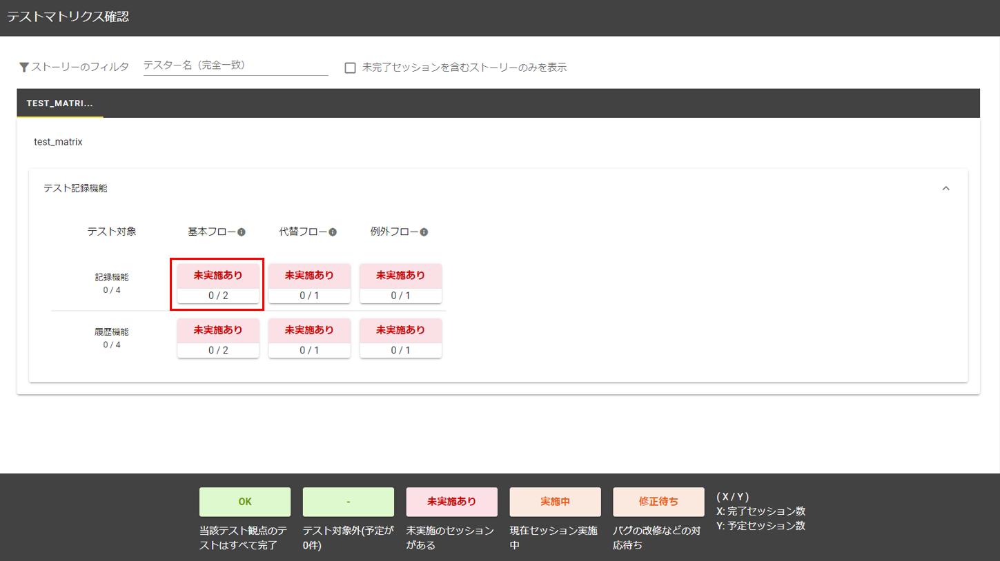 

 

- Press the "セッションを追加する" button in the red frame.

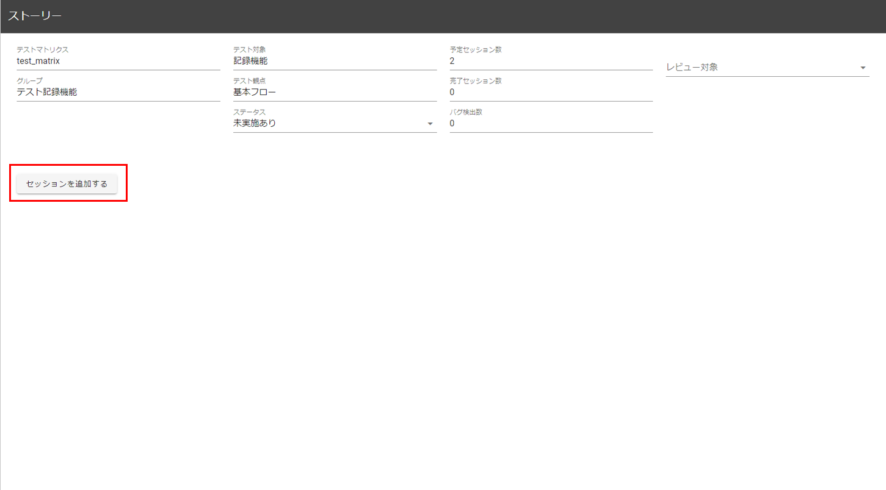 

 

- Enter the following in the "チャーター部".
  - Tester name("テスター名")
  - Memo("メモ"): More detailed test target elements and test remarks (arbitrary, multiple lines can be entered)

 

 

- The administrator informs the testers of the assigned sessions and charters.
  - :warning: Currently, there is no mechanism to automatically notify testers of session and charter content. Please show the screen of the management tool, or ask the tester about the work content via chat.
- When the session starts, change the status framed in red below to `実施中`.

 

 

- The tester will use the capturing tool to conduct an exploratory test of the specified story during the session time.

:bulb: For information on how to perform tests using the capturing tool, see "[LatteArt Tutorial (Operation Capturing)](/docs/tutorial/management/tutorial-management.md)" and "[Capturing Tool Operation Manual]( /docs/manual/management/manual-management.md)".

## Confirmation of test results

This section explains how to check the test results using the management tool.

:warning: Currently, there is no mechanism to automatically reflect test results on the management tool side.
If the testers do not have access to the administration tools, the directory containing the test results should be shared with the administrator in some way.

- Open the story with the session you want to register.

 

 

- Open the session to register the result, and select the session name of the test result from "実行結果の取り込み" in the report column.
- When creating a new test result from the management tool, start the recording tool from "記録ツール起動" and execute the test.
- If there is an attachment, add it from "添付ファイルの追加".

 

 

Executing the above will result in the following. You can reload the captured data by pressing the reload button. You can also delete the imported data by pressing the trash can button.

 

 

When you load a session, the purpose of the test is displayed in the "実施されたテスト" column, and the notes you left are displayed in the "テスト中の気付き" column.

 

 

- If you want to check the contents of the session, select the session from the "レビュー対象" list and press the "レビューする" button.

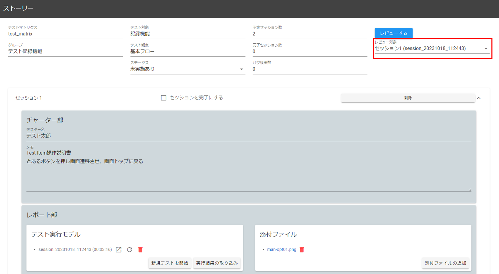 

 

- On the review screen, you can check information such as sequence diagrams, screen transition diagrams, and screen element coverage in the same way as the history screen of the capturing tool.
  - By right-clicking on "テスト中の気付き" in the sequence diagram, you can change the presence or absence of submission and the submission number from the review screen.

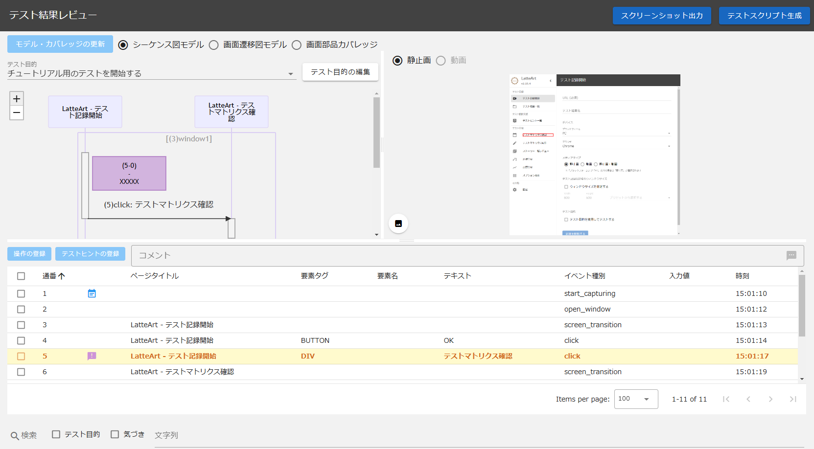 

 

- When the review is complete, return to the story screen and check "セッションを完了にする".
- Change story status to match the current situation.
  - If the story is completed, it will be `OK`, and if there is a problem with the test target and it is being fixed, it will be `修正待ち`.
  - Consider whether the testing in this story is sufficient, and add sessions if additional testing is needed. Here, it is preferable to describe the missing test perspectives in the charter section.

 

 

- Confirm that the number of completed sessions is increasing as the sessions are completed, as shown in the image below.

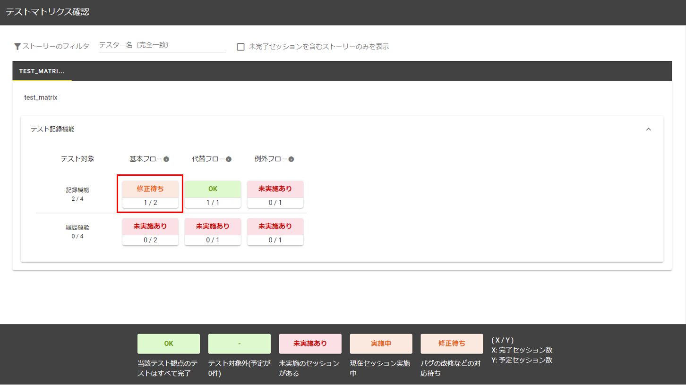 

 

- Analyze the current situation and decide which stories and sessions to work on next. The test proceeds by repeating this cycle.

# Support functions

Here are some features to help you conduct your tests.

## Check progress

- Click the "進捗管理" tab on the TOP screen to display progress information.
- You can grasp the progress with a line graph.
   - You can check changes in the number of planned sessions, completed sessions, and uncompleted sessions.
   - You can filter the aggregation period and test target.

 

 

## Check quality

- Click the "品質管理" tab on the TOP screen to display quality information.
- You can filter the test group and test target, and check the PB curve (reliability growth curve).
   - The vertical axis represents the number of bugs filed, and the horizontal axis represents the progress of the session.

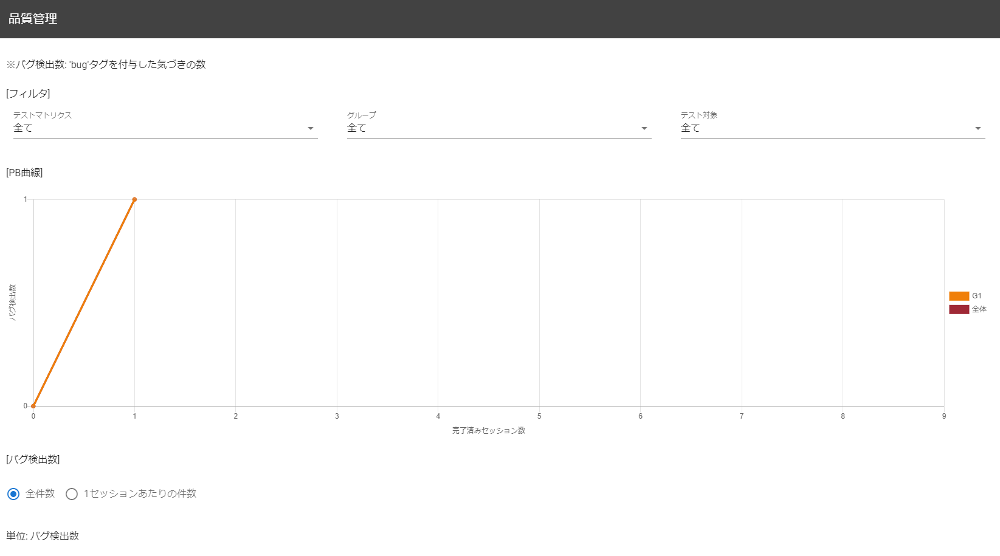 

 

- In "バグ起票状況", you can check the number of submissions for each test function and viewpoint.

 

## Output result

- When you click "スナップショット出力" in the red frame, the following directory will be output.

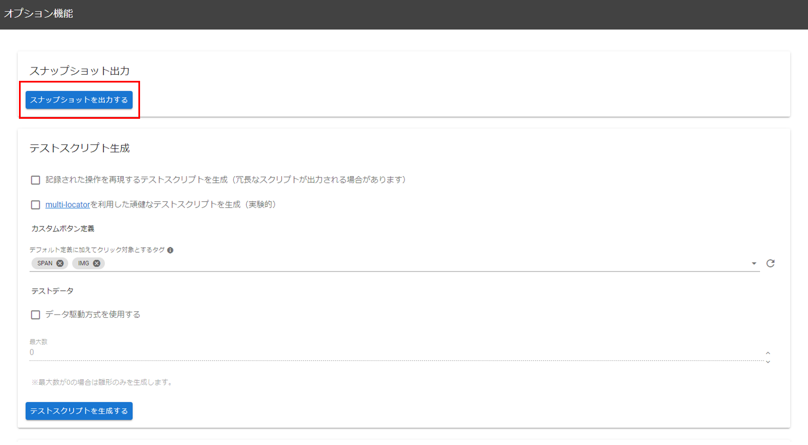 
 
<em>Snapshot output</em>

 

 
 
<em>Files of the directory</em>

 

- A snapshot of the administration tools can be viewed offline from `index.html`.
   - :warning: Contents cannot be edited or added.
- An Excel file with a summary of the test will be output to the same directory.
   Here it is `test_matrix.xlsx` in the folder.
   - You can check the list of the purpose of the test, what you noticed during the test, etc.

 
 
<em>Summary of the test</em>

## Generate test script

Generate a test script based on all registered sessions.
For details, please refer to "[Automatic test script generation](/docs/manual/common/test-script-generation.md)".

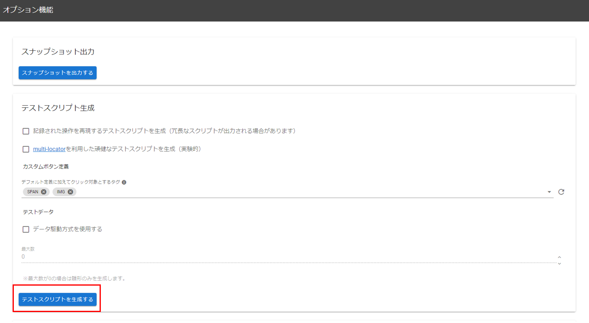 
 
<em>Test script generation</em>

 

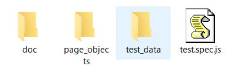 
 
<em>Files of the directory</em>

## Data import

- Click "データインポート" to import project information and test result information.
   - It is also possible to import only project information or only test result information.

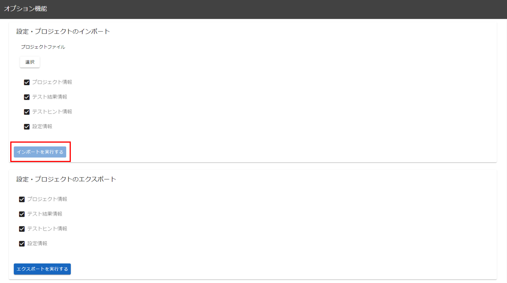

## Data export

- Click "データエクスポート" to export project information and test result information.
   - It is also possible to export only project information or only test result information.

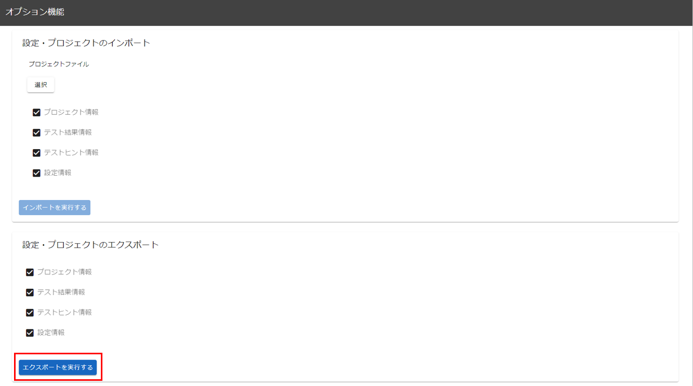

