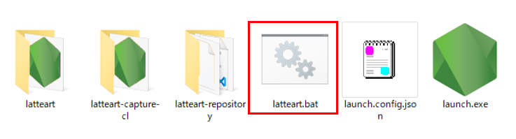
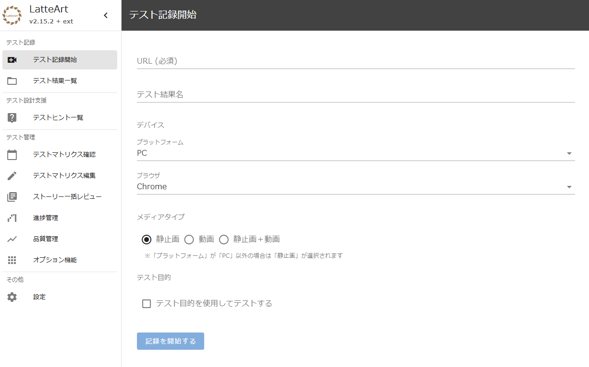
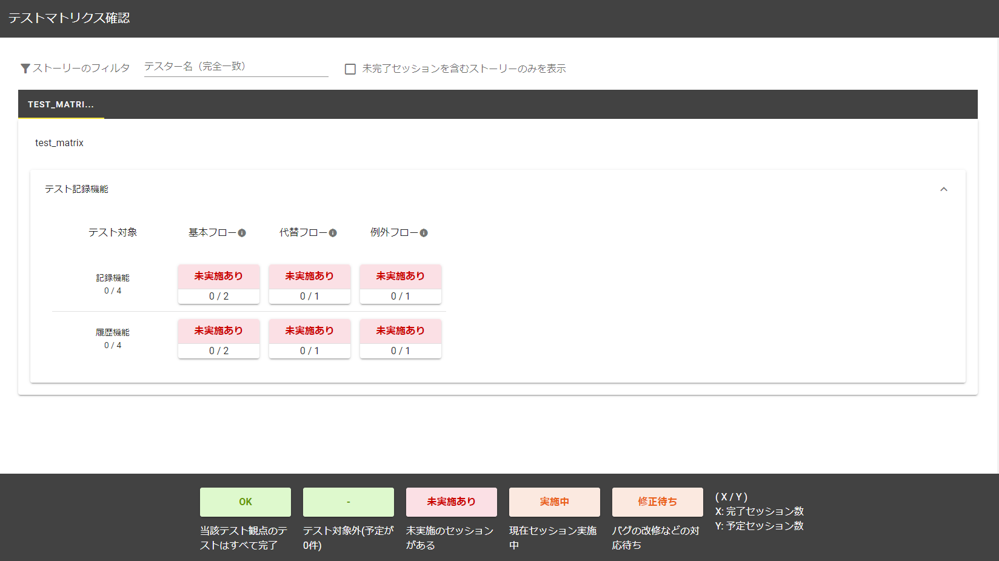
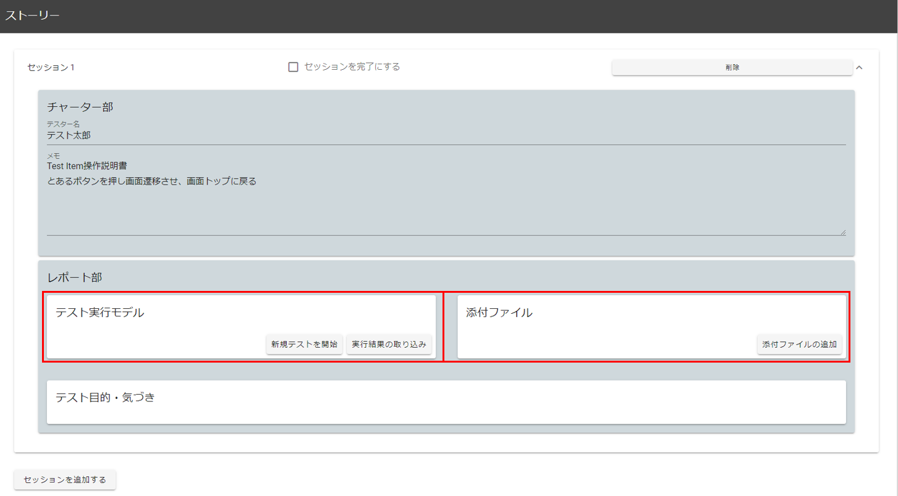
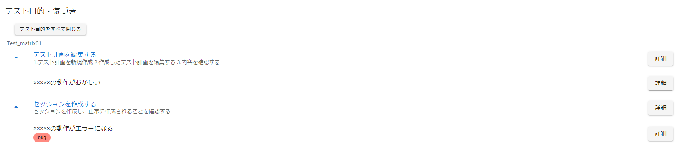
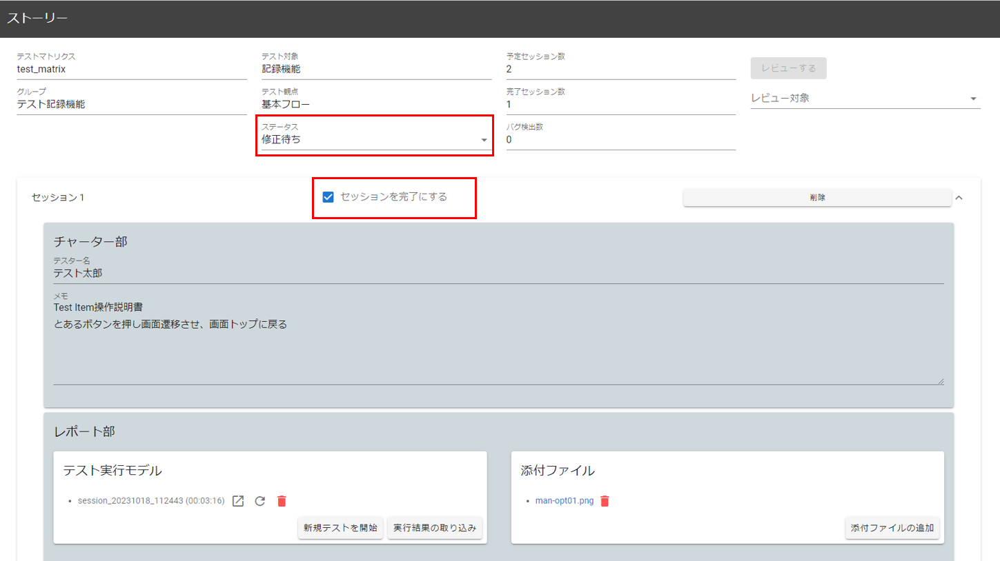

# LatteArt チュートリアル（テスト実践編）
# 目次

- [本技術の背景](#本技術の背景)
- [LatteArtを用いたテストの考え方](#latteartを用いたテストの考え方)
  - [テスト観点の設定](#テスト観点の設定)
  - [ストーリーとセッション](#ストーリーとセッション)
  - [テストの進め方](#テストの進め方)
- [LatteArt を用いたテストのチュートリアル](#latteart-を用いたテストのチュートリアル)
  - [テストの計画](#テストの計画)
  - [セッションの割り当て](#セッションの割り当て)
  - [テスト結果の確認](#テスト結果の確認)
- [各種補助機能](#各種補助機能)
  - [進捗の確認](#進捗の確認)
  - [品質の確認](#品質の確認)
  - [結果の出力](#結果の出力)
  - [テストスクリプト生成](#テストスクリプト生成)

# この資料について

本書は、LatteArtを用いたテストの考え方の説明、およびテストのチュートリアルとなります。

テストの記録については「[LatteArt チュートリアル（操作記録編）](/docs/tutorial/capture/tutorial-capture.md) 」をご参照ください。

# 本技術の背景

## 課題
1. 従来から広く用いられる記述式テストでは、事前に計画した指標値を満たすことを目的としたテスト設計書や手順書が作成される傾向があり、無駄が多い。一方で、探索的テストはアカウンタビリティが低く、記述式テストの補助的な役割でしか行われない。
2. アカウンタビリティ確保のためのテスト証跡の作成という本質的でない作業が行われる場合がある。
3. 繰り返し行われる回帰テストは自動化が欠かせないが、テストスクリプトの実装は手間がかかる上、ソフトウェアの進化に追従させるための保守の労力も大きい。

## 参考: 記述式テストと探索的テスト

### 記述式テスト
- 事前にテスト設計を行い、それに従ってテストを実施する。
- アカウンタビリティに優れるが、文書化のコストが大きい。
### 探索的テスト
- 事前に詳細なテスト設計はせず、テストを実行しながら臨機応変にテスターの知見を活用してテストを行う。
- バグ検出の効率が良いが、アカウンタビリティが低く、テストの質がテスターのスキルに依存する。

## 狙い

LatteArtは、以下を実現することで記述式テストと探索的テストのメリットを両立することを目指しています。

- 行われたテストや証跡はテスト活動データとして自動で収集する（課題2の解決）。
- 事前に計画した指標値のクリアを目的としたテストを行うのではなく、テストすべき箇所を選択し、そこに集中して探索的テストを行うことでテストを効率化する（課題1の解決）。
  - テストすべき箇所やテストの十分性は、テスト活動データを分析することで判断可能にする。
- テスト活動データを活用し、保守性の高いテストスクリプトを自動生成することで回帰テストを省力化する（課題3の解決）。

# LatteArtを用いたテストの考え方

本章では、LatteArt を用いたテストの考え方を説明します。
LatteArt では**テスト対象機能とテスト観点の組み合わせ**を単位としてテスト管理を行い、探索的テストを繰り返し行うことでアジリティの高いテスト行うことを目指しています。

下図は想定するテストプロセスの概略を示しており、一連のサイクルを繰り返すことでテストを進めます。

 

一般的に探索的テストの方法は様々ですが、LatteArt は**テストチャーター（テストの指針）を用いる探索的テスト**および**セッションベースの探索的テスト**のアイデアを取り入れています。

## テスト観点の設定

テストチャーターでは、一般的に以下のような内容を規定します。

- どこ（何）をテストするか
- どうやってテストするか
- どのような不具合の発見を狙うか

しかし、規定の自由度が高いために、これだけではテストの管理が困難です。
LatteArt では、事前に大まかなテスト観点を設定することでテストの管理が行いやすくなっています。

LatteArt のデフォルトのテスト観点は以下の 7 項目です。
テスト観点は自由にカスタマイズ可能です。

| テスト観点                       | 概要                                                                                                         |
| -------------------------------- | ------------------------------------------------------------------------------------------------------------ |
| 基本フロー                       | 一般的な使い方でテスト対象機能を達成するフロー上でバグを探索する。                                           |
| 代替フロー                       | 一般的ではない操作、特殊な操作をしながら、テスト対象機能を達成するフロー上でバグを探索する。                 |
| 例外フロー                       | エラーや不正によって、テスト対象機能を達成できないフロー上でバグを探索する。                                 |
| 中断・再開・取り消し             | 作業を中断させたり、再開させたり、繰り返したりして紆余曲折させながらバグを探索する。                         |
| データライフサイクル             | データの生成 → 更新 → 削除までの一連の流れに着目してバグを探索する。                                         |
| 共有・排他・ロール・セキュリティ | ログイン時、起動時、通常利用時に機能とデータについて、共有・排他・ロールセキュリティの観点でバグを探索する。 |
| 入出力                           | 外部ファイルや外部インタフェースの入出力に関するバグを探索する。                                             |

 

各テスト対象機能に対し、設定したテスト観点を満足するようにテストを進めていきます。
そうすることで、以下のような表形式で現在のテストの状況を把握できます。
これを、LatteArt では**テストマトリクス**と呼称します。

| テスト対象 | テスト観点 1 | テスト観点 2 | ... | テスト観点 N |
| ---------- | ------------ | ------------ | --- | ------------ |
| 機能 A     | OK           | OK           | ... | OK           |
| 機能 B     | OK           | テスト中     | ... | OK           |
| 機能 C     | OK           | 不具合あり   | ... | 未実施       |

## ストーリーとセッション

1つのテスト対象機能とテスト観点の組を LatteArt では**ストーリー**と呼びます。
例えば、「ログイン機能に対する代替フローのテスト」は1つのストーリーです。

各ストーリーに対して探索的テストを行う際、**セッション**と呼ばれる時間枠で区切ってテストを行います。
1 セッションの長さの目安は **30 分 ～ 120 分**です。
ストーリー単位で管理し、セッション単位でテストを行うことで、工数見積や進捗管理が容易になります。

## テストの進め方

LatteArtを用いたテストを円滑に行うため、以下のロールを定義します。

- テスト管理者（以下、**管理者**）
  - 各テストの結果を取りまとめ、不具合の内容や十分性を確認する。
- テスト実施者（以下、**テスター**）
  - 探索的テストを実施し、結果を管理者に報告する。
  - 管理者がテスターを兼務しても良い。

以下のようなプロセスでテストを実施することを推奨します。

1. テストの計画
   - 管理者がテスト対象機能とテスト観点のマトリクスを定義し、各ストーリーのセッション数を見積ります。
2. セッションの割り当て
   - 管理者が次に実施するストーリーを決定し、テスターにセッションを割り当てます。
3. テスト実施
   - テスターが割り当てられたセッションを実施します。
4. テスト結果の確認
   - 管理者がテスト結果を確認します。
5. 計画したテストが完了するまで 2〜4 の工程を繰り返します。 

:bulb: **LatteArt では、管理者は「管理ツール」、テスターは「記録ツール」を使用します。**

# LatteArt を用いたテストのチュートリアル

本章では、LatteArt を使ったテストの流れを説明します。

管理ツールの各機能の詳細については、「[管理ツール 操作説明書](../../manual/management/manual-management.md)」を参照ください。

## テストの計画

- 解凍したファイル内の下図赤枠で囲まれた`manage.vbs`をダブルクリックします。

 

管理ツール起動直後は、以下のような画面が表示されます。
（テスト計画実施後には、テストマトリクスが表示されます。）

- テスト計画の作成のため、「テスト計画編集」ボタンを押下します。

 

 

- 「テストマトリクスを追加」ボタンを押下します。

 

 

- 「テストマトリクス名」に任意の名前を記入します。
- テスト観点のプリセットを選択します。
  - 「テスト観点追加」を押すことで新しい観点が作成できます。
  - ゴミ箱ボタンを押すことで、観点を削除できます。
  - 前述のデフォルトのテスト観点（7 項目）は予め登録されています。
  

 

 

- テストマトリクス作成後、「グループを追加」ボタンを押下してグループを登録します。
  - グループは大規模なテスト対象に対し、機能のグループごとにテスト結果を管理したい場合に用います。

 

 

- グループ名を記入し、テスト対象機能を入力します。
  - 例えば、「ユーザ管理」グループには「ユーザ追加・ユーザ削除・ユーザ更新」機能等が属します。

 

 

- 各ストーリーについてセッション数を見積り、数値を入力します。
- 「TOP に戻る」ボタンを押下します。

 

 

- トップ画面に先ほど作成したテストマトリクスが表示されます。
  - 各ストーリーは色付けされ、テスト状況が把握ができます。

 

## セッションの割り当て

テスターにセッションを割り当てる手順を説明します。

- 赤枠で囲われている「未実施あり」の箇所をクリックすると、該当ストーリーの情報が表示されます。

 

 

- 赤枠の「セッションを追加する」ボタンを押下します。

 

 

- 「チャーター部」欄に以下を記載します。
  - テストアイテム： より詳細なテスト対象要素（任意）
  - テスター名
  - メモ： テストに関する備考（任意）

 

 

- 管理者は割り当てたセッションおよびチャーターの内容をテスターに伝えます。
  - :warning: 現状、セッションおよびチャーターの内容を、テスターに自動的に通知する仕組みはありません。管理ツールの画面を見せる、もしくはチャット等でテスターに作業内容を依頼してください。
- セッションが開始されたら、下図赤枠のステータスを`実施中`に変更します。

 

 

- テスト実施者は記録ツールを用いて、セッションの時間内に、指定されたストーリーの探索的テストを実施します。

:bulb: 記録ツールを用いたテストの実施方法については、「[LatteArt チュートリアル （操作記録編）](/docs/tutorial/management/tutorial-management.md)」や「[記録ツール 操作説明書](/docs/manual/management/manual-management.md)」をご確認ください。

## テスト結果の確認

テスト結果を管理ツールで確認する方法を説明します。

:warning: 現状、管理ツール側にテスト結果を自動で反映する仕組みはありません。
テスターが管理ツールにアクセスできない場合、テスト結果が格納されたディレクトリを何らかの手段で管理者に共有する必要があります。

- 登録したいセッションがあるストーリーを開きます。

 

 

- 結果を登録するセッションを開き、レポート欄にある「実行結果の取り込み」からテスト結果のセッション名を選択します。
- 添付ファイルがある場合、「添付ファイルの追加」から追加します。

 

 

上記を実行すると以下のようになります。ゴミ箱ボタンを押下すると、取り込んだデータの削除を行えます。

 

 

セッションを読み込むと、テストの目的が「実施されたテスト」欄に、残したメモが「テスト中の気付き」欄に表示されます。

- 「テスト中の気付き」を確認して管理者がバグとみなすか判断し、バグとみなす場合はバグトラッキングシステム等でバグを起票した後、「起票状態」を「起票済み」とし、「起票番号」を記載します。
  - これは後述のレビュー画面でも設定できます。
  - :warning: 現状、バグトラッキングシステムとの連携機能はありません。

 

 

- セッションの内容を確認したい場合は、「レビュー対象」リストからセッションを選択し、「レビューする」ボタンを押下します。

 

 

- レビュー画面では、記録ツールの履歴画面と同様にシーケンス図、画面遷移図、画面要素カバレッジといった情報を確認できます。
  - シーケンス図の「テスト中の気付き」上で右クリックすることで、レビュー画面から起票有無や起票番号の変更をすることができます。

 

 

- レビューが完了したらストーリー画面に戻り、「セッションを完了にする」にチェックを入れます。
- 現状に合わせてストーリーのステータスを変更します。
    - ストーリーが完了すれば `OK`、テスト対象に不具合があり修正中の場合は`修正待ち`とします。
    - このストーリーにおけるテストが十分かどうかを検討し、追加のテストが必要と判断すれば、セッションを追加します。ここでは不足しているテスト観点などをチャータ部に記述することが好ましいです。

 

 

- セッション完了に伴い、以下の画像のように完了セッション数が増加していることを確認します。

 

 

- 現状を分析し、次に取り組むストーリーおよびセッションを決定します。このサイクルを繰り返すことでテストを進めます。

# 各種補助機能

テストの実施を助ける各種機能を紹介します。

## 進捗の確認

- TOP 画面の「進捗管理」タブをクリックすると、進捗情報が表示されます。
- 折れ線グラフで進捗を把握できます。
  - 予定セッション数・完了セッション数・未完了セッション数の推移が確認できます。
  - 集計期間やテスト対象にフィルタをかけることができます。

 

 

## 品質の確認

- TOP 画面の「品質管理」タブをクリックすると、品質情報が表示されます。
- テストグループ、テスト対象がフィルタでき、PB 曲線（信頼度成長曲線）を確認できます。
  - 縦軸がバグの起票数、横軸がセッションの進捗を表します。

 

 

- 「バグ起票状況」では、テスト対象機能や観点ごとの起票数を確認することができます。

 

## 結果の出力

- 赤枠の「スナップショット出力」をクリックすると、以下のようなディレクトリが出力されます。

 
 
<em>スナップショット出力</em>

 

 
 
<em>ディレクトリの内容</em>

 

- `index.html`から、管理ツールのスナップショットがオフラインで閲覧できます。
  - :warning: 内容に対する編集・追加は行えません。
- 同ディレクトリにテストの概要が記載されたエクセルファイルが出力されます。
  ここでは、フォルダ内の`test_matrix.xlsx`です。
    - テストの目的・テスト中の気付き等の一覧を確認できます。

 
 
<em>テスト概要</em>

## テストスクリプト生成

- 「テストスクリプト生成」をクリックすると、テストの内容から回帰テスト用のテストスクリプトを自動生成します。
  - テストスクリプトは Webdriver.io を用いて実行できます。
  - テストスクリプトはページオブジェクトパターンを採用しており、テストケースは探索的テストで行われた画面遷移を全て網羅するように生成されます。
  - テストの内容を説明するドキュメントも自動生成されます。

 
 
<em>テストスクリプト生成</em>

 

 
 
<em>ディレクトリの内容</em>

